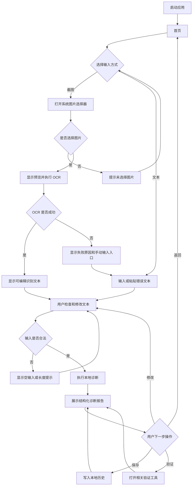

# 开发报错诊断助手需求规格说明书

> 文档版本：V1.1 草案
> 编写日期：2026-07-12
> 适用范围：课程项目第一版
> 文档状态：待项目组确认
> 产品原则：离线优先、单一主流程、结果可解释、失败可降级

## 1. 项目概述

### 1.1 项目名称

- 项目名称：开发报错诊断助手
- 英文名称：不设置
- 完整名称：开发报错诊断助手——HarmonyOS 报错截图与日志诊断工具

### 1.2 项目定位

开发报错诊断助手是一款面向学生开发者和初级软件开发者的 HarmonyOS 本地报错诊断工具。用户可以导入报错截图或粘贴错误日志，由应用提取并整理错误文本、识别常见错误类型、生成可执行的排查步骤，并使用相关验证工具辅助确认问题。

第一版定位为“离线优先的开发报错诊断助手”，不是综合开发平台，也不是在线技术社区。

### 1.3 项目要解决的问题

开发者在移动场景中遇到报错时，常面临以下问题：

- 错误信息只存在于截图中，无法直接复制和搜索；
- 错误日志较长，不容易快速找到关键错误类型；
- 搜索结果分散，缺少按顺序执行的排查步骤；
- JSON、HTTP 状态码等内容需要切换到其他工具验证；
- 诊断过程没有记录，类似问题再次出现时需要重复排查；
- 网络、OCR 或外部服务不可用时，现有流程容易中断。

### 1.4 目标用户

- 正在学习 HarmonyOS、ArkTS 或其他应用开发技术的学生；
- 需要在手机或平板上快速整理报错信息的开发者；
- 需要保存和复用个人排错记录的课程项目成员；
- 对复杂开发工具不熟悉、需要结构化排查提示的初级开发者。

### 1.5 典型使用场景

1. 用户在电脑或测试设备上看到报错，使用手机保存或获取报错截图，通过开发报错诊断助手识别并分析。
2. 用户从聊天软件、终端或测试报告中复制错误日志，粘贴到开发报错诊断助手进行诊断。
3. 用户发现接口响应无法解析，使用 JSON 验证工具定位格式错误。
4. 用户看到 HTTP 401、404 或 500 等状态码，通过状态码解释获得排查方向。
5. 用户从历史记录中找到之前处理过的同类错误，复用当时的解决步骤。
6. OCR 不可用或识别不准确时，用户手动修改或直接输入错误文本继续诊断。

### 1.6 核心价值

- 将“截图转文字、识别问题、查看步骤、辅助验证、保存记录”连接为一条完整流程；
- 在没有后端和外部 AI 服务时，仍能完成基础诊断；
- 诊断结论提供证据、原因和步骤，而不是只显示一个模糊答案；
- 所有第一版核心数据默认保存在本地，降低网络依赖和隐私风险；
- 使用与产品主题直接相关的 HarmonyOS 系统能力，避免为了增加功能数量而堆叠无关模块。

## 2. 项目范围

### 2.1 本项目要实现的内容

第一版应实现：

- 应用首页和核心功能入口；
- 报错截图选择和单张图片 OCR；
- 错误文本手动输入、粘贴和修改；
- 基于本地规则的常见错误分类；
- 结构化诊断报告；
- JSON 格式验证；
- HTTP 状态码解释；
- 诊断历史记录的本地保存、查看和删除；
- OCR、空输入、未知错误等失败场景的降级处理；
- 深色模式和基础显示设置；
- 手机和平板基础适配。

### 2.2 本项目暂时不实现的内容

第一版明确不实现：

- 用户注册、登录、找回密码和账号体系；
- 在线技术社区、发帖、评论、点赞和关注；
- 项目管理、任务看板和多人协作；
- GitHub、Gitee 等代码仓库的直接读取与写入；
- 私有仓库授权；
- 后端服务器、云端数据库和云端同步；
- 远程代码编译或执行；
- 自动修改用户项目代码；
- 多张图片批量 OCR；
- 语音输入、视频识别和实时摄像头识别；
- 付费、会员、广告和应用内购买；
- 与报错诊断无直接关系的综合工具集合。

### 2.3 第一版产品范围

第一版以一条核心闭环为验收边界：

```text
输入截图或错误文本
→ 获得可编辑文本
→ 执行本地诊断
→ 查看结构化报告
→ 使用相关工具验证
→ 保存并从历史记录再次查看
```

第一版页面控制在五个页面组：

1. 首页；
2. 诊断页；
3. 诊断报告页；
4. 验证工具页；
5. 记录与设置页。

隐私说明页属于“记录与设置”页面组的子页面，不单独计为主要页面组。Form Kit 服务卡片属于系统桌面入口，不属于应用内页面组。

### 2.4 第一版增强交付与后续扩展方向

- P1：历史记录搜索、收藏和分类筛选；
- P1：使用 Natural Language Kit 辅助提取可检索实体和识别待脱敏信息；
- P1：使用 Form Kit 提供桌面快捷入口和最近诊断摘要；
- P1：通过系统分享面板分享脱敏后的诊断报告；
- P1：在标题栏、底部导航和主要操作区域使用沉浸光感，并提供标准样式降级；
- P1：URL 编解码、Base64 编解码和正则验证；
- P1：使用 Data Augmentation Kit 构建 ArkTS、Hvigor、OHPM 本地错误知识库；
- P2：接入外部大模型，提供补充解释；
- P2：用户自定义诊断规则；
- P2：从诊断报告生成 GitHub/Gitee Issue 草稿；
- P2：多设备同步或云备份；
- P2：批量截图识别和诊断；
- P2：面向更多语言、框架和构建工具的规则包；
- P2：诊断统计和个人知识库。

优先级口径统一如下：P0 是首个稳定基线，必须先完成并独立通过验收；P1 是课程第一版的增强交付，在 P0 稳定后集成；P2 属于后续方向，不作为课程第一版交付前提。涉及外部服务的功能必须在服务提供方、费用、隐私和网络失败策略确认后才能进入开发。

## 3. 用户角色

### 3.1 本地用户

第一版只设置一种角色：本地用户。

主要目标：

- 从截图或文本快速获得报错诊断；
- 使用验证工具辅助确认错误；
- 保存、查看和删除自己的诊断记录；
- 调整显示设置。

可以使用的功能：

- 所有第一版功能。

权限范围：

- 只能访问当前设备上由本应用产生的数据；
- 只能读取用户通过系统选择器主动选择的图片；
- 不能访问其他用户、其他设备或远程仓库的数据。

### 3.2 角色与权限结论

第一版不需要复杂角色系统，不区分管理员、普通用户和访客，也不提供登录功能。所有数据属于当前设备上的本地使用者。

如果后续增加云同步、团队共享或付费功能，再单独设计账号、角色和权限，不在第一版中预留不可验证的空页面。

## 4. 功能模块

### 4.1 首页与功能导航

- 模块名称：首页
- 模块目标：让用户快速开始诊断，并查看最近使用情况。
- 功能优先级：P0

具体功能：

- 展示“截图诊断”和“文本诊断”两个主要入口；
- 展示最近诊断记录，默认最多 3 条；
- 展示验证工具入口；
- 在没有历史记录时展示新手引导和示例说明；
- 展示当前诊断方式为“本地规则”，不得把本地规则描述为云端 AI。

用户操作流程：

1. 用户启动应用进入首页；
2. 用户选择截图诊断、文本诊断、验证工具或最近记录；
3. 应用跳转到对应页面；
4. 用户返回时回到首页，并保留当前会话内的页面状态。

输入内容：用户点击的入口。

输出结果：目标页面或对应历史报告。

异常情况：

- 历史数据读取失败时，首页仍可使用诊断入口；
- 最近记录不存在时显示空状态，不显示空白列表；
- 页面恢复失败时默认返回首页，不崩溃。

使用限制：第一版不提供个性化推荐和云端统计。

### 4.2 截图选择与 OCR

- 模块名称：截图 OCR
- 模块目标：将用户主动选择的单张报错图片转换为可编辑文字。
- 功能优先级：P0

具体功能：

- 通过系统图片选择器选择一张图片；
- 使用 Core Vision OCR（鸿蒙提供的图片文字识别能力）提取截图中的文字；
- 显示所选图片的预览；
- 对图片执行 OCR；
- 显示 OCR 加载状态；
- 将识别结果放入可编辑文本框；
- 允许用户重新选择图片；
- OCR 失败时保留手动输入入口。

用户操作流程：

1. 用户从首页进入诊断页；
2. 点击“选择报错截图”；
3. 在系统选择器中选择一张图片；
4. 应用显示图片并开始识别；
5. 识别成功后显示文字；
6. 用户检查并修改文字；
7. 点击“开始诊断”。

输入内容：一张由用户主动选择的本地图片。

输出结果：图片预览、OCR 状态和可编辑的识别文本。

异常情况：

- 用户取消选择：返回诊断页并提示“未选择图片”；
- 图片读取失败：提示原因，并允许重新选择或手动输入；
- OCR 能力不可用：明确提示“当前设备无法使用 OCR”，不得伪造识别结果；
- OCR 未识别到文字：显示空结果提示，并允许手动粘贴；
- OCR 超时：结束加载状态，允许重试或手动输入；
- 页面离开：停止继续更新已销毁页面的状态。

使用限制：

- 每次只处理一张图片；
- 第一版不自动扫描相册；
- 第一版不保存原始图片到应用历史；
- 系统支持的图片格式以设备图片选择器为准；
- 单次 OCR 等待超过 15 秒应进入超时处理。

### 4.3 文本输入与编辑

- 模块名称：错误文本输入
- 模块目标：保证用户不依赖 OCR 也能完成诊断。
- 功能优先级：P0

具体功能：

- 手动输入或粘贴错误日志；
- 编辑 OCR 结果；
- 一键清空文本；
- 显示字符数量；
- 提供一段明确标记为“示例”的演示文本；
- 在提交前去除首尾空白，但不擅自改写日志正文。

用户操作流程：

1. 用户进入诊断页；
2. 输入、粘贴或通过 OCR 获得错误文本；
3. 检查并修改文本；
4. 点击“开始诊断”；
5. 系统校验输入后生成报告。

输入内容：1～100,000 个字符的纯文本错误信息。

输出结果：标准化后的诊断输入文本，或明确的校验提示。

异常情况：

- 空文本：阻止诊断并提示“请输入错误信息”；
- 仅包含空格或换行：按空文本处理；
- 超过 100,000 字符：阻止提交并提示当前限制；
- 清空操作：需要用户主动点击，不自动清除已输入内容。

使用限制：第一版不解析压缩文件、附件、日志文件夹或二进制内容。

### 4.4 本地错误识别与诊断

- 模块名称：本地诊断引擎
- 模块目标：根据错误文本识别常见问题，并生成可解释的结构化结果。
- 功能优先级：P0

第一版至少支持以下分类：

| 错误类别 | 识别示例 | 最低输出要求 |
| --- | --- | --- |
| JSON 解析错误 | `JSON.parse`、`Unexpected token` | 指出 JSON 格式或响应内容可能不合法 |
| HTTP 认证错误 | `401`、`403`、`Unauthorized`、`Forbidden` | 区分认证失败与权限不足 |
| HTTP 资源错误 | `404`、`Not Found` | 提示检查地址、路径和资源状态 |
| HTTP 服务错误 | `500`、`502`、`503` | 提示服务端或网关异常 |
| 网络超时 | `timeout`、`timed out`、`408` | 提示网络、超时配置和重试风险 |
| 权限错误 | `permission denied` | 提示权限声明、用户授权和设备能力 |
| 空值错误 | `null`、`undefined`、空引用相关文本 | 提示初始化和空状态保护 |
| ArkTS 编译错误 | `ArkTS:ERROR`、类型不兼容、严格类型检查相关信息 | 提示检查类型声明、空值处理和 ArkTS 编译约束 |
| Hvigor 构建错误 | `hvigor`、`assembleHap`、`BUILD FAILED` | 提示检查 SDK、构建配置、工程路径和任务参数 |
| OHPM 依赖错误 | `ohpm ERROR`、`Fetch Pkg Info Failed`、`NOTFOUND package` | 提示检查依赖名称、版本、仓库和锁文件 |
| 通用错误 | 未命中已知规则 | 明确标记为未分类，并提供通用排查步骤 |

具体功能：

- 分析用户输入文本；
- 输出一个主要错误类别；
- 列出触发分类的证据；
- 输出错误摘要、可能原因、排查步骤、建议和风险提示；
- 未命中规则时生成通用报告，不虚构具体根因；
- 报告中保留原始文本摘要，供用户核对。

用户操作流程：

1. 用户提交错误文本；
2. 应用显示诊断中状态；
3. 本地规则匹配错误特征；
4. 应用生成报告并跳转到报告页；
5. 用户核对证据和步骤。

输入内容：通过校验的错误文本。

输出结果：结构化诊断报告。

异常情况：

- 多个规则同时命中：选择证据最明确的类别作为主要类别，并保留其他命中标签；
- 未命中规则：输出“通用错误”，不得声称已确定根因；
- 诊断过程异常：保留用户输入，允许重试；
- 输入包含疑似 Token、密码或密钥：报告和分享内容中应提醒用户检查敏感信息；自动脱敏规则为 P1，第一版至少不得主动扩散这些内容。

使用限制：

- 第一版诊断结果仅供排查参考，不保证自动修复问题；
- 不执行用户日志中包含的任何代码或命令；
- 不直接修改用户工程；
- 不把规则匹配结果描述为专业安全审计或最终根因结论。

### 4.5 诊断报告

- 模块名称：诊断报告
- 模块目标：以明确顺序展示用户可以核对和执行的诊断结果。
- 功能优先级：P0

具体功能：

- 展示错误类别和一句话摘要；
- 展示命中证据；
- 展示可能原因；
- 展示按顺序排列的排查步骤；
- 展示建议和风险提示；
- 展示原始文本摘要；
- 保存报告到历史记录；
- 跳转到与结果相关的验证工具；
- 允许返回修改原始文本并重新诊断。

用户操作流程：

1. 用户完成诊断后进入报告页；
2. 查看类别、证据和排查步骤；
3. 选择保存、验证或返回修改；
4. 保存成功后显示明确反馈；
5. 重新诊断时生成新报告，不覆盖旧记录，除非用户未保存旧报告。

输入内容：诊断引擎产生的报告数据。

输出结果：可阅读、可保存、可继续操作的诊断报告。

异常情况：

- 报告数据缺失：显示错误状态并返回诊断页；
- 重复点击保存：同一报告只保存一次，并提示“已保存”；
- 保存失败：报告继续显示，允许重试；
- 没有适用工具：隐藏“去验证”入口，不跳转到无关工具。

使用限制：第一版不生成可执行修复脚本，不自动修改代码。

### 4.6 JSON 格式验证

- 模块名称：JSON 验证工具
- 模块目标：帮助用户验证接口响应或日志中的 JSON 是否可以解析。
- 功能优先级：P0

具体功能：

- 输入或粘贴 JSON；
- 检查是否可解析；
- 合法时格式化显示；
- 非法时显示错误提示；
- 从 JSON 诊断报告携带原始文本进入工具；
- 一键清空输入和输出。

用户操作流程：

1. 用户从工具页或诊断报告进入；
2. 输入 JSON 内容；
3. 点击“验证”；
4. 查看格式化结果或错误信息；
5. 返回报告继续排查。

输入内容：不超过 2 MB 的文本。

输出结果：格式化 JSON，或解析失败信息。

异常情况：

- 空输入：提示输入内容；
- 非法 JSON：不崩溃，不覆盖输入；
- 内容过大：提示大小限制；
- 大于 50 KB 的内容：显示处理状态，避免界面长时间无反馈。

使用限制：第一版只验证标准 JSON，不支持 JSON5、YAML 或 XML。

### 4.7 HTTP 状态码解释

- 模块名称：HTTP 状态码工具
- 模块目标：让用户快速理解常见 HTTP 状态码及排查方向。
- 功能优先级：P0

具体功能：

- 输入三位 HTTP 状态码；
- 展示状态码名称、含义、常见原因和排查建议；
- 支持从诊断报告直接带入状态码；
- 第一版至少覆盖 200、201、204、400、401、403、404、408、409、429、500、502、503、504；
- 未收录但格式正确的状态码显示所属类别和“暂无详细解释”。

用户操作流程：

1. 用户输入状态码或从报告页进入；
2. 点击“查询”；
3. 查看解释和排查建议；
4. 返回报告或继续查询。

输入内容：100～599 之间的整数。

输出结果：状态码解释和建议。

异常情况：

- 非数字、位数错误或超出范围：提示正确格式；
- 未收录状态码：显示类别，不伪造详细含义；
- 空输入：提示用户输入状态码。

使用限制：结果为通用 HTTP 语义，不能替代具体接口文档。

### 4.8 扩展验证工具

- 模块名称：扩展验证工具
- 模块目标：提供与诊断相关但不阻塞第一版交付的辅助能力。
- 功能优先级：P1

具体功能：

- URL 编码与解码；
- Base64 编码与解码；
- 正则表达式匹配测试；
- 结果复制；
- 从报告页带入相关文本。

用户操作流程：

1. 用户从验证工具页选择具体工具；
2. 输入内容并选择编码、解码或匹配操作；
3. 点击执行；
4. 查看结果或输入错误；
5. 复制结果、修改输入或返回原报告。

输入内容：纯文本、待解码字符串或正则表达式；具体长度上限待确认。

输出结果：编码、解码或正则匹配结果。

异常情况：非法编码、非法正则和空输入必须显示具体提示，保留原输入，不得导致页面崩溃。

使用限制：不执行正则替换脚本，不处理文件附件。

### 4.9 诊断历史记录

- 模块名称：诊断历史
- 模块目标：让用户在本机复用以前的诊断结果。
- 功能优先级：P0

具体功能：

- 保存用户主动确认的诊断报告；
- 按创建时间倒序展示；
- 展示错误类别、摘要、时间和文本摘要；
- 点击记录查看完整报告；
- 删除单条记录；
- 清空全部记录时进行二次确认；
- 第一版最多保存 200 条，超过后删除最早且未收藏的记录；收藏属于 P1，在收藏功能未实现前，超过限制时删除最早记录。

用户操作流程：

1. 用户在报告页点击保存；
2. 报告写入本地历史；
3. 用户进入记录与设置页；
4. 点击历史记录查看报告；
5. 用户可以删除单条记录或确认后清空全部。

输入内容：用户主动保存的诊断报告。

输出结果：历史列表和历史报告详情。

异常情况：

- 没有记录：显示空状态和“开始诊断”按钮；
- 读取失败：显示重试入口，不删除已有数据；
- 删除失败：记录继续显示并提示失败；
- 记录内容损坏：标记为无法读取，并允许用户删除。

使用限制：第一版不跨设备同步，不自动上传，不保存原始截图。

### 4.10 历史搜索、收藏与分享

- 模块名称：记录增强
- 模块目标：提高诊断记录的查找和复用效率。
- 功能优先级：P1

具体功能：

- 按关键词搜索历史；
- 按错误类别筛选；
- 收藏或取消收藏报告；
- 收藏记录优先展示；
- 通过系统分享面板分享脱敏后的纯文本报告；
- 分享前显示内容预览并允许取消。

用户操作流程：

1. 用户进入记录与设置页；
2. 输入关键词、选择类别或切换收藏状态；
3. 打开目标报告；
4. 选择收藏、取消收藏或分享；
5. 分享前检查预览内容并确认或取消。

输入内容：搜索关键词、错误类别、收藏操作和用户确认后的分享内容。

输出结果：筛选后的历史列表、更新后的收藏状态或系统分享结果。

异常情况：系统分享不可用时保留报告并提示用户复制；搜索无结果时显示空状态；收藏保存失败时恢复原状态并提示失败。

使用限制：分享内容不得自动包含原始截图；自动脱敏的具体规则待确认。

### 4.11 记录与设置

- 模块名称：设置
- 模块目标：提供必要的显示设置、数据管理和产品说明。
- 功能优先级：P0

具体功能：

- 跟随系统、浅色、深色三种主题模式；
- 主题选择在重启应用后保持；
- 展示应用版本和诊断能力说明；
- 展示隐私说明；
- 提供清空全部历史记录入口，并进行二次确认；
- 展示“诊断结果仅供排查参考”的说明。

用户操作流程：

1. 用户进入记录与设置页；
2. 切换主题或查看说明；
3. 必要时清理本地数据；
4. 返回后设置立即生效。

输入内容：主题选择和数据清理确认。

输出结果：更新后的主题或清理结果。

异常情况：

- 设置保存失败：本次会话可临时生效，同时提示重启后可能恢复；
- 清空失败：不显示成功提示，历史记录保持可见；
- 隐私说明加载失败：使用应用内置基础文本显示。

使用限制：第一版不包含账号、消息通知和云同步设置。

### 4.12 外部 AI 补充诊断

- 模块名称：AI 补充解释
- 模块目标：在本地诊断基础上，按用户主动操作请求更丰富的说明。
- 功能优先级：P2
- 当前状态：待确认，不属于第一版。

启用前必须确认：

- AI 服务提供方；
- API 费用和调用额度；
- 密钥存储方式；
- 用户日志是否发送到服务器；
- 敏感信息脱敏规则；
- 用户授权和隐私说明；
- 请求失败、超时和不可用时的降级行为。

AI 结果必须标记为“AI 补充建议”，不能覆盖本地报告，也不能自动执行建议中的代码或命令。

具体功能：

- 由用户在本地报告页主动发起补充分析；
- 上传前显示将要发送的文本范围；
- 用户确认后发送脱敏文本；
- 展示 AI 返回的补充说明及来源标识；
- 允许用户取消请求或忽略 AI 结果。

用户操作流程：

1. 用户先完成本地诊断；
2. 点击“获取 AI 补充解释”；
3. 查看数据发送说明和文本预览；
4. 确认后发起请求；
5. 查看 AI 补充建议，或在失败后继续使用本地报告。

输入内容：用户明确确认发送的脱敏错误文本和本地报告摘要。

输出结果：与本地报告分开展示的 AI 补充建议。

异常情况：未配置服务、用户取消、断网、超时、额度不足和返回内容为空时，均保留本地报告并显示具体状态。

使用限制：不得自动上传、不得自动执行建议、不得替代本地报告；服务、费用、隐私和脱敏方案未确认前不得进入开发。

### 4.13 桌面服务卡片

- 模块名称：Form Kit 桌面服务卡片
- 模块目标：让用户从桌面快速进入诊断流程，并查看最近一次诊断摘要。
- 功能优先级：P1

具体功能：

- 提供一个应用桌面服务卡片；
- 展示最近一次已保存报告的错误类别、摘要和时间；
- 没有历史记录时展示“尚无诊断记录”；
- 提供“截图诊断”“文本诊断”和“查看历史”快捷入口；
- 点击入口后打开应用内对应页面；
- 当应用内保存或删除历史记录后刷新卡片摘要；
- 卡片只展示摘要，不展示完整错误日志和截图。

用户操作流程：

1. 用户将服务卡片添加到桌面；
2. 用户在桌面查看最近诊断摘要；
3. 点击截图诊断、文本诊断或查看历史；
4. 系统打开应用并进入对应页面；
5. 用户完成诊断并保存后，卡片在允许的刷新时机更新摘要。

输入内容：用户点击的快捷入口，以及应用内最近一次已保存报告的摘要数据。

输出结果：对应应用页面或更新后的桌面卡片内容。

异常情况：

- 没有历史记录：显示空状态，不显示模拟报告；
- 卡片刷新失败：保留上一次有效摘要，并在进入应用后以应用内数据为准；
- 对应历史记录已删除：下次刷新后改为下一条最近记录或空状态；
- 应用无法拉起：由系统按标准方式处理，卡片不得伪造已进入状态；
- 当前设备或桌面不支持卡片：不影响应用内任何 P0 功能。

使用限制：

- 卡片不直接执行 OCR 或完整诊断；
- 卡片不展示原始日志、图片和敏感信息；
- 卡片刷新频率和交互能力以目标系统支持为准；
- 服务卡片未通过设备验证前不得作为唯一功能入口。

### 4.14 智能文本处理

- 模块名称：Natural Language Kit 智能文本处理
- 模块目标：辅助历史搜索、自动标签和分享前隐私检查，提高记录管理效率。
- 功能优先级：P1

具体功能：

- 对用户主动保存的错误文本提取系统可识别实体；
- 识别电话号码、邮箱、时间、数字等适合提示脱敏的实体；
- 将提取结果作为历史搜索的辅助关键词；
- 根据错误类型、工具名称和可识别实体生成候选标签；
- 分享报告前标记可能包含个人信息的片段；
- 文件路径、行号、包名、Token 和 URL 等开发日志特有信息继续使用本地规则补充识别；
- 用户可以忽略错误识别结果，不强制修改原始报告。

用户操作流程：

1. 用户保存诊断报告；
2. 应用在本地对报告文本执行实体提取；
3. 应用保存可用于搜索的非敏感标签；
4. 用户搜索历史时，标题、错误类型、标签和允许检索的文本共同参与匹配；
5. 用户分享报告时，应用显示疑似敏感片段；
6. 用户检查并决定保留、隐藏或取消分享。

输入内容：用户主动保存的错误文本，以及分享前待检查的报告文本。

输出结果：候选实体、搜索标签和待脱敏提示，不直接修改原始报告。

异常情况：

- 系统能力不可用：回退到错误类别、关键词和自定义规则搜索；
- 未提取到实体：正常保存报告，不显示失败弹窗；
- 误识别：允许用户忽略；
- 文本过长：只处理规定长度的摘要和关键片段，具体上限待技术验证；
- 实体提取失败：不得阻止报告保存、搜索和分享预览。

使用限制：

- Natural Language Kit 的识别结果只作为辅助信息；
- 不声称它能够完整识别 Token、密钥、内部 URL 或所有代码实体；
- 第一版不基于实体建立用户画像；
- 未经用户操作不得把实体信息发送到网络。

### 4.15 本地错误知识库

- 模块名称：Data Augmentation Kit 本地错误知识库
- 模块目标：为 ArkTS、Hvigor、OHPM 等错误提供可检索、可追溯的本地知识条目，增强本地诊断结果。
- 功能优先级：P1

具体功能：

- 建立 ArkTS、Hvigor、OHPM 和 HarmonyOS 常见错误知识库；
- 每条知识包含错误特征、适用环境、可能原因、排查步骤和来源说明；
- 使用知识检索能力查找与当前错误文本最相关的条目；
- 在诊断报告中展示“知识库参考”区域；
- 知识库结果与本地规则结果分开展示；
- 没有匹配条目时不显示虚构答案；
- 支持随应用版本更新知识库内容；
- 是否启用端侧问答或 RAG，需完成最小可行性验证后再确认。

用户操作流程：

1. 用户完成本地规则诊断；
2. 应用使用错误类别和关键文本检索本地知识库；
3. 有匹配结果时，在报告页展示相关知识条目；
4. 用户展开条目查看适用环境、步骤和来源；
5. 没有结果时继续使用原本的本地规则报告。

输入内容：错误类型、经过长度限制的错误文本和本地检索关键词。

输出结果：零条或多条相关知识条目及匹配说明。

异常情况：

- Data Augmentation Kit 不可用：隐藏知识库增强区域，不影响本地报告；
- 知识库初始化失败：显示“知识库暂不可用”，允许重试；
- 没有匹配结果：不显示错误提示，不生成伪造条目；
- 返回结果与当前错误类型冲突：以本地报告为主，并把知识条目标记为参考；
- 知识条目损坏：跳过损坏条目并记录本地诊断信息。

使用限制：

- Data Augmentation Kit 知识增强不得阻塞 P0 本地诊断和报告展示；
- 未确认 API 26、模拟器或真机支持前不得承诺现场演示；
- 知识条目必须有项目组核对过的来源，不把 AI 自动生成内容直接作为事实；
- 第一版不允许用户导入任意外部知识库文件；
- 端侧问答和 RAG 的设备、模型与资源限制均标记为待确认。

### 4.16 沉浸光感视觉增强

- 模块名称：沉浸光感
- 模块目标：使用 HarmonyOS 官方沉浸光感组件增强核心操作的层次和触控反馈，同时保持工具类应用的清晰与克制。
- 功能优先级：P1

具体功能：

- 在顶部标题栏使用轻量沉浸光感材质；
- 在底部导航的当前选中项使用光感反馈；
- 在“开始诊断”主要按钮上使用按压光感；
- 在诊断结果的错误类型区域使用克制的光线勾勒；
- 支持系统提供的光随指动、光线勾勒或相关交互效果时，按官方组件能力启用；
- 在深色模式、减少动态效果或不支持的设备上使用标准材质降级；
- 不改变按钮语义、页面结构和操作流程。

用户操作流程：

1. 用户进入支持沉浸光感的页面；
2. 标题栏和导航使用统一材质显示；
3. 用户触摸“开始诊断”等主要操作；
4. 组件提供与触摸对应的光感反馈；
5. 设备不支持或用户减少动态效果时，显示标准按压反馈。

输入内容：用户触摸、按压、选中导航项，以及系统主题和动态效果偏好。

输出结果：不会遮挡文字和内容的视觉与触控反馈。

异常情况：

- 设备或系统版本不支持：自动使用普通标题栏、导航和按钮；
- 光效初始化失败：保留组件原有功能；
- 深色模式对比度不足：关闭或减弱光效；
- 动画掉帧或影响响应：优先关闭非必要动态效果；
- 用户开启减少动态效果：停用非必要形变和跟随动画。

使用限制：

- 不应用于长日志文本区、JSON 代码区、普通历史列表和错误弹窗；
- 关键状态不能只通过光效表示；
- 光效不参与业务状态判断；
- 具体支持组件和属性以目标 API 26 SDK、官方 UI Design Kit 和设备验证结果为准；
- 沉浸光感不得影响文字对比度、无障碍和操作性能。

## 5. 核心业务流程

### 5.1 核心诊断流程



### 5.2 历史记录流程

1. 用户在报告页主动点击“保存”；
2. 应用保存报告，不保存原始截图；
3. 用户从首页或记录与设置页进入历史列表；
4. 历史按时间倒序展示；
5. 用户点击记录进入报告页；
6. 用户可以返回列表、删除该记录或重新使用其中的原始文本诊断；
7. 用户清空全部记录前必须进行二次确认；
8. 删除失败时列表保持原状并显示提示。

### 5.3 验证工具流程

1. 用户从工具页选择 JSON 验证或 HTTP 状态码解释；
2. 如果从报告页进入，应用自动带入适用内容；
3. 用户可以修改输入；
4. 点击验证或查询；
5. 应用显示结果或明确的输入错误；
6. 用户可以清空、再次验证或返回原报告；
7. 工具失败不能导致原报告或诊断输入丢失。

### 5.4 返回、退出与重新操作

- 所有二级页面必须提供系统返回能力；
- 从报告页返回诊断页时保留当前输入，直到用户主动清空或离开当前诊断会话；
- 从工具页返回报告页时保留工具输入和报告；
- 用户退出应用后，未保存的临时诊断可以不恢复；是否恢复草稿标记为待确认；
- 已保存历史和主题设置在应用重启后必须恢复；
- 应用不得通过自定义按钮直接终止系统进程。

## 6. 页面需求

### 6.1 首页

- 页面用途：提供核心入口和最近诊断摘要。
- 入口：应用启动默认进入；其他主页面返回首页。
- 展示内容：应用名称、产品说明、截图诊断入口、文本诊断入口、最近 3 条记录、验证工具入口、本地诊断标识；P1 可在标题栏和主要操作区域使用沉浸光感。
- 页面按钮和操作：开始截图诊断、开始文本诊断、打开工具、查看全部历史、点击最近记录。
- 页面跳转：首页 → 诊断页、验证工具页、记录与设置页、历史报告页。
- 空数据状态：显示“还没有诊断记录”和“开始第一次诊断”。
- 加载状态：读取本地历史时显示占位区域，不阻塞诊断入口。
- 错误状态：历史读取失败时显示“暂时无法读取记录”和重试按钮。
- 权限不足状态：首页不主动申请图片权限；进入截图选择时再由系统处理。

### 6.2 诊断页

- 页面用途：选择图片、OCR、输入和编辑错误文本。
- 入口：首页的截图诊断或文本诊断入口；报告页的“修改文本”。
- 展示内容：输入方式、图片选择区、图片预览、OCR 状态、可编辑文本框、字符计数、示例说明。
- 页面按钮和操作：选择/重选图片、使用示例、清空、开始诊断、取消诊断。
- 页面跳转：诊断页 → 诊断报告页；返回 → 首页。
- 空数据状态：文本框显示输入提示，诊断按钮不可提交或点击后显示校验提示。
- 加载状态：OCR 和诊断分别显示加载状态；加载期间禁止重复提交同一操作。
- 错误状态：显示 OCR、图片读取或诊断错误，并提供重试与手动输入。
- 权限不足状态：说明无法读取图片的原因，并保留文本输入功能。

### 6.3 诊断报告页

- 页面用途：展示诊断结论并引导用户执行下一步。
- 入口：诊断完成后自动进入；从历史记录进入。
- 展示内容：错误类别、摘要、证据、原因、步骤、建议、风险、原始文本摘要、保存状态；P1 可展示独立的知识库参考区域。
- 页面按钮和操作：保存、去验证、修改文本、重新诊断、返回。
- 页面跳转：报告页 → 验证工具页、诊断页、首页或历史列表。
- 空数据状态：正常情况下不应进入；如果报告为空，显示错误并返回诊断页。
- 加载状态：从历史读取时显示报告骨架；本地新报告直接展示。
- 错误状态：报告读取失败时显示重试和删除损坏记录入口。
- 权限不足状态：报告查看不需要额外权限；分享属于 P1，权限或系统能力不可用时提示降级。

### 6.4 验证工具页

- 页面用途：提供 JSON 验证和 HTTP 状态码解释；P1 增加其他工具。
- 入口：首页工具入口；诊断报告“去验证”。
- 展示内容：工具选择区、输入区、操作按钮、结果区、错误提示。
- 页面按钮和操作：选择工具、验证/查询、清空、复制结果（P1）、返回报告。
- 页面跳转：工具页 → 原报告或首页。
- 空数据状态：显示输入格式和示例，不自动执行。
- 加载状态：大文本处理时显示处理中，并防止重复执行。
- 错误状态：输入错误显示在结果区附近，原输入必须保留。
- 权限不足状态：P0 工具不需要系统权限；P1 复制或分享失败时显示提示。

### 6.5 记录与设置页

- 页面用途：查看本地诊断历史、管理数据和修改主题。
- 入口：首页“查看全部历史”或主导航入口。
- 展示内容：历史列表、主题选项、版本、隐私说明、数据管理入口。
- 页面按钮和操作：查看记录、删除单条、清空全部、切换主题、查看隐私说明；搜索、分类筛选和收藏为 P1，并可使用 Natural Language Kit 产生的辅助标签。
- 页面跳转：记录与设置页 → 历史报告页、隐私说明详情；返回 → 首页。
- 空数据状态：显示无记录说明和“开始诊断”按钮。
- 加载状态：读取本地记录时显示列表占位。
- 错误状态：读取或删除失败时显示重试，不能错误地清空界面。
- 权限不足状态：本页不需要额外系统权限。

### 6.6 桌面服务卡片

- 页面用途：通过 Form Kit 在桌面展示最近诊断摘要，并提供核心功能快捷入口。
- 入口：用户从系统桌面添加应用服务卡片。
- 展示内容：最近一次诊断的错误类别、摘要、时间，以及截图诊断、文本诊断、查看历史入口。
- 页面按钮和操作：点击三个快捷入口；卡片本身不执行完整诊断。
- 页面跳转：卡片 → 诊断页或记录与设置页。
- 空数据状态：显示“尚无诊断记录”和开始诊断入口。
- 加载状态：卡片刷新期间保留上一次有效内容，不显示无限加载。
- 错误状态：刷新失败时保留旧摘要；进入应用后以应用内数据为准。
- 权限不足状态：卡片不直接请求图片或其他权限；进入诊断页后再按功能流程处理。

### 6.7 页面与功能对应关系

| 功能模块 | 对应页面 |
| --- | --- |
| 首页与导航 | 首页 |
| 截图选择与 OCR | 诊断页 |
| 文本输入与编辑 | 诊断页 |
| 本地错误识别 | 诊断页、诊断报告页 |
| 诊断报告 | 诊断报告页 |
| JSON 验证 | 验证工具页 |
| HTTP 状态码解释 | 验证工具页 |
| URL/Base64/正则工具 | 验证工具页（P1） |
| 诊断历史 | 记录与设置页、诊断报告页 |
| 搜索、收藏、分享 | 记录与设置页、诊断报告页（P1） |
| 主题与数据管理 | 记录与设置页 |
| AI 补充解释 | 诊断报告页（P2，待确认后才增加） |
| Form Kit 桌面服务卡片 | 桌面服务卡片、诊断页、记录与设置页（P1） |
| Natural Language Kit 智能文本处理 | 记录与设置页、诊断报告页（P1） |
| Data Augmentation Kit 本地知识库 | 诊断报告页（P1） |
| 沉浸光感 | 首页、诊断页、诊断报告页及主导航（P1） |

## 7. 数据需求

### 7.1 诊断输入 `DiagnosisInput`

用途：保存当前诊断会话的输入，不代表已保存历史。

| 字段 | 含义 | 必填 | 数据来源 |
| --- | --- | --- | --- |
| `sessionId` | 当前诊断会话标识 | 是 | 应用生成，仅当前会话使用 |
| `sourceType` | `IMAGE` 或 `TEXT` | 是 | 用户选择的输入方式 |
| `rawText` | 用户最终确认的错误文本 | 是 | OCR 或手动输入 |
| `imageUri` | 当前会话图片地址 | 否 | 系统图片选择器 |
| `createdAt` | 本次输入创建时间 | 是 | 系统时间 |

保存方式：只保存在当前会话内；第一版不作为独立记录持久化。

更新时机：用户修改文本、重新选择图片或使用示例时。

删除规则：用户清空、开始新诊断或当前未保存会话结束时删除；图片地址不写入历史。

### 7.2 诊断报告 `DiagnosisReport`

用途：承载一次诊断的完整结果，也是历史记录的核心对象。

| 字段 | 含义 | 必填 | 数据来源 |
| --- | --- | --- | --- |
| `id` | 本地唯一标识 | 是 | 应用生成 |
| `errorType` | 主要错误类别 | 是 | 本地诊断引擎 |
| `secondaryTags` | 其他命中类别 | 否 | 本地诊断引擎 |
| `summary` | 一句话摘要 | 是 | 本地诊断引擎 |
| `evidence` | 命中证据列表 | 是 | 本地诊断引擎 |
| `possibleCauses` | 可能原因列表 | 是 | 本地诊断引擎 |
| `steps` | 有顺序的排查步骤 | 是 | 本地诊断引擎 |
| `suggestions` | 补充建议 | 否 | 本地诊断引擎 |
| `riskNotice` | 风险提示 | 否 | 本地诊断引擎 |
| `rawText` | 用户诊断时的文本 | 是 | `DiagnosisInput` |
| `sourceType` | 图片或文本来源 | 是 | `DiagnosisInput` |
| `createdAt` | 报告生成时间 | 是 | 系统时间 |
| `savedAt` | 用户保存时间 | 否 | 用户保存操作 |
| `isFavorite` | 是否收藏 | 否 | P1 用户操作 |
| `engineVersion` | 本地规则版本 | 是 | 应用版本配置 |

保存方式：用户点击保存后写入本地持久化存储；具体采用 Preferences、关系型数据库或其他方案由技术设计决定。

更新时机：P0 保存后不修改诊断内容；P1 可更新收藏状态。

删除规则：用户删除单条或确认清空全部时删除；超过 200 条时按第 4.9 节规则处理。

### 7.3 诊断规则 `DiagnosisRule`

用途：定义本地错误分类和报告模板。

| 字段 | 含义 | 必填 | 数据来源 |
| --- | --- | --- | --- |
| `ruleId` | 规则标识 | 是 | 应用内置 |
| `errorType` | 输出错误类别 | 是 | 应用内置 |
| `keywords` | 匹配关键词或模式 | 是 | 应用内置 |
| `priority` | 多规则命中时的优先级 | 是 | 应用内置 |
| `summaryTemplate` | 摘要模板 | 是 | 应用内置 |
| `causes` | 可能原因 | 是 | 应用内置 |
| `steps` | 排查步骤 | 是 | 应用内置 |
| `riskNotice` | 风险提示 | 否 | 应用内置 |
| `version` | 规则版本 | 是 | 应用内置 |

保存方式：第一版随应用发布，不允许普通用户编辑。

更新时机：应用版本升级时。

删除规则：由应用升级替换，用户不能删除内置规则。

### 7.4 HTTP 状态码条目 `HttpStatusEntry`

用途：提供 HTTP 状态码解释。

| 字段 | 含义 | 必填 | 数据来源 |
| --- | --- | --- | --- |
| `code` | 状态码 | 是 | 应用内置 |
| `name` | 标准名称 | 是 | 应用内置资料 |
| `category` | 2xx/4xx/5xx 等类别 | 是 | 状态码计算 |
| `description` | 通用含义 | 是 | 应用内置资料 |
| `causes` | 常见原因 | 否 | 应用内置资料 |
| `steps` | 排查建议 | 否 | 应用内置资料 |

保存方式：随应用发布。

更新时机：应用版本升级时。

删除规则：用户不可删除。

### 7.5 用户设置 `UserSettings`

用途：保存本机显示和基础行为设置。

| 字段 | 含义 | 必填 | 数据来源 |
| --- | --- | --- | --- |
| `themeMode` | `SYSTEM`、`LIGHT` 或 `DARK` | 是 | 用户设置，默认 `SYSTEM` |
| `historyLimit` | 最大历史数量 | 是 | 第一版固定为 200 |
| `firstLaunchCompleted` | 是否已完成首次引导 | 是 | 用户操作 |
| `draftRecoveryEnabled` | 是否恢复未保存草稿 | 否 | 待确认，第一版可不实现 |

保存方式：本地设置存储。

更新时机：用户修改设置时立即保存。

删除规则：卸载应用或执行“恢复默认设置”后重置；是否提供独立恢复按钮待确认。

### 7.6 文本实体与标签 `TextEntityTag`

用途：保存 Natural Language Kit 或本地规则从已保存报告中提取的辅助搜索标签。

| 字段 | 含义 | 必填 | 数据来源 |
| --- | --- | --- | --- |
| `reportId` | 所属诊断报告 | 是 | `DiagnosisReport` |
| `type` | 实体或标签类型 | 是 | Natural Language Kit 或本地规则 |
| `normalizedValue` | 用于搜索的规范化值 | 是 | 本地处理结果 |
| `source` | `NATURAL_LANGUAGE` 或 `LOCAL_RULE` | 是 | 处理模块 |
| `isSensitive` | 是否提示为敏感内容 | 是 | 系统实体类型或本地规则 |
| `createdAt` | 创建时间 | 是 | 系统时间 |

保存方式：只随用户主动保存的诊断报告保存在本地；疑似敏感实体不得单独形成用户画像。

更新时机：报告首次保存、规则版本升级后用户主动重建标签，或报告删除时。

删除规则：删除所属报告时同步删除；用户清空历史时全部删除。

### 7.7 知识库条目 `KnowledgeEntry`

用途：为 Data Augmentation Kit 的本地检索提供经过核对的错误知识。

| 字段 | 含义 | 必填 | 数据来源 |
| --- | --- | --- | --- |
| `entryId` | 知识条目标识 | 是 | 应用内置知识库 |
| `title` | 条目标题 | 是 | 项目组整理 |
| `errorType` | 对应错误分类 | 是 | 项目组整理 |
| `signatures` | 错误特征或关键词 | 是 | 真实错误样例 |
| `environment` | 适用 SDK、工具或版本 | 否 | 官方资料或实测记录 |
| `causes` | 可能原因 | 是 | 经核对的知识内容 |
| `steps` | 排查步骤 | 是 | 经核对的知识内容 |
| `sourceTitle` | 来源名称 | 是 | 官方文档或项目实测记录 |
| `sourceReference` | 来源引用 | 否 | 待确认的本地引用或 URL |
| `version` | 条目版本 | 是 | 应用版本配置 |

保存方式：P1 随应用发布到本地知识库；是否支持独立知识包待确认。

更新时机：应用版本升级或项目组发布经过核对的新知识内容时。

删除规则：普通用户不能删除单条内置知识；应用升级可替换旧版本条目。

### 7.8 不保存的数据

第一版默认不持久化：

- 用户选择的原始截图；
- 未主动保存的诊断报告；
- 工具输入与输出历史；
- 用户剪贴板内容；
- 外部账号或代码仓库信息；
- API 密钥、Token 和密码。

## 8. 非功能需求

### 8.1 性能要求

- 在课程指定的 API 26 或以上目标环境中，冷启动后 3 秒内出现可交互首页；
- 首页本地历史读取不得阻塞截图诊断和文本诊断入口；
- 对不超过 20 KB 的错误文本，本地诊断应在 2 秒内显示报告；
- 超过 50 KB 的 JSON 处理必须显示加载状态，并避免明显阻塞界面交互；
- OCR 超过 15 秒未返回时进入超时状态；
- 历史列表首屏加载 50 条以内记录时，应在 1 秒内显示首批内容；
- Natural Language Kit 实体提取不得阻塞报告保存和历史列表展示；
- Form Kit 卡片刷新不得阻塞应用内保存操作；
- Data Augmentation Kit 初始化或检索必须异步执行，并且不得延迟 P0 本地报告展示；
- 沉浸光感关闭后，页面布局和主要操作响应时间不得发生明显退化；
- 用户连续点击诊断、保存或删除按钮时，不得重复创建同一操作。

### 8.2 稳定性要求

- 图片取消、空输入、非法 JSON、未知状态码和本地数据读取失败不得导致应用崩溃；
- 核心诊断流程应能连续执行 10 次而不出现页面卡死或状态串联；
- 应用重新启动后，已保存历史和主题设置能够恢复；
- 从后台恢复时不得重复执行已经完成的 OCR 或保存操作；
- Form Kit、Natural Language Kit、Data Augmentation Kit 和沉浸光感任一能力不可用时，P0 核心诊断仍可使用；
- 每个异步操作都必须存在成功、失败和结束状态。

### 8.3 网络异常处理

- 第一版 P0 功能不依赖网络；
- 断网时，截图诊断、本地规则、验证工具和历史记录仍可使用；
- 后续 AI 或云服务请求必须设置超时、取消和重试上限；
- 外部服务失败不得清除用户输入，也不得阻止本地报告生成；
- 不允许无限重试网络请求。

### 8.4 数据安全

- 默认只在本机保存用户主动保存的诊断报告；
- 不保存原始截图；
- 不执行日志中的命令、脚本和代码；
- 不将诊断文本上传到服务器，除非未来 AI 功能获得用户明确授权；
- 不在源码、日志或设置中保存外部服务密钥；
- 删除历史后，应用界面和本地存储中均不应继续出现对应记录；
- 分享前应提示用户检查日志中的 Token、密码、内部地址和个人信息。
- 服务卡片不得展示完整日志、截图或疑似敏感实体；
- Natural Language Kit 提取的实体只用于本地搜索和隐私提示；
- Data Augmentation Kit 知识条目不包含用户历史日志。

### 8.5 用户隐私

- 首次使用截图诊断前说明图片仅用于当前识别；
- 使用系统图片选择器，只读取用户主动选择的内容；
- 隐私说明应列出收集的数据、保存位置、保存期限和删除方式；
- P0 不收集账号、位置、通讯录、设备标识和行为分析数据；
- 如果未来接入 AI，必须更新隐私说明，并在上传前取得单次或明确范围的授权。

### 8.6 权限申请

- 权限应在用户触发对应功能时申请，不在启动时集中申请；
- 用户拒绝或系统能力不可用时，必须保留文本输入诊断；
- 不申请与产品功能无关的权限；
- 使用系统图片选择器时，优先采用无需获取整个相册访问权的方式；
- 网络权限只有在实际启用联网功能时才应成为必要配置；具体权限清单在技术设计阶段确认。

### 8.7 易用性

- 首页主要操作不超过两次点击即可进入诊断输入；
- 诊断流程中的主要按钮使用明确动词，如“选择截图”“开始诊断”“保存报告”；
- 不使用“AI 已解决”等夸大表述；
- 错误提示必须说明问题和下一步操作；
- 用户输入在验证失败后保持不变；
- 删除全部历史必须二次确认，取消后不发生变化；
- 示例数据必须标记为“示例”，不能与真实 OCR 结果混淆。

### 8.8 可维护性

- 每个功能需求必须能对应到页面、数据对象和验收标准；
- 新功能进入开发前必须先更新本需求文档或经项目组记录确认；
- P2 功能不得以未完成入口出现在第一版正式页面中；
- P1/P2 鸿蒙能力必须通过独立接口与 P0 流程连接，禁用后不得破坏核心功能；
- 本地规则需要具备独立版本号；
- 诊断规则、HTTP 状态码资料和 UI 文案应避免散落在多个页面中；
- 禁止以复制页面的方式增加近似功能；
- AI 辅助生成的代码必须由负责成员测试并能够解释。

### 8.9 HarmonyOS 设备兼容性

- 最低 SDK/API 版本不低于课程要求的 API 26；最终准确版本待创建新工程时确认；
- 第一版必须在课程演示使用的 HarmonyOS 模拟器稳定运行；
- 如果 OCR 所需系统能力在模拟器不可用，必须准备手动输入降级路径；
- Form Kit、Natural Language Kit、Data Augmentation Kit 和沉浸光感均需在计划演示的 API 26 模拟器或设备上逐项验证；
- 真机和远程真机验证属于建议项，具体设备待确认；
- 不把只有特定设备支持的能力设为唯一核心入口。

### 8.10 手机和平板适配

- 手机窄屏以单列布局为主；
- 平板宽屏允许首页卡片双列、历史列表与报告详情分栏；
- 页面不得依赖固定像素宽度；
- 横屏时主要按钮、输入区和报告内容不得被遮挡；
- 工具输入和结果在平板上可并排，在手机上上下排列；
- 最终断点和布局规则由 UI 设计确定。

### 8.11 无障碍与深色模式

- 支持跟随系统、浅色和深色主题；
- 深色模式下文字、卡片、输入框和错误提示保持可读；
- 普通正文与背景的目标对比度不低于 4.5:1；
- 主要可点击区域目标尺寸不小于 44 vp × 44 vp；
- 关键状态不能只通过颜色表达，应同时使用文字或图标；
- 系统字体放大至 1.5 倍时，主要按钮和诊断步骤不得被截断；
- 图片选择、诊断、保存和删除按钮应提供明确的辅助描述；
- 动画不是理解流程的必要条件，减少动态效果时仍可使用全部功能。
- 沉浸光感只用于核心互动区域，深色模式或减少动态效果下必须自动减弱或关闭；
- 使用沉浸光感后，文字与背景的对比度要求保持不变。

### 8.12 鸿蒙增强能力降级要求

- Form Kit 不可用时，用户仍可从应用图标进入全部功能；
- Natural Language Kit 不可用时，历史搜索回退到错误类型、标题和本地关键词匹配；
- Data Augmentation Kit 不可用时，报告只展示本地规则结果；
- 沉浸光感不可用时，使用标准标题栏、导航、卡片和按压反馈；
- 任何增强能力的错误不得向用户显示原始系统堆栈；
- 应用需要能够记录增强能力是否启用，便于测试和答辩说明；
- 增强能力的设备支持、权限和资源限制必须在测试记录中注明。

## 9. 验收标准

### 9.1 AC-P0-01 应用启动与首页

条件：在目标 API 26 或以上模拟器上完成安装，设备中没有历史记录。

步骤：

1. 启动应用；
2. 等待首页出现；
3. 分别点击截图诊断、文本诊断和验证工具入口；
4. 使用系统返回操作返回首页。

通过标准：

- 3 秒内出现可交互首页；
- 首页显示三个入口和无历史记录空状态；
- 三个入口均进入对应页面；
- 返回后首页不白屏、不崩溃。

失败标准：首屏崩溃、入口不可点击、跳转错误或返回后丢失首页。

### 9.2 AC-P0-02 手动文本诊断

条件：应用已进入文本诊断页。

步骤：

1. 输入 `SyntaxError: Unexpected token } in JSON at position 18`；
2. 点击“开始诊断”；
3. 查看报告。

通过标准：

- 报告主要类别为 JSON 解析错误；
- 报告显示至少一条匹配证据、两条可能原因和三条有顺序的排查步骤；
- 原始文本摘要与输入一致；
- 可以返回诊断页修改原文。

失败标准：分类为无关类型、报告缺少核心区块、原文丢失或应用崩溃。

### 9.3 AC-P0-03 空输入与长度限制

条件：应用已进入诊断页。

步骤：

1. 保持文本为空并点击诊断；
2. 输入仅包含空格和换行的内容并点击诊断；
3. 输入超过 100,000 字符的内容并点击诊断。

通过标准：

- 前两种情况均提示“请输入错误信息”；
- 超长输入显示长度限制；
- 三种情况均不进入报告页；
- 已输入内容不会因校验失败被清空。

失败标准：生成空报告、输入被错误清空或应用崩溃。

### 9.4 AC-P0-04 图片选择与 OCR 成功

条件：目标设备支持 OCR，准备一张包含清晰英文错误日志的图片。

步骤：

1. 进入截图诊断；
2. 点击选择图片并选择测试图片；
3. 等待 OCR 完成；
4. 修改识别文本中的一个字符；
5. 开始诊断。

通过标准：

- 页面显示所选图片预览；
- OCR 期间显示加载状态；
- 识别结果出现在可编辑文本框；
- 修改后的内容用于生成报告；
- 诊断完成后可以返回查看修改后的文本。

失败标准：无法显示选图结果、文本不可编辑、重复产生多次报告或 OCR 失败后页面卡死。

### 9.5 AC-P0-05 OCR 取消与失败降级

条件：进入截图诊断页；准备一次取消选择和一次不可识别图片测试。

步骤：

1. 打开图片选择器后取消；
2. 再次选择一张不含可识别文字的图片；
3. 在 OCR 无结果后手动输入错误文本；
4. 开始诊断。

通过标准：

- 取消后提示未选择图片，并停留在诊断页；
- OCR 无结果时显示明确原因，不生成伪造文本；
- 手动输入始终可用；
- 手动输入可以正常生成报告。

失败标准：取消或 OCR 失败导致崩溃、无限加载，或系统把示例文本冒充识别结果。

### 9.6 AC-P0-06 错误分类覆盖

条件：准备以下测试文本：`401 Unauthorized`、`403 Forbidden`、`404 Not Found`、`500 Internal Server Error`、`request timeout`、`permission denied`、`value is null`、`ArkTS:ERROR Type 'string' is not assignable to type 'number'`、`hvigor ERROR: BUILD FAILED`、`ohpm ERROR: NOTFOUND package '@ohos/example@1.0.0'` 和一条未收录错误。

步骤：逐条输入并执行诊断。

通过标准：

- 401/403 分别进入认证或权限相关分类；
- 404 进入资源错误分类；
- 500 进入服务错误分类；
- timeout、permission、null 分别进入对应分类；
- ArkTS 类型错误进入 ArkTS 编译错误分类；
- Hvigor 构建失败进入 Hvigor 构建错误分类；
- OHPM 包不存在进入 OHPM 依赖错误分类；
- 未收录错误标记为“通用错误”或“未分类”；
- 每份报告均包含证据、原因和步骤；
- 未收录错误不虚构确定根因。

失败标准：多个测试均被错误归为同一类别，或未知错误显示未经证据支持的确定结论。

### 9.7 AC-P0-07 报告保存与重复保存

条件：已生成一份尚未保存的诊断报告。

步骤：

1. 点击保存；
2. 再次点击保存；
3. 返回首页并进入历史记录；
4. 打开该记录。

通过标准：

- 第一次保存显示成功反馈；
- 第二次保存提示已经保存，不产生重复记录；
- 历史列表只出现一条对应记录；
- 重新打开后报告类别、步骤和原始文本与保存前一致。

失败标准：重复记录、保存后找不到、报告字段缺失或内容被改变。

### 9.8 AC-P0-08 历史删除与清空确认

条件：历史列表中至少存在两条记录。

步骤：

1. 删除其中一条；
2. 确认剩余记录仍存在；
3. 点击清空全部；
4. 在确认弹窗中先取消；
5. 再次清空并确认。

通过标准：

- 单条删除只删除目标记录；
- 取消清空后数据不变；
- 确认清空后列表变为空状态；
- 重启应用后被删除记录不再出现。

失败标准：误删其他记录、取消后仍删除、重启后记录恢复或删除导致崩溃。

### 9.9 AC-P0-09 JSON 验证

条件：进入验证工具页。

步骤：

1. 输入 `{"name":"error-helper","api":26}` 并验证；
2. 输入 `{"name":"error-helper",}` 并验证；
3. 清空输入后验证。

通过标准：

- 合法 JSON 显示带缩进的格式化结果；
- 非法 JSON 显示解析失败提示并保留原输入；
- 空输入显示输入提示；
- 三次操作均不导致页面崩溃。

失败标准：非法 JSON 被判断为合法、错误时清空输入或应用崩溃。

### 9.10 AC-P0-10 HTTP 状态码解释

条件：进入 HTTP 状态码工具。

步骤：

1. 查询 401、404、500；
2. 查询未提供详细解释但格式正确的状态码；
3. 输入 `99`、`abc` 和空值。

通过标准：

- 401、404、500 显示不同的正确类别、含义和建议；
- 未收录状态码显示所属类别和暂无详细解释；
- 无效输入显示格式提示且不执行查询；
- 输入可以修改并重复查询。

失败标准：不同状态码显示相同错误含义、未收录状态码被虚构解释或无效输入导致崩溃。

### 9.11 AC-P0-11 主题持久化

条件：应用当前为跟随系统模式。

步骤：

1. 切换到深色模式；
2. 依次打开首页、诊断页、报告页、工具页和记录与设置页；
3. 关闭并重新启动应用。

通过标准：

- 五个页面都使用深色背景和可读文字；
- 输入框、按钮、卡片和错误提示没有明显不可读区域；
- 重启后仍为深色模式；
- 切换回跟随系统后立即生效。

失败标准：部分页面没有切换、文字与背景无法辨认或重启后设置丢失。

### 9.12 AC-P0-12 断网可用性

条件：设备关闭网络；应用中已准备至少一条历史记录。

步骤：

1. 启动应用；
2. 手动输入错误并生成报告；
3. 保存报告；
4. 使用 JSON 和 HTTP 状态码工具；
5. 查看历史记录。

通过标准：

- 所有步骤均可完成；
- 页面不显示必须联网才能继续的阻塞提示；
- 保存数据在重启后仍存在。

失败标准：断网导致 P0 主流程不可用、输入丢失或应用崩溃。

### 9.13 AC-P0-13 手机和平板适配

条件：准备一台手机规格模拟器和一台平板规格模拟器。

步骤：

1. 在两种设备上依次打开五个页面；
2. 输入长错误文本并查看长报告；
3. 切换横竖屏；
4. 将系统字体调整到 1.5 倍。

通过标准：

- 主要按钮、输入框和报告内容可见且可滚动；
- 页面没有严重横向溢出；
- 横屏后仍能返回和继续操作；
- 1.5 倍字体下主要按钮文字没有被截断到无法理解。

失败标准：关键操作被遮挡、内容无法滚动、页面严重溢出或旋转导致崩溃。

## 10. 待确认问题

### 10.1 已确认的产品决策

1. **产品名称：**确定为“开发报错诊断助手”，不设置花哨的中英文品牌名。
2. **本地历史：**确定为 P0，第一版必须支持保存、查看、单条删除和清空。
3. **专属规则：**第一版增加 ArkTS、Hvigor 和 OHPM 错误分类，具体最低范围见第 4.4 节。
4. **Core Vision OCR 的用途：**用于把报错截图中的文字提取到可编辑文本框；它是鸿蒙提供的图片文字识别能力，不是外部聊天 AI。
5. **P1 开发顺序：**优先完成历史搜索、收藏和分类筛选，再考虑 URL、Base64 和正则工具。
6. **Form Kit：**确定加入 P1，用于桌面快捷诊断入口和最近诊断摘要。
7. **Natural Language Kit：**确定加入 P1，用于辅助历史搜索、标签提取和分享前隐私提示。
8. **Data Augmentation Kit：**确定加入 P1，用于本地错误知识库；完成设备可行性验证后才进入正式开发。
9. **沉浸光感：**确定加入 P1，只用于标题栏、底部导航、主要诊断按钮和错误类型区域，并提供标准样式降级。

### 10.2 开发前必须确认

1. **第一版具体使用哪种本地持久化能力？** 需求只规定行为，技术选型待技术设计确认。
2. **课程演示设备是否实际支持 Core Vision OCR？** 需要在计划使用的模拟器、真机或远程真机上测试；无论结果如何都保留手动输入降级。
3. **ArkTS、Hvigor 和 OHPM 规则的具体样例库有哪些？** 开发前需要收集一组真实错误文本作为规则与测试依据。
4. **是否恢复未保存的诊断草稿？** 当前标记为待确认，默认不恢复。
5. **分享报告是否进入第一版？** 当前为 P1，不阻塞第一版验收。
6. **目标设备分别支持哪些增强能力？** 需要验证 Form Kit、Natural Language Kit、Data Augmentation Kit 和沉浸光感在目标 SDK、模拟器或真机上的实际可用性。

### 10.3 可在第一版开发期间确认

7. 历史记录上限是否使用 200 条？当前需求暂定为 200。
8. 自动脱敏需要覆盖哪些模式，例如 Token、Authorization、手机号、邮箱和内部地址？
9. 历史搜索是否只搜索标题和错误类型，还是同时搜索完整原始日志？
10. 收藏记录是否永不参与自动淘汰？当前需求按“收藏不自动删除”设计。

### 10.4 后续版本待确认

11. 是否需要登录？第一版不需要，后续只有在云同步或团队协作确定后再评估。
12. 是否需要 GitHub、Gitee 或其他代码托管平台？当前均不接入。
13. 是否支持私有仓库？当前不支持；未来接入需要单独授权和安全设计。
14. 是否需要后端服务器？第一版不需要。
15. 是否接入外部 AI 服务？第一版不依赖，后续待确认。
16. 外部 AI 服务由谁提供、费用由谁承担、是否允许发送错误日志？待确认。
17. 是否需要账号权限系统？第一版不需要。
18. 是否需要多设备协同和云端历史？待确认。
19. 是否需要付费功能、会员或广告？当前不需要，后续待确认。
20. 是否允许用户自定义诊断规则？待确认。

## 附录 A：第一版优先级汇总

### P0：第一版必须实现

- 首页与导航；
- 单张截图选择和 OCR；
- OCR 失败后的手动输入降级；
- 文本输入、编辑、清空和校验；
- 本地错误分类和通用错误兜底；
- 结构化诊断报告；
- JSON 格式验证；
- HTTP 状态码解释；
- 诊断历史保存、查看、单条删除和清空；
- 主题模式和持久化；
- 空状态、加载状态、错误状态和权限不足状态；
- 断网可用；
- 手机和平板基础适配。

### P1：重要增强

- 历史搜索、分类筛选和收藏（P1 第一优先级）；
- Natural Language Kit 辅助搜索、标签和隐私提示；
- Form Kit 桌面服务卡片；
- Data Augmentation Kit 本地错误知识库；
- 报告复制和系统分享；
- 自动敏感信息脱敏；
- 沉浸光感核心交互视觉增强；
- URL 编解码；
- Base64 编解码；
- 正则验证；

P1 开发顺序：先完成历史搜索、分类筛选和收藏，再接入 Natural Language Kit 和 Form Kit；随后完成分享、沉浸光感和其他验证工具。任何 P1 功能均不得影响 P0 演示。

### P2：后续方向

- 外部大模型补充解释；
- 自定义诊断规则；
- GitHub/Gitee Issue 草稿；
- 多设备同步和云备份；
- 批量截图；
- 个人知识库和诊断统计；
- 账号、权限或付费能力。

## 附录 B：需求变更规则

1. 新增功能前，先确认它是否直接服务于“报错诊断”核心流程；
2. 新增 P0 功能时，必须同时补充页面、数据和验收标准；
3. 不允许仅增加入口而没有可操作流程；
4. 不允许把 Mock、示例或待开发功能描述为已经实现；
5. P1、P2 功能不得阻塞 P0 构建、运行和演示；
6. 两名成员都必须能够解释自己负责模块的用户流程、数据和验收方法；
7. 使用 AI 生成内容后，负责人必须核对其是否符合本需求文档。
