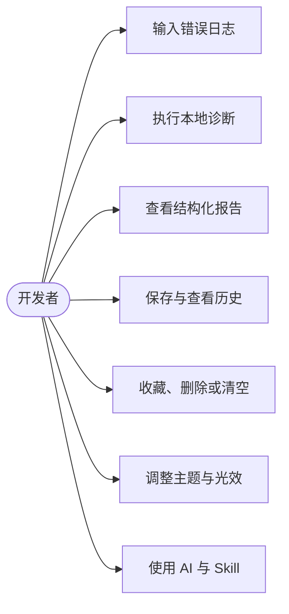
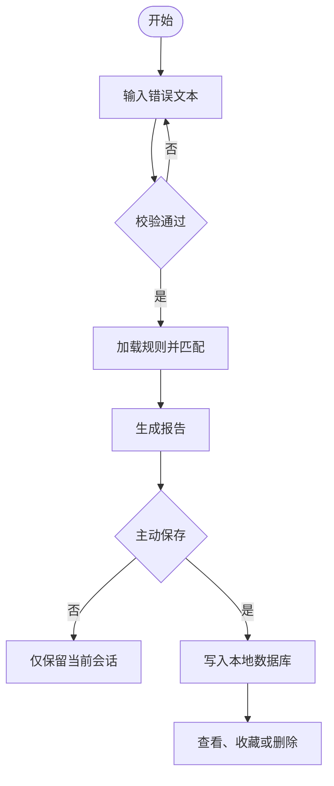
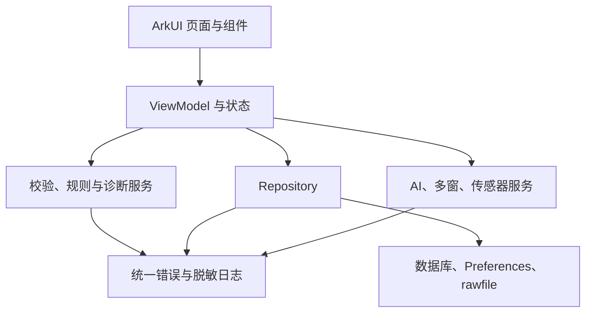
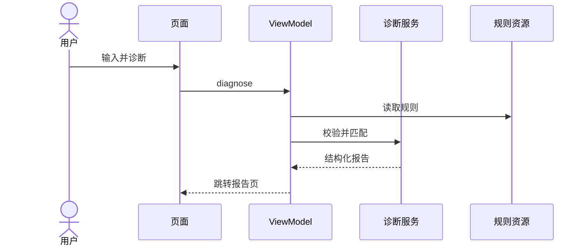
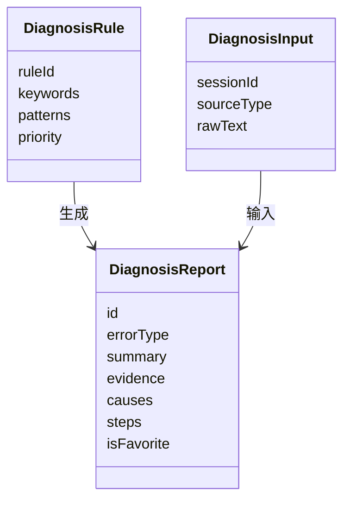
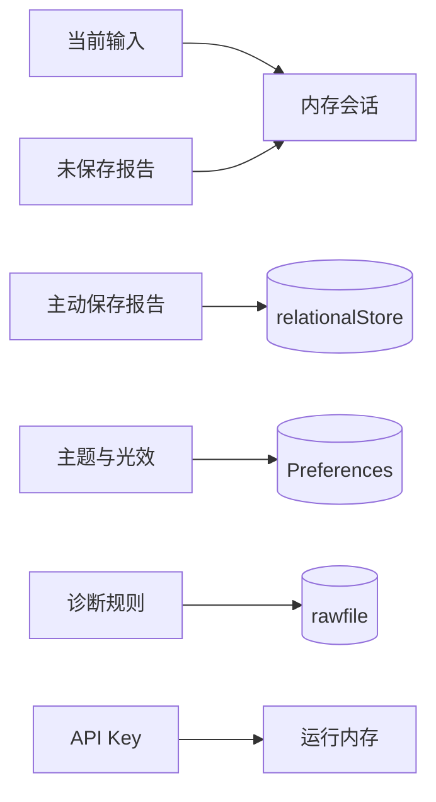
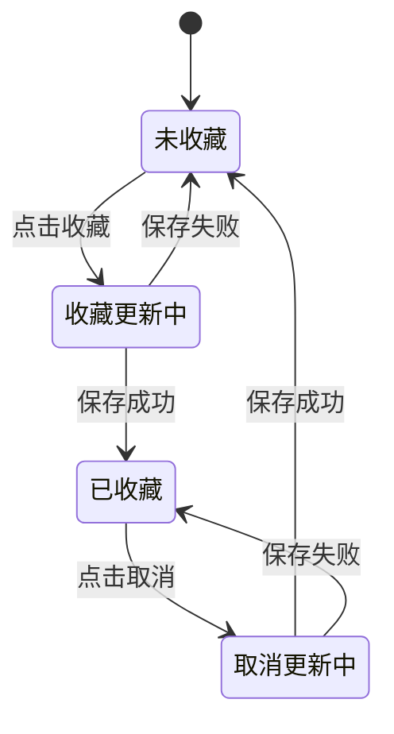
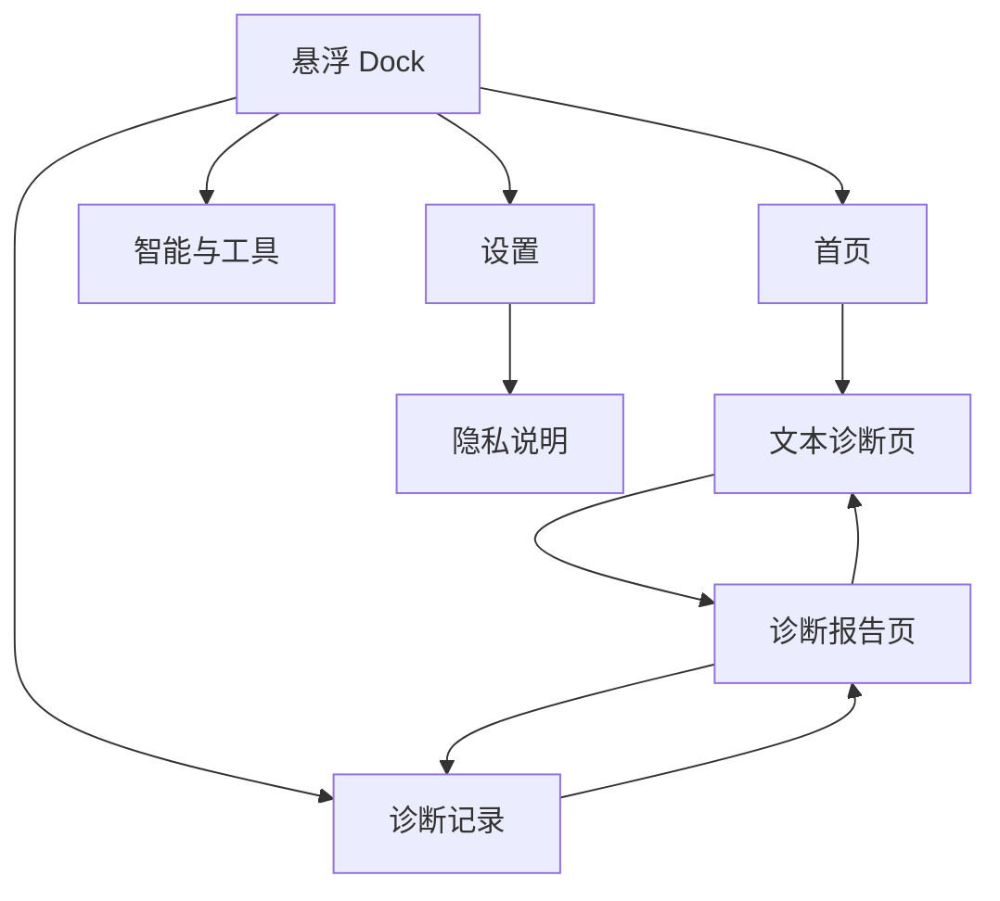
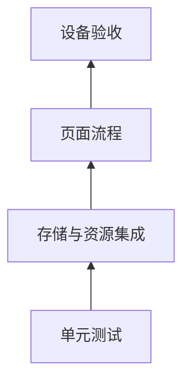
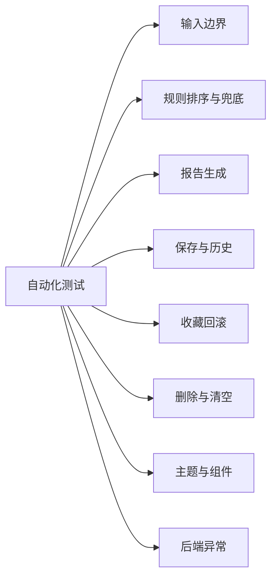

# 北京工业大学

# 2025—2026 学年第二学期课设报告

## 开发报错诊断助手——HarmonyOS 报错日志诊断工具

| 项目 | 内容 |
| --- | --- |
| 课程 | 移动软件开发 |
| 专业 | 软件工程（实验班，待核对） |
| 组别 | 待填写 |
| 组长 | 学号、姓名待填写 |
| 成员 | 学号、姓名待填写 |
| 指导教师 | 贺国平、王岚 |

## 目录

1. 绪论
2. 系统的需求分析
3. 系统设计与实现
4. 系统测试
5. 总结

# 1．绪论

## 1.1 系统的主要内容

HarmonyOS 学习者常遇到 ArkTS 类型错误、Hvigor 构建失败和 OHPM 依赖异常。原始日志长、包装层多，初学者容易只处理末尾的 `BUILD FAILED`，无法找到最早根因。本项目实现“开发报错诊断助手”，把错误文本转换为包含分类、证据、原因、步骤和风险的结构化报告，并支持保存、历史、收藏、删除、设置及 AI 辅助。核心诊断本地运行，断网时仍可使用。

系统功能闭环如图 1.1 所示。

**图 1.1 系统功能闭环**

## 1.2 系统涉及的技术知识点

项目使用 DevEco Studio 26.0.0.461、HarmonyOS SDK 26.0.0.23 和 API 26，采用 Stage 模型、ArkTS 与 ArkUI。Navigation 管理页面流程；ViewModel 管理状态；relationalStore 保存报告；Preferences 保存主题设置；rawfile 保存诊断规则。网络增强使用 OpenAI 兼容接口和零依赖 Node.js 本地后端。平台异常统一转换为 `AppError`，敏感文本不写日志。

# 2．系统的需求分析

## 2.1 用户与场景

目标用户是 HarmonyOS 学习者和初级开发者。典型场景是从 DevEco Studio 或终端复制错误，粘贴到应用后获得排查建议；用户可主动保存有价值的报告，之后从历史记录重新打开、收藏或删除。

主要用户行为如图 2.1 所示。

**图 2.1 系统用户用例图**

## 2.2 功能需求

P0 是首个稳定基线，P1 是课程第一版增强交付。系统重点需求如下。

**表 2.1 主要功能需求与完成状态**

| 功能 | 优先级 | 当前状态 |
| --- | --- | --- |
| 文本输入、校验和规则诊断 | P0 | 已实现 |
| 结构化报告 | P0 | 已实现 |
| 保存、历史、收藏、删除、清空 | P0 | 已实现 |
| 主题、字号、光效和隐私说明 | P0 | 已实现 |
| JSON、HTTP 工具 | P0 | 基础功能已实现 |
| AI、Agent、Skill、多窗、传感器 | 增强 | 已实现 |
| OCR、Form、NLP、数据增强 | P1 | 未纳入完成成果 |

核心业务流程如图 2.2 所示。

**图 2.2 核心业务流程**

## 2.3 非功能需求

系统要求核心入口不等待数据库；长操作显示加载状态并防止重复提交；页面不得直接访问网络和数据库；增强能力失败不得阻塞本地诊断。原始输入默认只在内存，报告仅在用户主动保存后持久化，API Key 只保存在本次运行内存。手机是主要目标设备，长内容必须可滚动，并支持深浅主题和大字号。

# 3．系统设计与实现

## 3.1 总体架构

系统采用分层单体架构。页面只渲染状态和转发事件；ViewModel 编排流程；领域服务完成校验和诊断；Repository 执行数据策略；Storage 封装平台存储。依赖方向单一，便于替换平台能力和单元测试。

系统总体架构如图 3.1 所示。

**图 3.1 系统总体架构**

## 3.2 核心模块实现

诊断页先去除首尾空白，检查空输入和 100000 个 UTF-16 单元上限。`RuleMatcher` 对 12 条版本化规则执行关键词和正则匹配，按优先级降序、规则编号升序稳定排序；最高项作为主类型，其余转为次要标签；无专用命中时使用通用兜底。`LocalDiagnosisService` 生成摘要、证据、原因、步骤、风险和引擎版本。该过程不依赖网络，相同输入与规则版本可得到稳定分类。

报告页支持当前会话和历史记录两种来源，统一展示结论、证据、原因、步骤、风险及原文。路由只传递 `sessionId` 或 `reportId`，不传递大段日志。输入失败保留原文，诊断中禁止重复提交，返回修改时会话仍可恢复。

文本诊断的层间调用如图 3.2 所示。

**图 3.2 文本诊断时序图**

## 3.3 数据与历史管理

未保存输入和报告存于 `DiagnosisSessionStore`；已保存报告进入 relationalStore；主题、字号和光效进入 Preferences。保存前按报告 ID 去重，最多保留 200 条，超限时淘汰最早未收藏记录。收藏按钮先即时改变文案和颜色，持久化失败再回滚。单条删除和清空全部均需二次确认，数据库失败时列表保持原状。

核心数据关系如图 3.3 所示。

**图 3.3 核心数据模型**

不同数据按照生命周期分配存储，流向如图 3.4 所示。

**图 3.4 数据存储流向图**

收藏操作采用即时反馈和失败回滚，状态变化如图 3.5 所示。

**图 3.5 收藏状态图**

## 3.4 页面与交互

底部悬浮 Dock 提供首页、智能、记录和设置四个入口。界面固定采用灰蓝、鼠尾草绿和陶土红，分别表示主要、收藏和危险操作；半透明底色、边框、阴影与按压缩放形成发光玻璃效果。主题支持 SYSTEM、LIGHT、DARK，光效支持 FULL、REDUCED、OFF。加载、空数据、错误、重试和确认由公共组件统一展示，状态同时使用文字和颜色表达。

主要页面导航关系如图 3.6 所示。

**图 3.6 页面导航图**

> 图 3.7：首页与悬浮 Dock（插入最终截图）  
> 图 3.8：文本输入页（插入最终截图）  
> 图 3.9：结构化报告页（插入最终截图）  
> 图 3.10：历史与收藏状态（插入最终截图）  
> 图 3.11：主题与光效设置（插入最终截图）

## 3.5 增强能力与安全

智能页支持 OpenAI 兼容服务和本地后端。Agent 按“规划—Skill 路由—执行—验证”展示过程，Skill 包含 JSON Formatter、Error Triage、Report Writer 和 Privacy Redactor。多窗服务管理诊断子窗，互动卡片接入加速度传感器并保留点击替代。这些增强失败时均回退到本地规则流程。

网络请求只在用户主动发送后发生，API Key 不持久化。日志仅记录领域、事件、结果和错误码，禁止写入原始日志、图片 URI、Token、Authorization 和本机路径。OCR、Form Kit、Natural Language Kit 与 Data Augmentation Kit 尚无完整设备证据，不作为本报告完成成果。

# 4．系统测试

## 4.1 测试环境与策略

测试环境为 Windows、DevEco Studio 26.0.0.461、API 26、Hvigor 6.26.1、OHPM 26.0.0.410 和 Pura 90 Pro API 26 模拟器。测试按模型与服务、Repository 与存储、页面流程、设备验收分层执行。

测试层次如图 4.1 所示。

**图 4.1 测试层次**

主要测试对象如图 4.2 所示。

**图 4.2 测试覆盖范围**

## 4.2 测试结果

**表 4.1 自动化测试与构建结果**

| 项目 | 实际结果 |
| --- | --- |
| HarmonyOS Local Test | 330 项通过，失败 0，错误 0 |
| Debug HAP 构建 | `BUILD SUCCESSFUL` |
| ArkTS 编译 | `CompileArkTS` 完成 |
| Node.js 后端 | 13 项测试通过 |
| 覆盖率 | 行 65.69%，函数 58.11%，分支 59.12% |

测试覆盖输入边界、规则排序和兜底、报告生成、路由参数、重复保存、最近记录、200 条上限、收藏回滚、删除、清空、数据库损坏、主题恢复、按钮防重复及后端异常。当前核心逻辑和构建通过；正式提交前仍需补充最终模拟器连续截图、平板与无障碍验收，并处理部分 API 弃用和命令行签名警告。

> 图 4.3：Local Test 330 项通过截图（待插入）  
> 图 4.4：Debug HAP 构建成功截图（待插入）  
> 图 4.5：模拟器核心流程运行截图（待插入）

# 5．总结

## 5.1 项目总结

项目完成了“输入—诊断—报告—保存—历史复用”闭环，可识别 ArkTS、Hvigor、OHPM、JSON、HTTP、网络、权限和空值等错误。分层架构隔离页面、业务和存储，本地规则保证断网可用；AI、Agent、Skill、多窗和传感器提供增强体验。统一状态、失败回滚、敏感日志禁写和莫兰迪玻璃界面提高了稳定性、隐私性与可演示性。后续重点是补充设备验收、扩充真实规则样例并完善 JSON/HTTP 工具。

## 5.2 成员个人总结

### 姓名、学号待填写（诊断核心方向）

本人负责需求设计、输入校验、规则匹配和报告生成。通过稳定排序、通用兜底和可注入时间与 ID 解决多规则结果不稳定问题，掌握了 ArkTS 类型设计、依赖注入、TDD 和隐私日志边界。

### 姓名、学号待填写（数据与界面方向）

本人负责工程基础、数据库、Repository、Navigation、主题和历史交互。通过保存去重、收藏即时反馈与失败回滚、删除确认和公共状态组件保证数据与页面一致，掌握了 relationalStore、Preferences 和 ArkUI 响应式设计。
