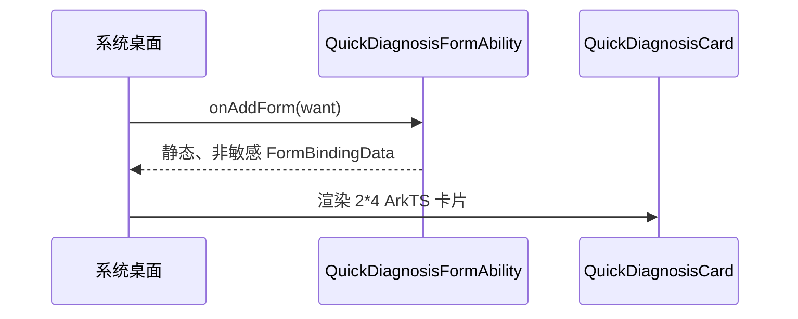
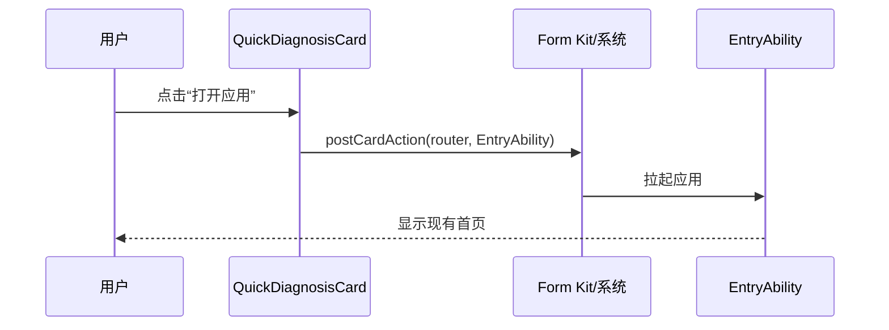

# Form Kit 最小服务卡片设计

## 1. 目标

为“开发报错诊断助手”增加一个可编译的 Form Kit 桌面服务卡片原型，验证当前 API 26 Stage 工程具备服务卡片的标准工程结构，并为后续最近诊断摘要与快捷入口留下稳定扩展点。

本原型只证明卡片能够被工程声明、渲染并通过标准动作拉起应用，不代表需求规格中完整的 P1 服务卡片已经交付。

## 2. 已确认方案

采用单一 `2*4` ArkTS 动态卡片：

- 默认且唯一支持尺寸为 `2*4`；
- 展示应用名称、快速诊断入口说明和“打开应用”操作；
- 点击操作后通过 Form Kit 标准卡片动作拉起 `EntryAbility`；
- `EntryAbility` 按现有行为加载首页，不新增独立页面组；
- 视觉使用当前项目的莫兰迪灰蓝、圆角和清晰层级，但不依赖沉浸光感；
- 卡片不读取报告数据库，不展示伪造的最近诊断记录。

选择 `2*4` 而不是 `2*2`，是因为该尺寸既能保持原型简单，也能在后续不更换主尺寸的前提下容纳错误类别、摘要、时间和三个快捷入口。当前不同时实现多尺寸，避免为原型维护重复布局。

## 3. 范围

### 3.1 本次包含

1. 在 entry 模块注册一个 `form` 类型的 `FormExtensionAbility`。
2. 增加 Form Kit profile，声明 ArkTS、动态卡片、自动颜色模式、`2*4` 尺寸和关闭周期刷新。
3. 增加卡片 ArkTS 页面。
4. 在 `onAddForm` 中返回最小、非敏感的静态绑定数据。
5. 卡片提供“打开应用”动作，目标为现有 `EntryAbility`。
6. 添加配置、绑定数据和卡片入口的最小自动化测试。
7. 执行 Local Test、ArkTS Linter 和 Debug HAP 构建。

### 3.2 本次不包含

- 不读取 `ReportRepository` 或 relationalStore；
- 不展示最近诊断类别、摘要和时间；
- 不实现“截图诊断”“文本诊断”“查看历史”三个定向入口；
- 不处理 Form Kit 冷启动路由参数；
- 不实现保存、删除后的主动卡片刷新；
- 不配置定时刷新、条件刷新或数据代理刷新；
- 不执行 OCR、本地诊断、网络请求或 AI 调用；
- 不增加 `2*2`、`4*4` 等其他尺寸；
- 不把服务卡片计入应用内页面组；
- 不要求本轮在桌面实际添加卡片或完成设备交互验收。

## 4. 工程结构

建议新增以下文件，名称可在不改变职责的前提下按 DevEco API 26 模板要求微调：

```text
entry/src/main/ets/form/
├── QuickDiagnosisFormAbility.ets
├── FormCardModels.ets
└── pages/
    └── QuickDiagnosisCard.ets

entry/src/main/resources/base/profile/
└── quick_diagnosis_form_config.json
```

同时修改：

```text
entry/src/main/module.json5
entry/src/main/resources/base/element/string.json
entry/src/test/
```

职责边界：

- `QuickDiagnosisFormAbility`：只管理卡片生命周期和最小绑定数据，不读取业务仓库。
- `FormCardModels`：定义卡片允许展示的非敏感字段和默认数据构造逻辑。
- `QuickDiagnosisCard`：只渲染绑定数据并发送标准拉起动作。
- profile：声明卡片名称、入口页面、尺寸、渲染语法、颜色模式和刷新策略。
- `EntryAbility`：保持现有首页加载逻辑；原型不为卡片增加 Want 参数解析。

## 5. 卡片内容与视觉

卡片从上到下包含：

1. 小型应用标识和“开发报错诊断助手”；
2. 主标题“快速诊断”；
3. 说明“从桌面进入本地报错分析”；
4. 一个明确的“打开应用”按钮或等价可点击区域；
5. 辅助说明“数据仅保存在本机”。

视觉要求：

- 使用低饱和灰蓝背景和深色主文字；
- 深色模式由卡片 `colorMode: auto` 和资源颜色适配，不依赖运行时主题仓库；
- 主要操作的点击目标不小于 44vp；
- 文字允许系统字号缩放，避免固定单行高度截断；
- 状态不能只依赖颜色表达；
- 不展示完整日志、截图 URI、报告 ID、文件路径、Token 或其他敏感数据。

## 6. 数据与交互流

### 6.1 添加卡片



绑定数据只包含：

- 应用展示名；
- 主标题；
- 简短说明；
- 操作文字；
- 本地隐私提示。

不包含报告对象或原始诊断文本。

### 6.2 拉起应用



如果系统无法拉起应用，由系统按标准方式处理；卡片不显示伪造的成功状态。

## 7. 刷新与异常处理

- profile 的 `updateEnabled` 设为 `false`，原型不声明周期刷新。
- `onUpdateForm` 不承担业务刷新；如果模板要求保留方法，只返回相同的静态安全数据。
- 构造绑定数据失败时使用内置安全文案，不读取或拼接异常详情。
- Form Kit 不可用或桌面不支持卡片时，现有应用图标和应用内功能保持不变。
- 卡片异常不得写入原始日志、用户输入或完整平台错误对象。

## 8. 测试设计

实现采用测试先行，至少覆盖：

1. 默认卡片数据只包含允许字段且不含原始日志、图片、报告 ID 和 URI。
2. 默认数据文案稳定、非空，并返回相互独立的对象。
3. Form profile 只有一个卡片声明，默认尺寸和支持尺寸均为 `2*4`。
4. profile 使用 `uiSyntax: arkts`、`isDynamic: true`、`colorMode: auto`、`updateEnabled: false`。
5. `module.json5` 注册 `form` 类型 ExtensionAbility，并通过 `$profile` 引用正确配置。
6. 卡片页面和 FormExtensionAbility 能通过 ArkTS 编译。
7. 现有 Local Test、Linter 和 Debug HAP 构建不回归。

本轮不声明“桌面卡片运行通过”。设备添加、显示、点击和宿主兼容性在后续完整 Form Kit 任务中验证。

## 9. 验收标准

满足以下条件时，本最小原型完成：

- entry 模块存在合法 FormExtensionAbility 声明；
- Form profile 通过当前 SDK Schema 与构建校验；
- `2*4` ArkTS 卡片页面能够编译；
- 静态绑定数据不包含敏感或业务数据；
- 卡片代码只发出打开 `EntryAbility` 的标准动作；
- 不引入数据库、Repository、OCR、网络或 AI 依赖；
- 相关测试通过，Linter 无新增缺陷，Debug HAP 构建成功；
- 文档明确标注设备运行状态仍为未验证。

## 10. 后续扩展边界

完整 P1 服务卡片应在独立任务中继续实现：

1. 通过专用 `FormSummaryService` 从 `ReportRepository.getRecent(1)` 生成脱敏摘要模型；
2. 报告保存、删除和清空提交成功后请求卡片刷新，刷新失败不回滚数据库操作；
3. 增加截图诊断、文本诊断和查看历史三个定向入口；
4. 在 `EntryAbility` 将受控的卡片参数转换为现有 `AppRouter` 参数；
5. 空历史显示真实空状态，刷新失败保留上一次有效摘要；
6. 在支持 Form Kit 的模拟器或真机验证添加、刷新、点击、冷启动和深色模式。

这些扩展不得修改本原型的隐私边界：服务卡片始终只展示错误类别、短摘要和时间，不展示完整日志、截图或敏感实体。
