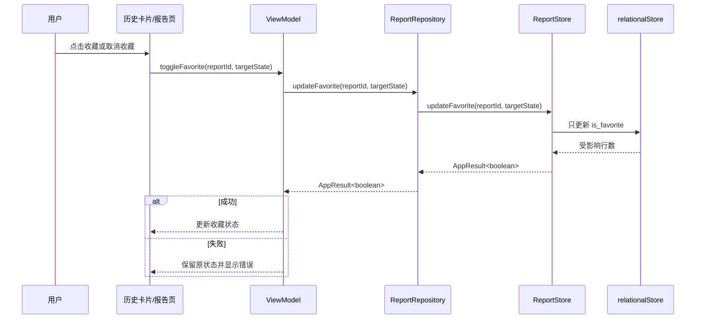

# 历史管理与收藏功能设计

## 1. 目标与范围

本次在当前 `develop2` 分支上完成两项能力：

1. 从旧提交 `7407c3f` 选择性恢复历史记录单条删除、清空全部、二次确认、失败保留与重试。
2. 增加收藏状态切换和本地持久化，使历史记录卡片与报告详情页能够收藏或取消收藏同一份报告。

本次不整体 cherry-pick 旧提交，不覆盖朋友后续加入的界面、AI、动效或运行时改动。收藏功能不包含搜索、分类筛选、收藏置顶、批量收藏或分享。OCR、JSON/HTTP 工具闭环、设备自动化测试、适配验收及 T20～T24 收口不在本次范围内。

## 2. 采用方案

采用“当前代码增量实现 + 旧提交选择性移植”。旧提交只作为已验证行为和测试用例的参考来源；每个改动都根据当前接口和页面结构重新落位。

不采用整体 cherry-pick，因为旧提交还修改了数据库映射、运行时和页面文件，而当前分支已经在这些位置加入朋友的新功能。也不重写历史模块，避免扩大范围。

## 3. 模块边界

### 3.1 数据访问层

`ReportDataStore` 和 `ReportStore` 提供按报告 ID 更新 `is_favorite` 的能力。更新只允许修改收藏列，不改报告正文、生成时间、保存时间或规则版本。

`DatabaseStore` 若缺少通用更新边界，则增加最小的、可测试的更新契约。SQL/关系存储细节不得进入 ViewModel 或页面。

### 3.2 Repository 层

`ReportRepository` 和 `LocalReportRepository` 增加：

```ts
updateFavorite(reportId: string, favorite: boolean): Promise<AppResult<boolean>>;
```

空白 ID 返回参数错误；报告不存在返回稳定的未找到结果；存储失败映射为统一错误。Repository 继续负责对象隔离和脱敏日志。现有历史上限策略保持不变：超过 200 条时优先淘汰最早的未收藏报告，不自动删除收藏记录。

### 3.3 ViewModel 层

`HistoryViewModel` 统一协调：

- 加载历史；
- 删除单条；
- 清空全部；
- 收藏或取消收藏；
- 操作失败后保留列表并允许重试；
- 成功后刷新首页最近记录。

收藏切换采用“持久化成功后更新页面状态”，避免数据库失败时 UI 显示虚假的收藏状态。并发变更期间拒绝重复提交。

报告详情使用现有 `ReportViewModel` 或等价的报告业务边界切换收藏，不允许页面直接调用数据库。成功后更新当前报告状态；失败时保留原状态。

### 3.4 页面与组件层

`HistoryReportCard` 增加可选的收藏、删除展示参数和事件。首页的紧凑卡片继续只负责打开报告，不显示危险删除操作；历史页面的完整卡片显示收藏和删除入口。

历史主页面与设置内历史页面保持一致：

- 点击收藏图标立即发起收藏状态切换；
- 点击删除先显示危险操作确认框；
- 点击“清空全部”先显示二次确认框；
- 取消确认不调用 Repository；
- 删除或清空失败时保留原列表并显示可重试错误；
- 删除最后一条或清空成功后展示空状态。

报告详情页提供收藏/取消收藏按钮，并展示当前状态。收藏记录仍按保存时间排序，不置顶。

## 4. 数据流

收藏流程：



删除和清空流程沿用旧提交的行为，但根据当前页面结构接入 `ConfirmActionDialog`：只有用户确认后才进入 ViewModel 和 Repository。

## 5. 错误与并发处理

- 删除、清空或收藏时使用独立的 mutation 状态，不覆盖历史加载状态。
- 同一时刻只执行一个历史变更，重复点击不重复写数据库。
- 删除失败不移除列表项；清空失败不清空列表；收藏失败不翻转图标。
- 页面销毁后忽略迟到的异步结果，不再写页面状态。
- 错误提示不包含报告原文、路径、账号、Token 或底层数据库细节。
- 首页刷新失败不回滚已经成功提交的删除、清空或收藏操作；首页下次出现时重新加载。

## 6. 测试设计

严格按测试驱动顺序实施。

### 6.1 数据层测试

- 收藏 `false → true` 和 `true → false` 后可重新读取；
- 更新不存在的报告返回 `false` 或稳定未找到语义；
- 数据库更新异常映射为存储写入错误；
- 收藏只修改 `is_favorite`，其他报告字段保持不变；
- 历史淘汰继续保护收藏记录。

### 6.2 ViewModel 测试

- 删除成功后只移除目标项并刷新首页；
- 删除失败保留列表，重试仍针对原报告；
- 取消删除不触发数据层调用；
- 清空成功进入空状态；
- 清空失败保留列表并可重试；
- 收藏成功更新目标项；
- 收藏失败保留原状态；
- 重复操作被拒绝；
- 页面销毁后迟到结果不更新状态。

### 6.3 页面和组件测试

- 完整历史卡片显示收藏和删除入口；
- 首页紧凑卡片不显示删除入口；
- 删除和清空均出现确认框；
- 取消确认不改变记录；
- 报告页收藏状态与持久化结果一致；
- 清空后显示空状态。

### 6.4 回归验证

- Local Test 全量通过；
- ArkTS Linter 无错误级缺陷；
- Debug HAP 构建成功；
- `git diff --check` 通过。

设备端自动化测试和 OCR 验证不作为本次完成门槛，仍按开发计划保留为后续任务。

## 7. 文档同步

实现和验证结束后更新 `docs/开发实施计划.md`：

- T16、T17 补充明确的完成状态；
- T19 只有在删除、清空、确认、失败处理和测试通过后标记完成；
- 收藏作为 P1 历史增强能力单独记录实际完成范围；
- T20～T24 保持当前真实状态，不因本次改动提前标记完成。

## 8. 验收标准

1. 用户能在历史页面删除单条记录，确认前不产生删除。
2. 用户能清空全部历史，确认前不产生清空。
3. 删除、清空失败时数据和页面列表不被错误修改，并能重试。
4. 用户能在历史卡片和报告详情页收藏或取消收藏。
5. 收藏状态重启应用后仍存在，且收藏记录受到现有历史淘汰策略保护。
6. 收藏不改变列表时间排序，不引入搜索和分类筛选。
7. 当前朋友代码和已有核心诊断流程不被覆盖，完整本地测试与构建通过。
