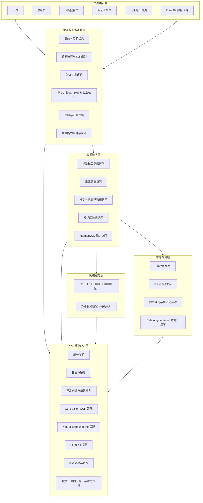
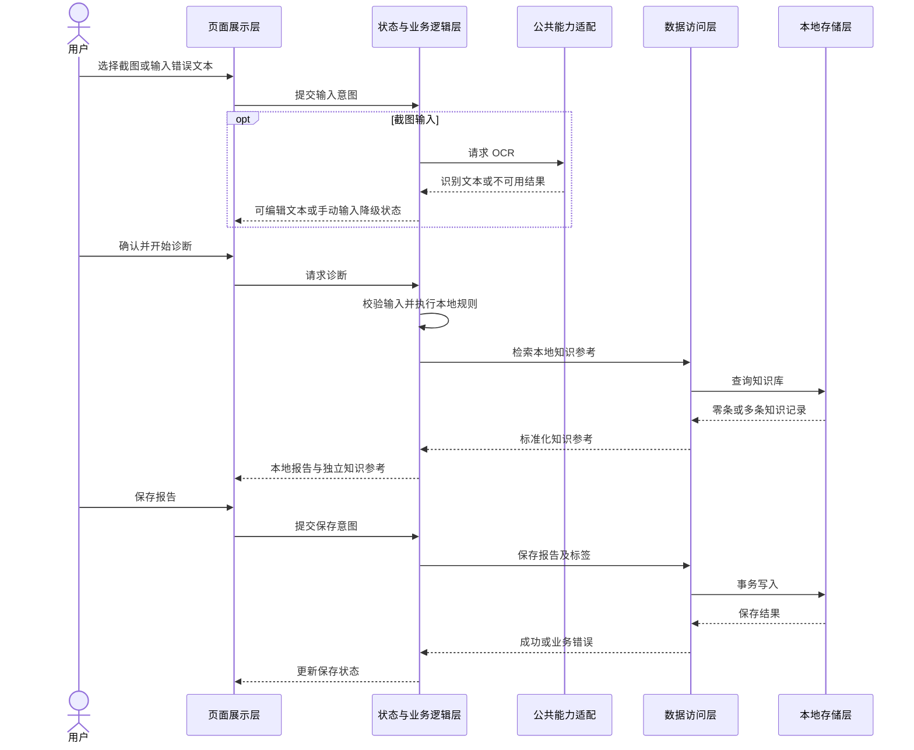
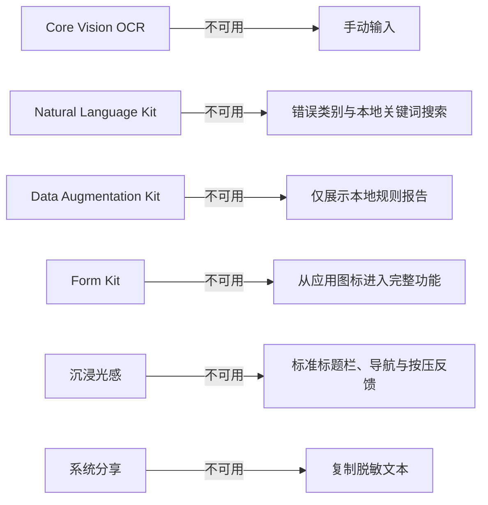
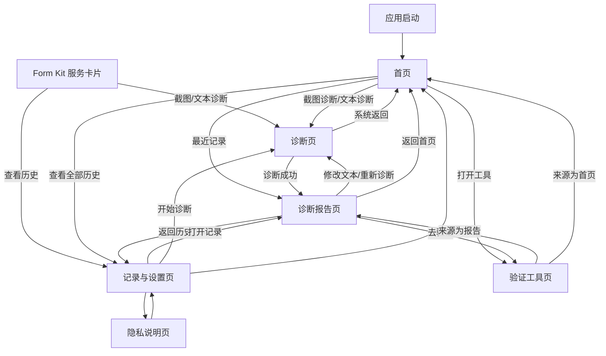
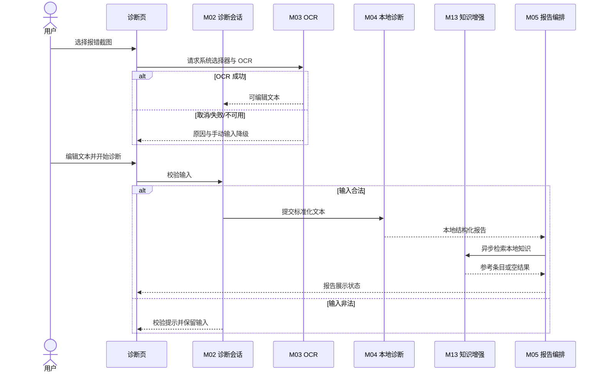
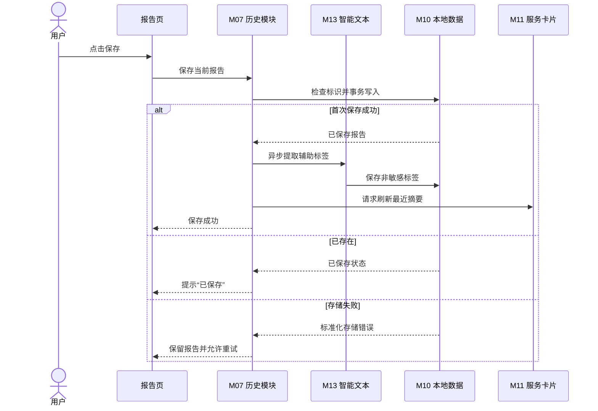
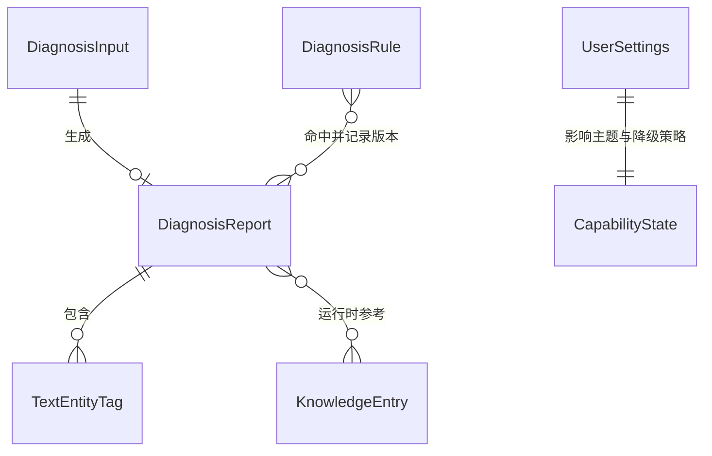

# 开发报错诊断助手概要设计说明书

> 文档版本：V1.1 草案
>
> 编写日期：2026-07-12
>
> 需求来源：`docs/development/需求规格说明书.md`
>
> 适用范围：课程项目第一版（P0 + P1）
>
> 技术基线：HarmonyOS 7（API 26）、ArkTS、ArkUI
>
> 文档说明：本文只描述系统级技术方案、模块边界和数据流，不涉及具体类、函数及代码实现。

## 1. 设计目标

### 1.1 系统核心目标

开发报错诊断助手面向学生开发者和初级软件开发者，提供离线优先、结果可解释、失败可降级的 HarmonyOS 报错诊断能力。系统需要实现以下核心目标：

1. 支持用户选择单张报错截图，通过 Core Vision OCR 提取文字，并允许用户在诊断前检查和编辑识别结果。
2. 支持用户直接输入或粘贴错误日志，在 OCR 不可用时仍可完成全部核心诊断流程。
3. 使用本地诊断规则识别 JSON、HTTP、网络、权限、空值、ArkTS、Hvigor、OHPM 等常见错误，输出包含证据、可能原因、排查步骤和风险提示的结构化报告。
4. 提供 JSON 验证、HTTP 状态码解释、URL 编解码、Base64 编解码和正则表达式测试等辅助工具。
5. 在本地保存用户主动确认的诊断报告，支持查看、搜索、筛选、收藏、删除、清空和分享前脱敏检查。
6. 集成 Form Kit、Natural Language Kit、Data Augmentation Kit 和沉浸光感等 HarmonyOS 能力，并保证增强能力不可用时核心流程仍可使用。
7. 支持手机和平板基础适配、深色模式和必要的无障碍能力，确保应用在课程指定环境中稳定运行和重复演示。

系统的核心业务闭环为：

```text
输入截图或错误文本
→ 获得并确认可编辑文本
→ 执行本地规则诊断
→ 检索本地知识库参考
→ 展示结构化诊断报告
→ 使用辅助工具验证
→ 保存、检索和复用历史报告
```

### 1.2 概要设计要解决的问题

概要设计需要在需求规格与后续详细设计之间建立稳定边界，重点解决以下问题：

- 明确页面、业务状态、诊断规则、数据访问、本地存储、网络服务和系统能力之间的职责边界，避免页面直接承担诊断、数据库或系统能力调用。
- 规定层间依赖方向和数据传递方式，防止循环依赖及跨层访问。
- 为 OCR、Natural Language Kit、Data Augmentation Kit、Form Kit 和沉浸光感建立可替换、可降级的能力边界。
- 区分临时诊断会话、已保存报告、应用设置、文本标签和只读知识数据的生命周期与存储方式。
- 统一导航、状态、日志、异常和异步任务的处理原则，避免返回后状态丢失、重复提交、无限加载和异常扩散。
- 为未来接入外部 AI、云同步或其他规则包保留扩展位置，同时不让尚未确认的能力增加第一版核心流程的复杂度。
- 建立与需求验收标准一致的测试边界，使核心规则、数据存储、系统能力降级和主要页面流程能够分别验证。

### 1.3 第一版设计范围

优先级口径统一为：P0 是首个稳定基线，必须先完成并独立通过验收；P1 是课程第一版的增强交付，在 P0 稳定后集成。课程第一版最低交付范围为全部 P0 和全部 P1 功能。

#### 1.3.1 P0 核心范围

- 首页及五个主要页面组的导航与返回；
- 单张图片选择、Core Vision OCR 和手动输入降级；
- 错误文本输入、编辑、校验和会话内保留；
- 本地错误分类、通用错误兜底和结构化诊断报告；
- JSON 验证和 HTTP 状态码解释；
- 报告保存、查看、单条删除和清空；
- 主题设置及其持久化；
- 空状态、加载状态、错误状态和权限不足状态；
- 断网可用、手机和平板基础适配。

#### 1.3.2 P1 增强范围

- 历史记录搜索、分类筛选、收藏和收藏优先展示；
- 报告复制、系统分享、分享预览及敏感信息提示；
- URL 编解码、Base64 编解码和正则表达式测试；
- Form Kit 桌面服务卡片；
- Natural Language Kit 辅助标签、搜索和隐私提示；
- Data Augmentation Kit 本地错误知识库；
- 沉浸光感核心交互视觉增强及标准样式降级。

Data Augmentation Kit 在需求规格、概要设计和详细设计中统一按 P1 管理。

#### 1.3.3 第一版范围之外

- 用户账号、角色权限、付费和广告；
- 后端服务器、云端数据库和跨设备同步；
- GitHub、Gitee 或其他代码仓库的直接读写；
- 自动执行日志中的命令、远程编译和自动修改用户代码；
- 外部大模型补充诊断；
- 用户自定义诊断规则和批量截图诊断。

上述能力如进入后续版本，应先完成需求变更和独立设计，不在第一版中保留不可操作的空入口。

### 1.4 设计原则

#### 1.4.1 离线优先

P0 和 P1 的核心诊断、验证工具、历史记录和设置不依赖外部网络。网络服务失败或完全不可用时，用户仍能完成核心闭环。

#### 1.4.2 单向依赖

高层业务规则不依赖具体页面、数据库或系统能力实现。页面通过状态与业务逻辑层发出操作，数据访问层负责选择数据来源，底层结果再向上转换为页面状态。

#### 1.4.3 模块解耦

诊断、工具、历史、设置和 HarmonyOS 增强能力具有明确边界。OCR、自然语言处理、知识库和服务卡片通过独立能力接口接入，禁止系统能力调用散落在多个页面中。

#### 1.4.4 稳定核心、增强可降级

本地文本诊断是始终可用的核心路径。Core Vision OCR、Form Kit、Natural Language Kit、Data Augmentation Kit 和沉浸光感均不得成为核心业务的唯一入口；初始化或调用失败时必须回退到标准功能。

#### 1.4.5 单一数据来源

每类数据只能由一个明确模块负责维护。诊断会话由诊断状态模块维护，已保存报告由历史数据仓库维护，主题等设置由设置数据仓库维护，页面不得保存相互冲突的副本。

#### 1.4.6 易维护与易测试

本地诊断规则、HTTP 状态码资料、UI 文案和知识条目集中管理并带版本信息。业务规则应能脱离页面进行测试，数据访问和系统能力应能在测试中替换为受控实现。

#### 1.4.7 易扩展但不过度设计

第一版采用单 HAP 的模块化单体结构，不因未来可能出现的需求提前拆分 HAR、HSP 或远程服务。后续只有在复用、独立发布或团队并行开发需求明确时再进行工程级拆分。

#### 1.4.8 隐私与最小权限

系统只读取用户主动选择的图片，不保存原始截图，不执行日志内容，不在日志中记录完整诊断文本、Token、密码或内部地址。权限在用户触发对应功能时按需申请。

## 2. 技术选型

### 2.1 HarmonyOS 开发模式

| 项目 | 选型 | 选择原因 |
| --- | --- | --- |
| 应用模型 | Stage 模型 | Stage 模型是当前 HarmonyOS 应用开发的主要模型，适合管理 UIAbility 生命周期、页面启动和服务卡片拉起场景。 |
| 工程形态 | 单 HAP、模块化单体 | 当前主要由个人开发，单 HAP 可以降低构建、签名和模块通信复杂度；通过内部清晰分层保持可维护性。 |
| 开发工具 | 最新稳定版 DevEco Studio | 满足课程要求，并与 API 26 SDK、模拟器、调试和测试工具保持一致。具体 DevEco Studio 构建版本待创建工程后记录。 |
| 设备范围 | 手机为主要目标，兼顾平板 | 对应课程的鸿蒙移动应用要求，同时满足需求中的手机和平板基础适配。 |

暂不拆分 HAR 或 HSP。若后续出现跨 HAP 复用、独立发布或明显的构建隔离需求，再单独评估模块拆分。

### 2.2 ArkTS 与 ArkUI

项目使用 ArkTS 作为业务和界面开发语言，使用 ArkUI 声明式 UI 构建页面。

选择原因：

- 符合课程指定的 ArkTS 开发要求；
- ArkTS 的静态类型和编译期检查有助于降低诊断数据结构、异步状态和页面参数的运行时错误；
- ArkUI 的声明式开发方式适合由状态驱动空闲、加载、成功、失败和降级等多种页面状态；
- ArkUI 支持响应式布局、主题适配、无障碍属性和多设备界面适配；
- 与 Core Vision、Form Kit、Natural Language Kit、Data Augmentation Kit 等系统能力的 ArkTS 接口保持统一技术栈。

### 2.3 API Version

推荐以 HarmonyOS 7（API 26）作为第一版的编译、目标和主要验证基线。

选择原因：

- 满足课程“SDK/API 26 或以上”的硬性要求；
- API 26 是 HarmonyOS 7 新能力的目标版本，适合验证沉浸光感和 AI 相关开放能力；
- 统一使用 API 26 可以减少开发环境、模拟器和答辩设备之间的差异。

工程创建时应记录实际的 `compileSdkVersion`、`compatibleSdkVersion`、`targetSdkVersion` 和 SDK 补丁版本。各字段是否全部固定为 26，需要根据最新版 DevEco Studio 创建模板、课程演示设备和所有 P1 能力的最低版本要求确认，当前标记为**待确认**。如果课程设备只支持 API 26 的特定版本，应以可安装、可运行、可演示为最终选择标准。

### 2.4 页面路由方案

项目采用 ArkUI `Navigation` 作为统一页面路由和返回栈管理方案。

选择原因：

- 适合首页、诊断页、报告页、工具页、历史与设置页之间的多层跳转；
- 能统一处理系统返回、页面参数、返回来源和导航栈恢复；
- 便于从诊断报告携带文本进入验证工具，并在返回时保留原报告；
- 便于处理 Form Kit 服务卡片拉起应用后跳转到截图诊断、文本诊断或历史记录等目标页面；
- 比分散的页面跳转调用更容易测试和维护。

路由层只传递页面定位所需的轻量参数或本地数据标识，不传递大段日志、图片内容或完整报告对象。报告详情优先根据会话状态或报告标识读取，避免导航参数成为第二份数据源。

服务卡片的具体拉起参数格式、目标页面恢复方式和冷启动行为需在 API 26 设备上验证，标记为**待确认**。

### 2.5 状态管理方案

推荐使用 ArkUI 状态管理 V2，并按状态作用域分为三类：

1. 页面局部状态：输入框内容、选中的工具页签、弹窗开关和当前加载提示等，只在单个页面或组件树中有效。
2. 业务会话状态：当前诊断输入、OCR 状态、未保存报告、工具返回来源和一次性操作结果，由对应业务状态模块维护。
3. 应用级状态：主题模式、增强能力可用性和必要的全局导航信息，由应用级状态容器维护。

选择原因：

- 状态管理 V2 适合新建 ArkUI 工程，能够通过明确的数据所有权驱动界面刷新；
- 有助于区分临时会话与持久化数据，避免把数据库内容复制为多个互相冲突的页面状态；
- 便于禁止 OCR、诊断、保存和删除等操作的重复提交；
- 可以在系统能力失败时将页面稳定切换到降级状态，而不是由异常直接控制 UI。

状态管理 V2 的具体装饰器组合以及与 API 26 工程模板的兼容情况，应以实际 SDK 文档和工程验证结果为准，标记为**待确认**。无论采用何种具体装饰器，均应保持单向状态更新和单一数据来源原则。

### 2.6 网络请求方案

项目保留独立网络服务层，计划使用 HarmonyOS 官方 HTTP 请求能力，并在其上建立统一的请求配置、超时、取消、错误转换和日志策略。

选择原因：

- 使用系统官方能力可以减少第三方依赖和适配风险；
- 统一封装能够避免页面直接发起请求，并为未来外部 AI 或云服务提供稳定边界；
- 便于统一实施超时、取消、有限重试和敏感信息保护。

第一版 P0 和 P1 均按离线可用设计，目前没有必须访问外部服务器的业务。Data Augmentation Kit 使用本地知识库，Natural Language Kit 的结果用于本地标签和隐私提示。因此第一版网络层不参与核心诊断流程，也不应为了保留扩展能力而申请不必要的网络权限。

以下内容均标记为**待确认**：

- 是否在后续版本启用外部 AI 或其他云服务；
- 服务提供方、基础地址、鉴权方式和证书策略；
- 各类请求的超时和最大重试次数；
- 用户授权、上传内容范围和脱敏规则；
- 是否需要网络缓存。

### 2.7 本地数据存储方案

根据数据规模、查询方式和生命周期，采用组合存储方案。

| 数据类型 | 推荐方案 | 选择原因 |
| --- | --- | --- |
| 主题、首次启动等少量设置 | Preferences | 数据量小、键值结构稳定，适合立即读写和应用重启恢复。 |
| 诊断报告、收藏状态、搜索标签 | relationalStore | 需要排序、筛选、搜索、数量限制、关联删除和事务一致性，关系型存储更适合持续增长的结构化记录。 |
| 诊断规则、HTTP 状态码资料 | 应用内置只读资源 | 内容随应用版本发布，普通用户不可修改，集中维护可避免散落在页面中。 |
| Data Augmentation Kit 知识条目 | 独立本地知识库资源及能力适配层 | 与用户历史隔离，支持按版本发布、检索和不可用时降级。 |
| 当前诊断输入和未保存报告 | 内存中的业务会话状态 | 默认不持久化，防止用户未确认的数据被长期保存。 |
| 原始截图 | 不持久化 | 满足隐私和需求约束，只在当前 OCR 会话中使用系统返回的临时访问地址。 |

存储设计遵循以下原则：

- 报告只在用户主动保存后写入持久化存储；
- 保存报告及其标签时保持一致性，删除报告时同步删除关联标签；
- 同一报告重复保存不能产生重复记录；
- 历史记录达到 200 条时优先淘汰最早且未收藏的记录；
- 收藏记录是否永久不参与自动淘汰，按当前需求暂定为“是”，最终标记为**待确认**；
- 历史全文搜索范围、索引方式和 Natural Language Kit 长文本处理上限标记为**待确认**；
- 数据表结构、字段约束、迁移版本和索引属于详细设计内容，不在本文展开。

### 2.8 日志和异常处理方案

#### 2.8.1 日志方案

公共基础能力层提供统一日志入口，底层使用 HarmonyOS HiLog。日志按调试、信息、警告和错误等级输出，并至少区分以下业务域：

- 应用启动与导航；
- OCR 和图片读取；
- 本地诊断与知识库检索；
- 验证工具；
- 历史记录与设置存储；
- Form Kit、Natural Language Kit、Data Augmentation Kit 和沉浸光感；
- 网络服务。

生产或答辩构建不得记录完整原始日志、原始截图、Token、密码、密钥、Authorization 内容或内部地址。日志只记录必要的操作标识、结果类型、耗时、能力可用状态和脱敏后的错误摘要。

#### 2.8.2 异常处理方案

异常分为输入校验错误、业务可预期错误、系统能力不可用、存储错误、网络错误和未知系统错误。底层异常必须先转换为稳定的业务错误，再由业务状态层决定页面展示内容。

处理原则如下：

- 输入错误在当前页面就近提示，不清空用户输入；
- OCR 失败、取消或超时后停止加载，并保留手动输入路径；
- 数据读取失败不删除已有数据，删除失败不提前从页面移除记录；
- 增强能力失败只关闭对应增强区域，不中断本地诊断报告；
- 异步操作无论成功或失败都必须进入结束状态；
- 网络请求必须支持超时和取消，只允许对明确可重试的失败进行有限重试；
- 未知异常显示可理解的通用提示，详细信息只写入脱敏日志；
- 页面销毁后，不再用过期异步结果更新页面状态。

### 2.9 测试方案

采用“业务单元测试 + 数据与能力集成测试 + 页面流程测试 + 设备验收”的分层测试策略。

| 测试层次 | 主要范围 | 推荐方式 |
| --- | --- | --- |
| 单元测试 | 输入校验、错误分类、规则优先级、报告生成、JSON/URL/Base64/正则处理、HTTP 状态码分类、脱敏规则 | DevEco Studio Local Test |
| 数据集成测试 | 报告保存、重复保存、收藏、标签关联、删除、清空、200 条淘汰、Preferences 设置恢复 | Instrument Test 或目标环境集成测试 |
| 能力适配测试 | Core Vision OCR、Natural Language Kit、Data Augmentation Kit、Form Kit 刷新与拉起、增强能力降级 | 模拟能力测试与 API 26 模拟器/真机验证相结合 |
| UI 流程测试 | 首页导航、截图/文本诊断、报告保存、工具返回、历史搜索、主题切换和错误状态 | DevEco Studio UI 测试或 Hypium 自动化测试 |
| 非功能测试 | 冷启动、长文本、连续诊断、断网、横竖屏、1.5 倍字体、深色模式和异常恢复 | 手工验收、自动化回归及 DevEco Testing |

测试优先覆盖需求规格说明书中的十三项 P0 验收标准，并为全部 P1 能力补充成功、不可用、失败和降级用例。最终至少在 API 26 手机模拟器和平板模拟器上完成回归；Core Vision OCR、Form Kit、Natural Language Kit、Data Augmentation Kit 和沉浸光感还应在支持 API 26 的真机或官方远程真机上逐项验证。

以下测试环境信息标记为**待确认**：

- 最终 DevEco Studio、SDK 和模拟器的完整版本号；
- 答辩使用的具体设备型号；
- API 26 远程真机的可用时间和型号；
- 各 P1 系统能力在模拟器上的支持范围；
- 自动化测试覆盖率目标。

## 3. 系统总体架构

### 3.1 架构风格

系统采用分层模块化单体架构。在单个 HAP 内按职责划分页面展示层、状态与业务逻辑层、数据访问层、网络服务层、本地存储层和公共基础能力层，并在各层内部按首页、诊断、报告、工具、历史、设置和增强能力组织功能。

该结构在个人开发场景下保持工程简单，同时能够隔离变化频繁的页面与系统能力，避免业务规则依赖具体 UI、数据库或网络实现。

### 3.2 总体分层



### 3.3 各层职责

#### 3.3.1 页面展示层

职责：

- 展示页面、服务卡片、表单、列表、报告和用户反馈；
- 将用户点击、输入、返回和确认等行为转换为业务意图；
- 根据状态与业务逻辑层提供的状态展示空闲、加载、成功、失败和降级界面；
- 负责响应式布局、主题、无障碍描述和沉浸光感的视觉呈现。

依赖关系：只依赖状态与业务逻辑层及公共导航、主题等展示相关能力，不直接访问数据库、HTTP、OCR、知识库或系统分享能力。

#### 3.3.2 状态与业务逻辑层

职责：

- 管理诊断会话、页面操作状态和应用级状态；
- 校验输入并编排 OCR、诊断、知识库检索、报告保存、验证工具和分享流程；
- 执行本地诊断规则和通用错误兜底；
- 控制异步任务的开始、成功、失败、取消和结束状态；
- 防止重复诊断、重复保存和重复删除；
- 根据能力检测结果选择标准路径或降级路径。

依赖关系：依赖数据访问层提供的数据操作抽象，并使用公共基础能力；不依赖具体页面和具体存储实现。

#### 3.3.3 数据访问层

职责：

- 为业务层提供统一的数据读取、写入、搜索和删除入口；
- 隔离 Preferences、relationalStore、内置资源、本地知识库和未来远程服务的差异；
- 维护保存报告与标签、删除报告与关联数据等一致性；
- 负责数据对象与存储对象之间的转换；
- 根据业务需要组合本地数据和增强能力结果，但不得改变本地诊断结论。

依赖关系：依赖本地存储层、网络服务层和公共能力适配，不依赖页面展示层。

#### 3.3.4 网络服务层

职责：

- 统一管理 HTTP 请求、超时、取消、有限重试和错误转换；
- 隔离未来外部 AI 或云服务的提供方差异；
- 负责网络请求的最小必要日志和敏感信息保护。

依赖关系：只能被数据访问层调用，不能由页面直接使用。第一版没有确定的联网业务，因此该层处于预留状态，不进入 P0/P1 核心链路。

#### 3.3.5 本地存储层

职责：

- 使用 Preferences 保存轻量设置；
- 使用 relationalStore 保存报告、收藏状态和搜索标签；
- 提供内置诊断规则、HTTP 状态码和 UI 基础文案；
- 提供 Data Augmentation Kit 使用的本地知识资源；
- 执行必要的事务、数据版本识别和存储错误上报。

依赖关系：由数据访问层统一访问，不向页面暴露具体存储结构。

#### 3.3.6 公共基础能力层

职责：

- 提供统一导航、日志、脱敏、错误分类、配置、时间和本地标识能力；
- 封装 Core Vision OCR、Natural Language Kit、Form Kit、沉浸光感及系统分享等平台能力；
- 检测设备和 API 能力，向上层返回标准化的可用、不可用和失败结果；
- 保证平台能力更换或降级时不改变核心业务层的调用语义。

依赖关系：作为基础设施被上层使用，但不反向依赖页面和具体业务流程。平台能力适配之间保持独立，禁止相互隐式调用。

### 3.4 依赖规则

系统依赖必须遵守以下规则：

1. 页面展示层只能向状态与业务逻辑层发出操作，不直接访问持久化或网络。
2. 状态与业务逻辑层通过数据访问抽象获取数据，不感知 relationalStore、Preferences 或 HTTP 的具体细节。
3. 数据访问层可以组合多个数据源，但不得包含页面展示逻辑。
4. 网络服务层和本地存储层互不依赖，二者只通过数据访问层进行协调。
5. 公共基础能力层不得持有具体页面状态，也不得反向调用页面。
6. P1 增强能力通过独立适配边界接入，禁用或失败后不得破坏 P0 本地诊断。
7. P2 外部 AI 如后续启用，只能作为本地报告之后的独立补充结果，不得覆盖本地诊断结论。

### 3.5 核心数据传递方向



数据从页面向下传递时表示用户意图，从底层向上返回时表示标准化结果或业务错误。底层不得直接修改页面；页面也不得持有与持久化数据相竞争的长期副本。

### 3.6 关键业务模块与架构映射

| 业务模块 | 主要所在层 | 协作层 |
| --- | --- | --- |
| 首页与功能导航 | 页面展示层、状态与业务逻辑层 | 数据访问层、统一导航 |
| 截图选择与 OCR | 状态与业务逻辑层、公共能力层 | 页面展示层 |
| 文本输入与本地诊断 | 状态与业务逻辑层 | 规则数据访问、公共错误模型 |
| 诊断报告 | 页面展示层、状态与业务逻辑层 | 报告数据访问、知识库数据访问 |
| JSON/HTTP/扩展工具 | 状态与业务逻辑层 | 页面展示层、公共日志 |
| 历史、搜索和收藏 | 状态与业务逻辑层、数据访问层 | relationalStore、Natural Language Kit |
| 分享与脱敏 | 状态与业务逻辑层、公共能力层 | Natural Language Kit、本地脱敏规则 |
| 主题与设置 | 状态与业务逻辑层、数据访问层 | Preferences、页面展示层 |
| Form Kit 服务卡片 | 页面展示层、公共能力层 | 报告数据访问、统一导航 |
| Data Augmentation 知识库 | 数据访问层、公共能力层 | 本地知识存储、诊断报告 |
| 沉浸光感 | 页面展示层、公共能力层 | 主题和能力检测 |

### 3.7 增强能力降级关系



所有增强能力都必须先检测设备与 API 支持情况，并将不可用视为可预期状态，而不是应用级故障。

### 3.8 主要待确认事项

概要设计保留以下待确认项，不在本阶段随意假设：

1. DevEco Studio、API 26 SDK、模拟器和答辩设备的完整版本号。
2. 工程中各 SDK 版本字段的最终取值及 API 26 补丁版本。
3. Core Vision OCR、Form Kit、Natural Language Kit、Data Augmentation Kit 和沉浸光感在目标模拟器及真机上的实际支持范围。
4. Form Kit 冷启动、页面拉起和刷新参数的具体约定。
5. 历史全文搜索范围、索引方式和 Natural Language Kit 长文本处理上限。
6. URL、Base64 和正则工具的最终输入长度限制。
7. 自动脱敏需要覆盖的具体规则及用户确认交互。
8. 收藏记录是否永久不参与 200 条历史上限的自动淘汰。
9. 是否恢复未保存的诊断草稿；第一版默认不恢复。
10. 是否在后续版本接入外部 AI，以及相关服务、费用、鉴权、隐私和网络策略。

## 4. 功能模块设计

### 4.1 模块划分原则

功能模块按业务职责而不是按页面机械拆分。页面负责交互，业务模块负责规则与流程，数据模块负责数据来源，平台能力模块负责隔离 HarmonyOS API。一个模块可以服务多个页面，但不得同时承担页面展示、业务判断和持久化实现三类职责。

### 4.2 功能模块清单

| 编号 | 模块名称 | 模块职责 | 主要功能 | 输入 | 输出 | 依赖模块 | 对应需求 | 第一版 |
| --- | --- | --- | --- | --- | --- | --- | --- | --- |
| M01 | 应用入口与导航模块 | 维护应用入口、导航栈和返回来源 | 首页入口、页面跳转、系统返回、服务卡片定向拉起、异常恢复到首页 | 用户入口、目标页面、轻量路由参数 | 导航状态、目标页面 | M07、M09、M11、M12 | 4.1、5.4、6.1、9.1 | P0 必须 |
| M02 | 诊断会话与文本输入模块 | 管理当前未保存诊断会话和输入校验 | 截图/文本模式、输入编辑、示例、清空、字符计数、首尾空白处理、长度校验、会话内保留 | 用户文本、OCR 文本、输入来源 | 合法 `DiagnosisInput` 或校验错误 | M03、M04、M12 | 4.3、5.1、6.2、7.1、9.2、9.3 | P0 必须 |
| M03 | 图片选择与 OCR 模块 | 将用户主动选择的单张图片转换为可编辑文本 | 系统图片选择、预览、Core Vision OCR、取消、超时、无结果与手动输入降级 | 用户选择的图片 URI、取消操作 | 图片预览状态、OCR 文本或能力错误 | M02、M12 | 4.2、6.2、8.5、8.6、9.4、9.5 | P0 必须 |
| M04 | 本地诊断引擎模块 | 使用可版本化本地规则生成可解释诊断 | 规则匹配、优先级处理、主要类别、次要标签、证据、原因、步骤、通用兜底 | 合法错误文本、`DiagnosisRule` | 未保存的 `DiagnosisReport` | M05、M12、M13 | 4.4、7.2、7.3、9.2、9.6 | P0 必须 |
| M05 | 诊断报告编排模块 | 组合本地结论、知识参考和后续操作 | 报告展示模型、保存状态、修改后重诊断、工具推荐、知识库参考分区 | 本地报告、知识条目、保存状态 | 可展示报告、后续操作意图 | M04、M06、M07、M13 | 4.5、5.1、6.3、7.2、9.7 | P0 必须；P1 增强 |
| M06 | 验证工具模块 | 提供与报错诊断直接相关的本地验证能力 | JSON 验证、HTTP 状态码解释、URL/Base64 编解码、正则测试、复制结果 | 工具类型、文本、状态码、正则表达式 | 验证结果或明确输入错误 | M12 | 4.6、4.7、4.8、5.3、6.4、9.9、9.10 | P0 必须；P1 扩展 |
| M07 | 诊断历史模块 | 负责已保存报告的生命周期和查询 | 保存去重、倒序列表、查看、单条删除、清空、200 条上限、关联数据删除 | `DiagnosisReport`、报告标识、删除确认 | 历史列表、报告详情、操作结果 | M08、M10、M12 | 4.9、5.2、6.5、7.2、9.7、9.8 | P0 必须 |
| M08 | 历史增强与分享模块 | 提高记录查找、复用和安全分享能力 | 关键词搜索、分类筛选、收藏、标签、敏感片段提示、脱敏预览、系统分享与复制降级 | 搜索条件、报告文本、收藏操作、用户确认 | 筛选结果、标签、脱敏预览、分享结果 | M07、M10、M12 | 4.10、6.5、7.6、8.4 | P1 必须 |
| M09 | 设置与数据管理模块 | 管理主题、说明和本地数据清理 | 跟随系统/浅色/深色、设置持久化、版本和隐私说明、清空历史 | 用户设置、清理确认 | `UserSettings`、清理结果 | M07、M10、M12 | 4.11、6.5、7.5、9.11 | P0 必须 |
| M10 | 本地数据访问模块 | 统一访问设置、历史、标签和只读资源 | Preferences、relationalStore、内置规则与状态码、事务、数据版本、损坏记录隔离 | 业务查询与写入请求 | 数据实体或标准化存储错误 | M12 | 7.1～7.8、8.4、8.8 | P0 必须 |
| M11 | Form Kit 服务卡片模块 | 从桌面展示最近诊断摘要和快捷入口 | 空状态、最近摘要、截图/文本/历史入口、保存或删除后刷新、失败保留旧摘要 | 最近报告摘要、卡片点击、刷新事件 | 卡片内容、目标页面意图 | M01、M07、M12 | 4.13、6.6、8.12 | P1 必须 |
| M12 | 公共平台与质量模块 | 提供跨模块公共能力和统一约束 | 能力检测、统一错误、HiLog、脱敏、系统分享、主题、时间与标识、异步状态、沉浸光感降级 | 平台调用请求、运行环境、异常 | 标准化结果、能力状态、脱敏日志 | 无业务模块依赖 | 4.16、8.1～8.12 | P0 必须；P1 增强 |
| M13 | 智能文本与知识增强模块 | 隔离 Natural Language Kit 和 Data Augmentation Kit | 实体提取、辅助标签、隐私提示、本地知识检索、来源展示、能力降级 | 已保存文本、错误类型、受限关键词 | `TextEntityTag`、`KnowledgeEntry` 列表或不可用状态 | M10、M12 | 4.14、4.15、7.6、7.7、8.12 | P1 必须 |
| M14 | 网络服务模块 | 为后续联网能力提供统一边界 | HTTP、超时、取消、有限重试、错误转换 | 网络请求配置 | 标准化网络结果 | M12 | 4.12、8.3 | 第一版预留，不进入 P0/P1 核心链路 |

### 4.3 模块依赖约束

- M01～M09 是面向业务的上层模块，只能通过 M10、M12、M13、M14 获取数据或平台能力。
- M03、M11、M13 的系统能力必须返回“成功、失败、不可用”三类稳定结果，不能向业务层抛出未经转换的系统异常。
- M04 的本地诊断结论优先于 M13 的知识库参考；知识检索不能覆盖本地分类。
- M07 是已保存报告的唯一数据入口，M08 和 M11 不得绕过它直接操作数据库。
- M14 在第一版不被核心业务依赖；断网不影响 M01～M13 的本地功能。

## 5. 页面与导航设计

### 5.1 主要页面

应用内仍按首页、诊断页、诊断报告页、验证工具页、记录与设置页五个页面组管理。隐私说明页归入“记录与设置”页面组；桌面服务卡片是系统桌面入口，不计入应用内页面组。

| 页面 | 页面职责 | 页面入口 | 可跳转页面 | 调用模块 | 主要展示状态 |
| --- | --- | --- | --- | --- | --- |
| 首页 | 展示核心入口、最近三条记录和本地诊断说明 | 应用启动、其他主页面返回 | 诊断页、验证工具页、记录与设置页、诊断报告页 | M01、M07、M09、M12 | 正常、最近记录加载、无历史、历史读取失败；不主动申请图片权限 |
| 诊断页 | 选择图片、执行 OCR、输入和编辑错误文本 | 首页截图/文本入口、报告页修改文本、服务卡片入口 | 诊断报告页、首页 | M02、M03、M04、M12 | 空输入、编辑、OCR 加载、诊断加载、OCR 失败、权限/能力不足、输入校验失败 |
| 诊断报告页 | 展示本地报告、知识参考和后续操作 | 新诊断完成、历史记录详情 | 诊断页、验证工具页、记录与设置页、首页 | M05、M07、M08、M13 | 正常、历史读取加载、未保存/已保存、知识检索加载、知识为空、报告损坏、分享失败 |
| 验证工具页 | 提供 JSON、HTTP 和 P1 扩展工具 | 首页工具入口、报告页“去验证” | 诊断报告页、首页 | M06、M12 | 输入空、可编辑、处理中、成功、输入错误；网络异常不影响本地工具 |
| 记录与设置页 | 展示和管理历史、搜索收藏、主题、隐私与数据 | 首页“查看全部历史”、主导航、服务卡片入口 | 诊断报告页、诊断页、隐私说明、首页 | M07、M08、M09、M13 | 历史加载、正常列表、空历史、搜索无结果、读取/删除失败、设置保存失败 |
| 隐私说明页 | 说明数据收集、保存、使用和删除方式 | 记录与设置页 | 记录与设置页 | M09 | 内置文本正常展示；资源读取失败时展示基础说明 |
| 桌面服务卡片 | 展示最近报告摘要和快捷入口 | 系统桌面 | 诊断页、记录与设置页 | M01、M07、M11 | 最近摘要、无记录、刷新中保留旧值、刷新失败、设备不支持 |

### 5.2 页面状态设计

| 状态类型 | 统一设计要求 |
| --- | --- |
| 正常状态 | 展示当前有效数据和可执行操作；关键操作使用明确动词。 |
| 加载状态 | OCR、诊断、知识检索、历史读取和大文本处理分别显示局部加载；禁止重复提交，不用全屏加载阻塞无关入口。 |
| 空数据状态 | 首页/历史显示“还没有诊断记录”，搜索显示“没有匹配结果”，知识库零结果时隐藏参考区，不能用示例伪装真实数据。 |
| 网络异常状态 | P0/P1 本地能力继续工作；只在实际联网功能启用后就近提示超时或断网，不显示阻塞全应用的网络弹窗。 |
| 权限或能力不足状态 | 图片读取/OCR 不可用时保留手动输入；其他增强能力切换到标准 UI 或本地规则，不使页面不可进入。 |
| 错误状态 | 保留用户输入和最后一份有效数据，提供重试、返回或删除损坏记录等明确下一步。 |

### 5.3 页面跳转关系



导航返回时应根据入口恢复来源页面。工具页来自报告时返回原报告，历史报告返回历史列表；发生导航状态损坏时安全回到首页。

## 6. 核心业务流程

### 6.1 截图 OCR 与诊断流程

- **触发条件：**用户从首页或服务卡片选择截图诊断。
- **用户操作：**选择一张图片，检查并编辑 OCR 文本，点击“开始诊断”。
- **系统处理：**M01 进入诊断页；M03 调用图片选择与 OCR；M02 保存会话文本并校验；M04 执行本地规则；M13 异步检索知识参考；M05 组合报告状态。
- **涉及模块：**M01、M02、M03、M04、M05、M13、M12。
- **数据流向：**图片 URI 只进入当前会话；OCR 文本进入 `DiagnosisInput`；诊断结果形成未保存 `DiagnosisReport`；知识结果独立附加。
- **成功结果：**报告页显示可解释的本地结论及可用的知识参考。
- **失败处理：**取消选择留在诊断页；图片/OCR 失败或超时后结束加载并允许重试或手动输入；诊断失败保留文本。



### 6.2 手动文本诊断流程

- **触发条件：**用户选择文本诊断，或 OCR 进入降级路径。
- **用户操作：**输入、粘贴、编辑或使用明确标记的示例，点击“开始诊断”。
- **系统处理：**M02 检查空白和 100,000 字符限制；M04 匹配本地规则并确定主要类别；M05 生成报告展示状态。
- **涉及模块：**M02、M04、M05、M12、M13。
- **数据流向：**纯文本由页面进入会话内存，生成报告前不持久化。
- **成功结果：**已知错误得到分类、证据、原因和步骤；未知错误得到不虚构根因的通用报告。
- **失败处理：**空白或超长输入留在当前页；内部异常保留输入并允许重试。

### 6.3 报告保存与历史管理流程

- **触发条件：**用户在报告页主动保存，或在历史页执行查看、收藏、删除和清空。
- **用户操作：**保存报告、再次保存、打开记录、删除单条或确认清空。
- **系统处理：**M05 提交保存意图；M07 去重并调用 M10 事务写入；M13 生成辅助标签；M11 在允许时机刷新摘要。
- **涉及模块：**M05、M07、M08、M10、M11、M13。
- **数据流向：**未保存报告从会话进入 relationalStore；标签关联报告；主题等设置不混入报告数据。
- **成功结果：**报告在重启后可恢复；重复保存不产生副本；删除同步清理关联标签。
- **失败处理：**保存失败时报告继续显示；删除失败时列表保持原状；损坏记录隔离并允许删除；清空必须二次确认。



### 6.4 验证工具流程

- **触发条件：**用户从首页打开工具，或从诊断报告进入推荐工具。
- **用户操作：**选择工具、输入或修改内容、执行、复制结果或返回。
- **系统处理：**M06 校验输入并在本地执行 JSON、HTTP、URL、Base64 或正则处理。
- **涉及模块：**M01、M05、M06、M12。
- **数据流向：**报告仅传递适用文本到临时工具状态；工具输入输出默认不持久化。
- **成功结果：**展示格式化结果、状态码解释或编解码/匹配结果。
- **失败处理：**非法输入就近显示原因且保留原文；大文本显示处理中；返回时原报告不丢失。

### 6.5 搜索、收藏、脱敏与分享流程

- **触发条件：**用户管理历史或在报告页选择分享。
- **用户操作：**输入关键词、选择类别、切换收藏、检查敏感片段、确认或取消分享。
- **系统处理：**M08 组合本地字段和 M13 标签进行查询；分享前用系统实体和本地规则标记疑似敏感内容；用户确认后调用系统分享。
- **涉及模块：**M07、M08、M10、M12、M13。
- **数据流向：**查询条件进入本地数据访问；分享内容只在当前操作内存中生成，不自动上传。
- **成功结果：**获得筛选列表、更新收藏状态或调起系统分享面板。
- **失败处理：**无结果显示空状态；标签能力失败回退到本地关键词；分享不可用时提供复制脱敏文本。

### 6.6 设置与主题恢复流程

- **触发条件：**应用启动读取设置，或用户切换主题、查看隐私说明、清空数据。
- **用户操作：**选择跟随系统/浅色/深色，或确认数据清理。
- **系统处理：**M09 更新应用级主题并调用 M10 保存；清空历史委托 M07；所有页面订阅统一主题状态。
- **涉及模块：**M09、M07、M10、M12。
- **数据流向：**`UserSettings` 写入 Preferences，历史清理写入 relationalStore。
- **成功结果：**主题立即生效并在重启后恢复；清空后显示历史空状态。
- **失败处理：**设置保存失败时本次会话临时生效并提示；清空失败时保留列表。

## 7. 数据设计概览

### 7.1 主要数据实体

| 实体 | 职责与主要字段 | 来源 | 存储位置 | 更新与失效策略 |
| --- | --- | --- | --- | --- |
| `DiagnosisInput` | 当前诊断输入；会话标识、来源类型、原始文本、临时图片 URI、创建时间 | 用户输入或 OCR | 仅内存 | 编辑/重选图片时更新；清空、新会话或会话结束时失效；图片 URI 不进入历史 |
| `DiagnosisReport` | 一次完整诊断；标识、主要类别、次要标签、摘要、证据、原因、步骤、建议、风险、原文、来源、时间、收藏、规则版本 | M04 本地诊断 | 未保存时在内存；用户保存后进入 relationalStore | 保存后诊断内容不可变，P1 可更新收藏；删除/清空/上限淘汰时失效 |
| `DiagnosisRule` | 定义本地分类和报告模板；规则标识、类别、关键词/模式、优先级、模板、版本 | 应用内置 | 只读资源 | 随应用版本升级替换，用户不可修改 |
| `HttpStatusEntry` | HTTP 状态码名称、类别、含义、原因和建议 | 应用内置资料 | 只读资源 | 随应用版本升级更新 |
| `UserSettings` | 主题、历史上限、首次启动、草稿恢复开关 | 用户设置和默认配置 | Preferences | 用户操作后立即更新；卸载或恢复默认时失效；草稿恢复待确认 |
| `TextEntityTag` | 报告的辅助搜索和敏感提示标签；报告标识、类型、规范值、来源、敏感标记、时间 | Natural Language Kit 或本地规则 | relationalStore | 报告保存后生成；报告删除时级联删除；规则升级后的重建方式待确认 |
| `KnowledgeEntry` | 经核对的本地错误知识；标识、标题、类别、特征、环境、原因、步骤、来源、版本 | 项目组核对的官方资料和实测记录 | Data Augmentation 本地知识库 | 随应用或知识包升级；普通用户不可修改；独立知识包待确认 |
| `OperationState` | OCR、诊断、保存、删除、检索等异步操作状态 | 各业务模块 | 仅内存 | 操作开始时创建，成功/失败/取消后结束；页面销毁后失效 |
| `CapabilityState` | OCR、NLP、知识库、Form Kit、沉浸光感等可用性 | M12 能力检测 | 应用级内存；必要状态可记录到测试日志 | 启动、进入功能或环境变化时检测；不能被当作业务数据 |

### 7.2 实体关系



`KnowledgeEntry` 与报告之间只建立运行时参考关系，第一版不要求持久化关联表。知识库内容不能写入或改写用户报告的本地诊断结论。

### 7.3 数据来源与生命周期

- **网络数据：**第一版 P0/P1 无必需网络数据。未来外部 AI 的输入输出属于 P2，方案待确认。
- **本地持久化数据：**已保存报告、收藏状态、文本标签和用户设置。
- **随应用发布的只读数据：**诊断规则、HTTP 状态码、基础文案和知识条目。
- **仅内存数据：**当前输入、临时图片 URI、未保存报告、工具输入输出、分享预览和异步状态。
- **明确不保存：**原始截图、剪贴板内容、未主动保存的报告、API 密钥、Token、密码、仓库信息和外部账号信息。

### 7.4 一致性与版本策略

- 保存报告与初始标签应采用可恢复的一致性流程；标签失败不能回滚已成功保存的报告。
- 删除报告时同步删除标签；服务卡片刷新失败不影响数据库结果。
- 报告保留生成时的规则版本，用于答辩说明和问题追踪。
- 数据结构升级需提供版本识别和迁移策略，具体迁移步骤属于详细设计。
- 损坏记录不能阻塞整个历史列表，应隔离、记录脱敏日志并允许用户删除。

## 8. 接口设计概览

### 8.1 外部平台与系统接口

| 接口 | 用途 | 调用方 | 输入 | 输出 | 主要异常 | 认证 | 状态 |
| --- | --- | --- | --- | --- | --- | --- | --- |
| 系统图片选择器 | 让用户主动选择一张报错图片 | M03 | 图片选择意图 | 临时图片 URI 或取消结果 | 取消、读取失败、URI 失效 | 不需要账号认证；权限行为待设备确认 | 确定 |
| Core Vision OCR | 从图片提取可编辑文字 | M03 | 临时图片数据或 URI | OCR 文本或无结果 | 能力不可用、超时、无文字、处理失败 | 是否需能力申请待确认 | 待确认（需 API 26 设备验证） |
| Natural Language Kit | 提取辅助实体、标签和敏感提示 | M13 | 受限长度的已保存文本 | 候选实体与标签 | 能力不可用、长文本、误识别、处理失败 | 待确认 | 待确认（需设备验证） |
| Data Augmentation Kit | 检索本地错误知识 | M13 | 错误类别、关键词、受限文本 | 零条或多条知识参考 | 初始化失败、无结果、条目损坏 | 待确认 | 待确认（P1，需最小可行性验证） |
| Form Kit | 展示最近摘要并定向拉起应用 | M11 | 卡片数据、点击事件、刷新事件 | 卡片内容或页面目标 | 不支持、刷新失败、拉起失败 | 不需要用户登录；平台配置待确认 | 待确认（需设备验证） |
| 系统分享面板 | 分享用户确认的脱敏纯文本 | M08/M12 | 脱敏预览文本 | 分享结果或取消 | 分享不可用、用户取消 | 不需要应用账号 | 确定，具体 API 待工程验证 |
| HiLog | 输出分级脱敏日志 | M12 | 等级、领域、事件和脱敏上下文 | 日志记录 | 日志被系统限制 | 不需要 | 确定 |
| 沉浸光感组件 | 增强核心交互视觉 | 页面层/M12 | 主题、动态偏好、触摸状态 | 光感或标准反馈 | 设备不支持、对比度不足、掉帧 | 不需要 | 待确认（需 API 26 设备验证） |

### 8.2 外部服务、AI 与代码托管接口

| 接口类别 | 第一版处理结论 | 当前状态 |
| --- | --- | --- |
| 外部 AI 服务接口 | 第一版不调用；本地诊断与本地知识库不上传用户日志。若 P2 启用，服务方、鉴权、费用、脱敏、授权、超时和取消均需重新设计。 | 待确认（P2，不需要 Mock） |
| GitHub/Gitee 接口 | 需求明确第一版不读取或写入代码仓库，不支持私有仓库授权。 | 确定（第一版不接入） |
| 后端业务接口 | 第一版无账号、云同步和远程诊断，不需要后端。 | 确定（第一版不接入） |
| 项目文件分析接口 | 产品分析的是用户输入的报错文本，不扫描工程或仓库，因此不存在项目文件上传/分析接口。 | 确定（不适用） |

### 8.3 应用内部模块接口

以下是模块级契约，不规定具体类名、函数名和参数语法。

| 内部接口 | 用途 | 调用方 | 输入 | 输出 | 主要异常 | 状态 |
| --- | --- | --- | --- | --- | --- | --- |
| 导航契约 | 页面进入、返回与来源恢复 | 页面、服务卡片 | 页面目标、来源、轻量标识 | 导航状态 | 参数无效、栈恢复失败 | 确定 |
| OCR 能力契约 | 隔离图片选择和 OCR 实现 | M02 | 图片选择/OCR 请求 | 文本、取消、不可用或失败结果 | 超时、能力缺失 | 确定，平台实现待确认 |
| 诊断执行契约 | 根据规则生成本地报告 | M05 | 合法文本、规则版本 | `DiagnosisReport` | 规则损坏、内部处理失败 | 确定 |
| 报告数据契约 | 保存、读取、搜索、收藏和删除报告 | M05、M07、M08、M11 | 报告或查询条件 | 报告/列表/操作结果 | 重复、存储错误、损坏数据 | 确定 |
| 设置数据契约 | 读取和保存用户设置 | M09 | 设置项 | `UserSettings` 或错误 | 读取/保存失败 | 确定 |
| 工具执行契约 | 执行本地验证工具 | 工具页 | 工具类型与输入 | 结果或校验错误 | 非法 JSON/编码/正则、内容过大 | 确定 |
| 知识检索契约 | 获取独立知识参考 | M05 | 类别与受限文本 | `KnowledgeEntry` 列表或能力状态 | 初始化/检索失败 | 确定，平台实现待确认 |
| 标签与脱敏契约 | 生成搜索标签和分享提示 | M07、M08 | 报告文本 | 标签、敏感片段候选 | 能力失败、误识别 | 确定，平台实现待确认 |
| 能力检测契约 | 查询设备功能并选择降级路径 | 全部增强模块 | 能力标识与运行环境 | `CapabilityState` | 检测失败 | 确定 |

## 9. 状态管理设计

### 9.1 状态分类

| 状态 | 状态内容 | 作用域 | 是否持久化 | 管理模块 |
| --- | --- | --- | --- | --- |
| 页面交互状态 | 当前页签、输入焦点、弹窗、展开区、局部提示 | 页面局部 | 否 | 对应页面 |
| 诊断会话状态 | 输入方式、原文、临时图片 URI、OCR/诊断进度、未保存报告、来源页面 | 业务会话共享 | 默认否 | M02、M05 |
| 工具会话状态 | 工具类型、输入、输出、来源报告 | 页面/会话局部 | 否 | M06 |
| 导航状态 | 页面栈、返回来源、服务卡片目标 | 应用级共享 | 仅系统必要恢复；具体待确认 | M01 |
| 历史状态 | 列表、当前查询条件、筛选结果、收藏更新结果 | 页面与业务共享 | 实体持久化，列表状态不持久化 | M07、M08 |
| 设置状态 | 主题、首次启动、历史上限 | 应用级共享 | 是 | M09、M10 |
| 能力状态 | OCR、NLP、知识库、Form Kit、沉浸光感可用性 | 应用级共享 | 通常否，仅记录测试信息 | M12 |
| 异步状态 | idle/loading/success/error/cancelled 等语义状态 | 页面或业务操作 | 否 | 发起操作的业务模块 |
| 错误状态 | 标准错误类型、用户提示、是否可重试、关联操作 | 页面或业务操作 | 否；仅脱敏日志持久化 | M12 |

### 9.2 需求示例中不适用的状态

- **用户登录状态：**第一版没有账号体系，不设计登录状态。
- **仓库信息：**第一版不读取 GitHub/Gitee 或本地工程，不设计仓库状态。
- **项目分析进度：**系统执行的是单次错误文本诊断，不是仓库或项目扫描；对应状态应称为“诊断进度”。
- **分析结果：**对应本项目的未保存或已保存 `DiagnosisReport`。

### 9.3 状态更新规则

- 页面只能通过业务意图请求状态更新，不直接修改其他页面或持久化数据。
- 同一 OCR、诊断、保存或删除操作在进行中时拒绝重复提交。
- 异步结果必须校验当前会话和页面生命周期，过期结果不得覆盖新状态。
- 持久化写入成功后再发布持久化成功状态；失败时恢复或保留上一个有效 UI 状态。
- 增强能力错误更新对应能力状态，不更新 P0 核心流程为失败。

## 10. 权限、安全与隐私设计

### 10.1 权限与资源访问

| 权限或资源 | 用途 | 第一版策略 | 状态 |
| --- | --- | --- | --- |
| 用户选择的图片 | 当前会话预览和 OCR | 使用系统图片选择器，仅访问用户主动选择的一张图片；不扫描相册、不保存截图 | 确定；具体权限声明待工程验证 |
| 网络访问 | 未来外部 AI 或云服务 | P0/P1 不依赖网络，不为预留模块申请非必要权限 | 确定；P2 启用时待确认 |
| 剪贴板 | 用户主动粘贴日志、复制工具或脱敏报告结果 | 仅响应明确操作，不后台读取、不保存剪贴板历史 | 具体 API 和权限提示待确认 |
| 本地应用数据 | 保存报告、标签和设置 | 只使用应用沙箱内存储 | 确定 |
| 系统分享 | 分享用户确认的脱敏纯文本 | 先预览再由用户确认；不包含截图 | 确定，具体平台行为待验证 |
| 通知、位置、通讯录、设备标识 | 无业务用途 | 不申请、不读取 | 确定 |

### 10.2 Token、仓库和源代码保护

- 第一版没有用户登录和外部服务鉴权，不产生需要保存的用户 Token。
- 诊断日志中可能包含 Token、密码、密钥和 Authorization 内容；系统只做敏感提示和脱敏，不把这些值写入应用日志。
- 第一版不访问公开或私有代码仓库，不保存仓库地址、访问令牌或仓库文件。
- 第一版不读取、打包或上传用户源代码；“私有仓库数据保护”和“大型仓库处理”在当前范围内不适用。
- 如果 P2 接入外部 AI，密钥不得硬编码在客户端，用户日志上传必须单次或明确范围授权，并在发送前展示脱敏预览；具体方案全部标记为**待确认**。

### 10.3 数据安全

- 原始截图、剪贴板内容和未保存报告不持久化。
- 日志只能记录操作类型、结果、耗时和脱敏摘要，不能记录完整错误文本和知识检索原文。
- 服务卡片只展示错误类别、摘要和时间，不展示完整日志、截图或敏感实体。
- 内置知识必须经过项目组核对并保存来源，不能将大模型自动生成内容直接当作事实。
- 删除单条报告时同步删除标签；清空历史必须二次确认，完成后本地存储和界面均不再显示相关记录。
- 用户可通过记录与设置页删除单条历史、清空全部历史；卸载应用会清除应用沙箱数据。

### 10.4 隐私告知

隐私说明至少包含：处理的数据类型、数据用途、保存位置、保存条件、删除方式、图片不保存、本地诊断不上传，以及未来启用 AI 前需要重新授权。首次截图诊断前应说明图片仅用于当前识别。

## 11. 异常处理设计

### 11.1 主要异常矩阵

| 异常场景 | 检测方式 | 页面提示与状态 | 可重试 | 日志 |
| --- | --- | --- | --- | --- |
| 无网络 | 网络服务返回离线；第一版本地功能无需主动探测 | P0/P1 继续使用；仅实际联网操作提示“当前无网络” | 联网功能可重试 | 记录网络状态类型，不记录请求正文 |
| 图片选择取消 | 系统选择器返回取消 | 停留诊断页并提示“未选择图片” | 是 | 通常不记错误日志 |
| 图片读取失败 | URI 打开或解码失败 | 提示重新选择或手动输入 | 是 | 脱敏记录错误类型 |
| OCR 不支持/无文字/超时 | 能力检测、空结果或 15 秒超时 | 结束加载，说明原因，保留手动输入 | 是 | 记录能力状态和耗时 |
| 输入为空或超长 | M02 本地校验 | 就近提示，不进入报告页，不清空原文 | 修改后重试 | 不记错误；可记录校验计数 |
| 未命中诊断规则 | M04 零规则命中 | 生成“通用错误/未分类”报告，不虚构根因 | 可修改文本重诊断 | 记录规则版本和未命中类型 |
| 诊断任务失败 | M04 捕获内部业务错误 | 保留输入，提示重试 | 是 | 记录脱敏错误和规则版本 |
| JSON/编码/正则非法 | M06 本地校验或解析失败 | 在结果区附近说明错误，保留输入 | 修改后重试 | 不记录原始输入 |
| 工具输入过大 | 长度/大小检查 | 显示限制或处理中；JSON 上限 2 MB | 缩短后重试 | 记录大小区间，不记录内容 |
| 报告重复保存 | M07 根据报告标识判断 | 提示“已保存”，不产生重复记录 | 不需要 | 信息级事件 |
| 本地保存/读取/删除失败 | M10 返回标准存储错误 | 保留报告或列表；显示重试 | 是 | 错误级脱敏日志 |
| 本地数据损坏 | 反序列化/字段校验失败 | 隔离目标记录，允许删除，不阻塞其他记录 | 读取可重试，删除可重试 | 记录记录标识和版本，不记录原文 |
| Natural Language Kit 不可用 | 能力检测或调用失败 | 回退本地关键词和脱敏规则，不弹阻塞错误 | 可稍后重试 | 记录能力状态 |
| Data Augmentation Kit 不可用 | 初始化或检索失败 | 隐藏/标记知识参考不可用，本地报告正常显示 | 是 | 记录初始化阶段和错误类型 |
| Form Kit 刷新失败 | 刷新结果失败 | 保留旧摘要；进入应用后以本地数据为准 | 系统允许时重试 | 记录刷新结果 |
| 分享不可用/用户取消 | 系统分享返回结果 | 取消不报错；不可用时提供复制 | 是 | 取消不记错误；不可用记录能力状态 |
| 页面已销毁但异步返回 | 会话标识或生命周期检查 | 忽略过期结果，不更新 UI | 重新进入可操作 | 调试级记录 |

### 11.2 需求示例中不适用的异常

| 示例异常 | 处理结论 |
| --- | --- |
| 仓库地址无效、仓库不存在、无权访问私有仓库 | 第一版不访问代码仓库，因此不设计此类异常流程。 |
| GitHub API 调用次数受限 | 第一版不调用 GitHub API，不适用。 |
| 项目文件或大型仓库过大 | 第一版只处理用户输入的文本和单张图片，不扫描项目或仓库；使用现有 100,000 字符和 2 MB JSON 限制。 |
| AI 服务不可用 | 外部 AI 属于 P2；如后续启用，必须保持本地报告并提供超时、取消和明确降级，具体待确认。 |

### 11.3 统一异常原则

- 用户可理解的提示必须包含“发生了什么”和“下一步可以做什么”。
- 可预期业务错误不以系统堆栈呈现，未知异常也不能直接显示原始错误对象。
- 重试只针对可能恢复的操作，不能无限重试。
- 任一异步流程必须在成功、失败或取消后结束加载状态。

## 12. 非功能设计

### 12.1 性能设计

- API 26 目标环境冷启动后 3 秒内出现可交互首页。
- 首页历史读取异步执行，不阻塞截图、文本和工具入口。
- 不超过 20 KB 的错误文本在 2 秒内生成本地报告。
- JSON 超过 50 KB 显示处理状态，上限为 2 MB；诊断文本上限为 100,000 字符。
- 历史首屏最多读取 50 条，1 秒内显示首批数据；搜索和筛选尽量下推到 relationalStore。
- Natural Language Kit 和 Data Augmentation Kit 异步执行，不阻塞报告保存和本地报告展示。
- 对诊断、知识检索和大文本工具处理评估 UI 线程占用；是否使用 TaskPool 由详细设计和性能测试决定，标记为**待确认**。

### 12.2 稳定性设计

- 核心诊断连续执行 10 次不能出现卡死和状态串联。
- 所有系统能力都经过适配和降级，不把能力异常扩散为应用崩溃。
- 应用后台恢复时不重复执行已完成的 OCR、保存或删除操作。
- 持久化数据写入失败不提前显示成功，数据损坏按记录隔离。

### 12.3 可扩展性设计

- 本地诊断规则、HTTP 状态码和知识条目独立于页面并带版本。
- 系统能力通过适配边界接入，可替换实现或关闭。
- 后续外部 AI 只能通过 M14 和独立数据访问适配接入，不改写本地诊断引擎。
- 当前单 HAP 足够；只有出现明确跨模块复用或独立发布需求时才评估 HAR/HSP。

### 12.4 可维护性设计

- 页面、状态、服务、数据访问和存储分别放置，禁止把网络、诊断规则和数据库代码写入页面文件。
- 需求、模块、页面、数据和验收标准通过第 14 节追踪矩阵关联。
- 公共 UI 文案、规则和状态码集中管理，避免复制。
- AI 辅助生成的内容必须由开发者运行、测试并能够解释。

### 12.5 手机和平板适配

- 手机窄屏采用单列；平板可使用双列卡片及历史/报告分栏。
- 工具输入和结果在手机上下排列、平板可并排。
- 不依赖固定像素宽度，横竖屏下主要按钮和滚动内容不被遮挡。
- 最终断点、折叠屏和平行视界适配策略标记为**待确认**。

### 12.6 深色模式与无障碍

- 支持跟随系统、浅色和深色，统一主题状态驱动全部页面。
- 正文与背景对比度目标不低于 4.5:1，可点击区域目标不小于 44 vp × 44 vp。
- 关键状态同时用文字或图标表达，不只依赖颜色或动画。
- 1.5 倍系统字体下主要操作和步骤不得被截断；图片选择、诊断、保存和删除提供辅助描述。
- 减少动态效果时关闭或减弱沉浸光感，不影响业务操作。

### 12.7 网络流量控制

- 第一版 P0/P1 无必需外部网络流量，不后台轮询，不上传诊断文本。
- 如果未来启用联网能力，应限制请求正文、设置超时和取消、禁止无限重试，并明确向用户展示上传范围。
- 服务卡片刷新使用系统允许的时机，不通过自建高频网络轮询。

### 12.8 大型输入处理策略

需求中的“大型仓库”不适用于本产品，因为系统不读取仓库或项目文件。大型输入按现有产品边界处理：单次诊断最多 100,000 字符、JSON 最多 2 MB、单次只处理一张图片；超限时提示用户缩短内容，不自动扫描或分批上传。

## 13. 项目目录规划

### 13.1 建议目录结构

```text
entry/src/main/ets/
├── pages/                    # 页面入口，只负责组合界面、绑定状态和转发用户意图
│   ├── home/
│   ├── diagnosis/
│   ├── report/
│   ├── tools/
│   ├── history/
│   └── settings/
├── components/               # 可复用 ArkUI 组件
│   ├── common/               # 加载、空状态、错误提示、确认弹窗等通用组件
│   ├── diagnosis/
│   ├── report/
│   ├── tools/
│   └── history/
├── viewmodel/                # 页面状态、业务意图和流程编排
├── model/                    # 需求数据实体、枚举和稳定结果模型
├── domain/                   # 与 UI、数据库和系统 API 无关的核心业务规则
│   ├── diagnosis/            # 本地错误分类和报告生成规则
│   ├── validation/           # JSON、HTTP、URL、Base64、正则等规则
│   └── privacy/              # 本地脱敏和敏感片段规则
├── service/                  # 平台与外部能力适配
│   ├── ocr/
│   ├── nlp/
│   ├── knowledge/
│   ├── form/
│   ├── share/
│   ├── visual/
│   └── network/              # 第一版预留，不进入核心链路
├── repository/               # 向业务层提供统一的数据访问契约
├── storage/                  # Preferences、relationalStore 和只读资源访问
├── router/                   # Navigation 路由定义、来源与页面目标
├── utils/                    # 无业务状态的通用工具
├── constants/                # 限制值、配置键、日志域等稳定常量
└── form/                     # Form Kit 卡片展示与事件入口

entry/src/main/resources/
├── base/                     # 字符串、颜色、媒体等资源
└── rawfile/                  # 版本化诊断规则、HTTP 状态码和知识资源

entry/src/ohosTest/           # Instrument/UI 测试
entry/src/test/               # Local Test：规则、校验和纯业务测试
```

### 13.2 目录职责约束

- `pages` 不直接调用 relationalStore、Preferences、HTTP 或 Core Vision。
- `components` 不持有跨页面业务状态，不写持久化数据。
- `viewmodel` 负责把用户意图编排为业务操作和页面状态，不实现平台 API 细节。
- `domain` 保持纯业务，可脱离 HarmonyOS 页面和数据库进行 Local Test。
- `service` 只封装平台/外部能力，不决定页面文案和业务优先级。
- `repository` 是业务层与数据源之间的边界，统一处理数据组合和错误转换。
- `storage` 不被页面直接引用。
- `utils` 不成为无边界的杂物目录；包含业务规则的内容必须回到 `domain`。
- 目录名是概要建议，最终工程模板、Form Kit 生成结构和资源规范需在新建 API 26 工程后确认。

## 14. 需求与设计对应关系

### 14.1 P0 需求追踪矩阵

| 需求功能 | 优先级 | 对应模块 | 对应页面 | 数据来源 | 第一版实现 |
| --- | --- | --- | --- | --- | --- |
| 首页与导航 | P0 | M01、M07 | 首页 | 本地历史、应用配置 | 是 |
| 单张截图选择与 OCR | P0 | M02、M03 | 诊断页 | 系统图片选择器、Core Vision OCR | 是 |
| OCR 失败手动输入降级 | P0 | M02、M03、M12 | 诊断页 | 用户输入 | 是 |
| 文本输入、编辑、清空和校验 | P0 | M02 | 诊断页 | 用户输入、OCR 文本、示例资源 | 是 |
| 本地错误分类与通用兜底 | P0 | M04 | 诊断页、报告页 | `DiagnosisRule` 只读资源 | 是 |
| 结构化诊断报告 | P0 | M04、M05 | 诊断报告页 | `DiagnosisInput`、诊断规则 | 是 |
| JSON 格式验证 | P0 | M06 | 验证工具页 | 用户输入/报告携带文本 | 是 |
| HTTP 状态码解释 | P0 | M06 | 验证工具页 | `HttpStatusEntry` 只读资源 | 是 |
| 历史保存与重复保存 | P0 | M05、M07、M10 | 报告页、记录与设置页 | relationalStore | 是 |
| 历史查看、单条删除与清空 | P0 | M07、M09、M10 | 记录与设置页、报告页 | relationalStore | 是 |
| 主题模式与持久化 | P0 | M09、M10、M12 | 全部页面、记录与设置页 | Preferences、系统主题 | 是 |
| 空/加载/错误/权限不足状态 | P0 | M02～M12 | 全部页面 | 业务状态、能力检测 | 是 |
| 断网可用 | P0 | M04、M06、M07、M10、M12 | 全部核心页面 | 本地规则和存储 | 是 |
| 手机和平板基础适配 | P0 | M12、页面展示层 | 全部页面 | 设备窗口和系统设置 | 是 |

### 14.2 P1 需求追踪矩阵

| 需求功能 | 优先级 | 对应模块 | 对应页面 | 数据来源 | 第一版实现 |
| --- | --- | --- | --- | --- | --- |
| 历史搜索、分类筛选和收藏 | P1 | M07、M08、M10 | 记录与设置页、报告页 | 报告和标签 | 是 |
| Natural Language Kit 辅助搜索和隐私提示 | P1 | M08、M13 | 记录与设置页、报告页 | 已保存报告文本 | 是，需设备验证 |
| Form Kit 服务卡片 | P1 | M01、M07、M11 | 桌面服务卡片 | 最近报告摘要 | 是，需设备验证 |
| 报告复制、脱敏预览和系统分享 | P1 | M08、M12、M13 | 报告页 | 报告文本、候选敏感片段 | 是 |
| URL/Base64/正则工具 | P1 | M06 | 验证工具页 | 用户输入或报告文本 | 是 |
| Data Augmentation Kit 本地知识库 | P1 | M05、M10、M13 | 报告页 | 本地知识条目 | 是，需最小可行性验证 |
| 沉浸光感视觉增强 | P1 | M12、页面展示层 | 首页、诊断页、报告页、导航 | 主题、触摸与能力状态 | 是，需设备验证 |

### 14.3 P0 覆盖结论

需求附录 A 所列全部 P0 功能均已映射到至少一个功能模块、一个页面或展示区域、一项数据来源和第一版交付结论。第 6 节已覆盖诊断、保存历史、验证工具和设置等核心流程；横切的异常、离线、适配、深色模式和无障碍由第 10～12 节覆盖。

## 15. 风险和待确认事项

### 15.1 需求文档问题及建议

| 问题 | 影响 | 建议方案 |
| --- | --- | --- |
| Data Augmentation Kit 曾存在优先级口径矛盾 | 范围、排期和验收口径曾不一致 | 已在三份文档中统一为 P1；知识增强仍不得阻塞 P0 本地诊断 |
| P0/P1 与“第一版”的关系曾不明确 | 容易把 P1 误解为课程第一版之外 | 已统一为“P0 首个稳定基线，P1 课程第一版增强交付” |
| 历史搜索范围未确定 | 影响索引、性能和隐私 | 建议第一版搜索类别、摘要、标签和受限原文；最终待确认 |
| 收藏记录的淘汰规则未最终确认 | 影响 200 条上限策略 | 建议收藏不自动淘汰，全部收藏达到上限时提示用户清理；待确认 |
| 自动脱敏规则未确定 | 影响分享安全和验收 | 至少覆盖 Token、Authorization、密码、邮箱、手机号和内部 URL；误识别允许用户恢复；待确认 |
| P1 能力缺少独立验收标准 | 无法明确判断“全部 P1 已完成” | 为 Natural Language、Form、Data Augmentation、分享和沉浸光感补充成功与降级验收用例 |
| 知识库来源引用格式未确定 | 影响可追溯性 | 统一保存来源标题、适用版本和本地引用/URL；具体格式待确认 |

### 15.2 技术与交付风险

| 风险 | 可能影响 | 控制方案 | 状态 |
| --- | --- | --- | --- |
| API 26 或答辩设备不支持某项 P1 能力 | 功能无法现场演示 | 尽早在 API 26 模拟器、真机或远程真机逐项验证；所有能力保留降级 | 待确认 |
| Core Vision OCR 模拟器不可用 | 截图诊断演示受阻 | 保留手动输入；准备支持设备和可重复测试图片 | 待确认 |
| Data Augmentation Kit 最小可行性不足 | P1 范围延误 | 先完成本地规则报告，再以独立适配接入；确定知识数据规模和检索方式 | 待确认 |
| Form Kit 拉起和刷新行为差异 | 卡片状态不同步 | 本地历史为唯一数据源；失败保留旧摘要；设备验证 | 待确认 |
| 长日志和复杂正则阻塞 UI | 卡顿或无响应 | 输入限制、加载状态、执行耗时测试；是否使用 TaskPool 待确认 | 待确认 |
| 单人开发但 P1 范围较广 | 集成和回归时间不足 | 按 P0 核心闭环→历史增强→平台能力顺序交付，每阶段保持可演示版本 | 已识别 |
| 大模型生成知识或代码未经核对 | 错误结论或答辩无法解释 | 真实运行、测试和人工复核；知识条目必须有来源 | 已确定控制方案 |

### 15.3 当前明确不需要确认的范围

- **是否需要后端服务：**第一版不需要。
- **AI 分析在本地还是服务端：**第一版本地规则与本地知识库；外部 AI 为 P2，未启用。
- **支持哪些代码托管平台：**第一版不支持任何代码托管平台。
- **是否支持私有仓库：**第一版不支持。
- **大型仓库处理策略：**不适用；系统不读取仓库。
- **GitHub API 调用额度：**不适用；第一版不调用 GitHub API。
- **源代码能否上传第三方 AI：**第一版不读取、不上传源代码；未来变更必须重新取得授权。

### 15.4 进入详细设计前必须确认

1. 目标 DevEco Studio、API 26 SDK、模拟器及答辩设备的准确版本。
2. 五项平台能力在目标设备上的可用性：Core Vision OCR、Natural Language Kit、Data Augmentation Kit、Form Kit、沉浸光感。
3. relationalStore 与 Preferences 的最终使用边界，以及数据迁移版本策略。
4. P1 搜索范围、收藏淘汰、脱敏模式和工具输入长度。
5. 服务卡片的刷新时机、页面拉起参数和冷启动恢复行为。
6. 全部 P1 功能的验收用例和可演示证据。

在上述事项中，设备能力验证会影响详细设计中的具体平台接口，其余事项可以按本文推荐方案先形成详细设计草案，再在验证后收敛。

## 16. 参考资料

- 项目需求规格说明书：`docs/development/需求规格说明书.md`
- HarmonyOS 开发者文档中心：<https://developer.huawei.com/consumer/cn/doc/>
- HarmonyOS 7（API 26）能力说明：<https://developer.huawei.com/consumer/cn/discover/>
- HarmonyOS 应用开发知识地图：<https://developer.huawei.com/consumer/cn/app/knowledge-map/>
- HarmonyOS 开发者测试服务：<https://developer.huawei.com/consumer/cn/testing/get-started/>
