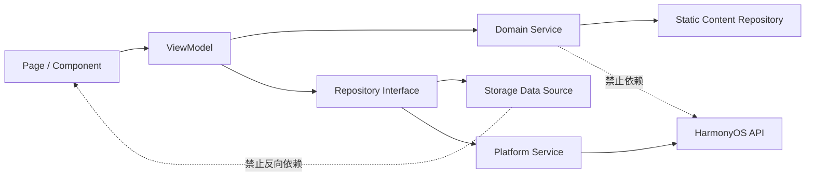
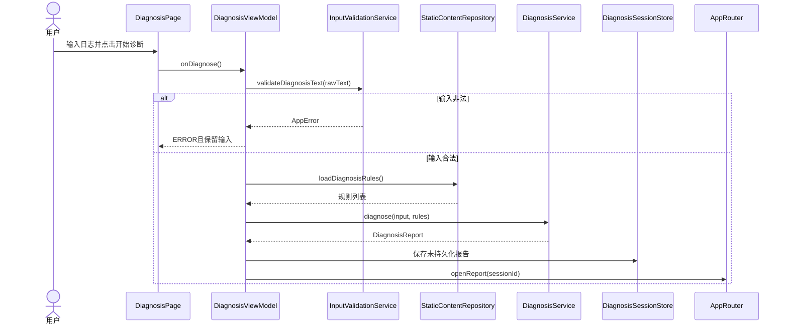
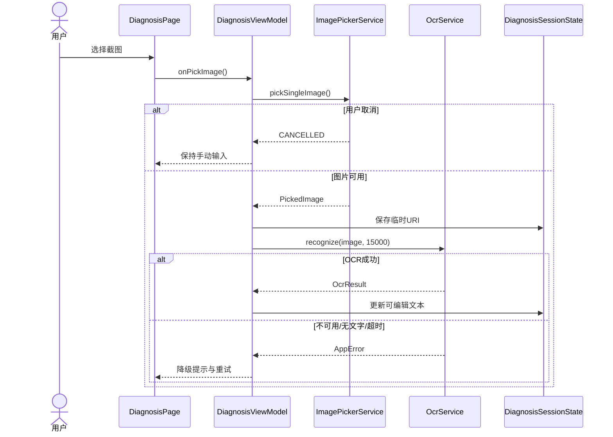

# 开发报错诊断助手详细设计说明书

> 文档版本：V1.1 草案
>
> 编写日期：2026-07-12
>
> 依据文档：`docs/requirements/移动软件开发要求.md`、`docs/development/需求规格说明书.md`、`docs/概要设计说明书.md`
>
> 适用范围：课程项目第一版；本文完整细化 P0，并为已确定进入第一版的 P1 保留稳定扩展边界
>
> 技术基线：最新版 DevEco Studio、新建 HarmonyOS Stage 模型工程、ArkTS、ArkUI、API 26 或以上
>
> 文档边界：本文允许给出模型、接口和方法签名，不包含完整业务实现，不创建业务代码文件。

## 0. 文档一致性审计

### 0.1 审计结论

三份上游文档的产品方向一致：开发一个离线优先的 HarmonyOS 报错诊断工具，以截图 OCR 或手动文本为输入，通过本地规则输出可解释报告，并支持本地验证工具和历史记录。概要设计已覆盖全部 P0，整体方案可以进入详细设计。

统一优先级口径为：P0 是首个稳定基线，P1 是课程第一版增强交付，P2 是后续方向。

当前问题不会阻止 P0 详细设计，但必须在开发和验收前收敛。本文不改变已确定的产品方向，采用“P0 核心先稳定、P1 在独立边界内继续集成”的落地顺序；课程第一版的最终范围仍按用户决定包含 P0 和 P1。

### 0.2 审计问题与同步结果

下表记录详细设计审计时发现的问题及本轮同步结果。已解决项保留作为变更依据，不再视为当前冲突。

| 编号 | 问题 | 影响 | 修改建议 | 本文处理 |
| --- | --- | --- | --- | --- |
| A01 | Data Augmentation Kit 曾存在优先级口径矛盾 | 范围、页面和验收口径冲突 | 统一为 P1 | 已同步三份文档；P1平台实现仍需可行性验证 |
| A02 | P1曾被称为“后续扩展”，同时又被确定为课程第一版范围 | “第一版”含义不统一 | P0定义为首个稳定基线，P1定义为课程第一版增强交付 | 已同步三份文档；开发仍按 P0后 P1顺序 |
| A03 | 需求列 5个页面组，概要设计另列隐私页和服务卡片 | 页面数量口径看似冲突 | 隐私页归入记录与设置页面组；服务卡片为系统桌面入口 | 已同步三份文档和路由归属 |
| A04 | 概要 M10同时表示数据访问和存储，M12同时承担日志、错误、主题、分享、能力检测和视觉，M13同时承担 NLP 与知识检索 | 详细编码时边界过宽 | 维持概要模块编号用于追踪，在工程中拆成小型 Repository 和平台 Service | 第 1、7节给出细分边界和禁止职责 |
| A05 | 需求要求的具体本地存储能力原为待确认，概要推荐 Preferences + relationalStore | 无法直接建立数据表和迁移 | 采用概要推荐方案：设置用 Preferences，报告与标签用 relationalStore；知识与规则为只读资源 | 第 8节给出 V1表与 Key 设计 |
| A06 | Core Vision OCR、Natural Language Kit、Data Augmentation Kit、Form Kit、沉浸光感尚未在目标 API 26设备验证 | 具体 API、权限和现场演示存在风险 | 把能力验证设为开发任务 0；所有平台能力必须有 Fake/Unavailable 实现和降级路径 | P0 的 OCR适配保留降级；P1接口不侵入 P0 |
| A07 | 历史搜索范围、收藏淘汰、脱敏模式、扩展工具长度和草稿恢复仍未确定 | 影响 P1数据结构和边界条件 | 不阻塞 P0；按概要推荐值形成可替换配置，明确标注“待确认” | 第 4、8、15节列为 P1待确认 |
| A08 | 需求缺少 ArkTS/Hvigor/OHPM 的真实错误样例库 | 诊断规则无法可靠验收 | 开发前收集并人工核对样例；规则和测试样例都记录来源与规则版本 | 任务 3和测试设计设为完成门槛 |
| A09 | 课程要求每位小组成员实际编码，而当前主要由一人开发 | 可能影响个人贡献认定，不影响产品架构 | 如小组还有其他成员，必须给其分配可独立演示的编码任务并保留 Git记录 | 任务按可独立开发和测试粒度拆分，不代替人员分工确认 |
| A10 | 全部 P0+P1 对单人和短周期开发规模偏大 | 集成与回归风险 | 不删减已确定方向；按 P0闭环→P0验收→P1历史增强→P1平台能力分阶段交付 | 第 15节只拆 P0，P1另行排期 |

### 0.3 不属于本产品的概念

上游编写模板中出现的登录、仓库、私有仓库、项目扫描、GitHub API、大型仓库和服务端 AI 不属于第一版产品范围。本文不会为这些概念虚构页面、状态、接口或错误流程：

- 第一版没有登录状态、用户 Token 和账号认证；
- 第一版不读取 GitHub/Gitee、本地工程或私有仓库；
- 第一版分析用户主动输入的报错文本，不扫描大型仓库；
- 第一版 P0/P1 无必需后端和外部网络接口；
- 外部大模型补充诊断属于 P2，服务方、鉴权、费用和数据上传策略均为待确认。

## 1. 项目模块详细划分

### 1.1 模块与目录映射

概要模块编号继续作为需求追踪标识；编码目录按职责进一步细分。

| 概要编号 | 模块名称 | 模块职责 | 对应目录 | 依赖的其他模块 | 对外提供的能力 | 禁止承担的职责 |
| --- | --- | --- | --- | --- | --- | --- |
| M01 | 应用入口与导航 | 管理应用入口、导航栈、路由参数和返回来源 | `router/`、`pages/home/` | M07、M09、M12 | 路由名称、参数校验、返回恢复、首页编排 | 不读取数据库、不执行诊断、不调用 OCR |
| M02 | 诊断会话与文本输入 | 管理未保存诊断会话及输入生命周期 | `viewmodel/diagnosis/`、`domain/validation/` | M03、M04 | 会话状态、文本更新、字符限制、输入校验、重置 | 不直接渲染 UI、不持久化未保存输入、不实现 OCR |
| M03 | 图片选择与 OCR | 隔离图片选择和 OCR平台能力 | `service/ocr/` | M12 | 图片选择结果、OCR结果、取消/失败/不可用状态 | 不决定诊断类别、不保存截图、不操作页面路由 |
| M04 | 本地诊断引擎 | 以版本化规则生成可解释本地报告 | `domain/diagnosis/` | StaticContentRepository | 规则匹配、分类、证据、原因、步骤、通用兜底 | 不访问页面、数据库、网络和系统能力 |
| M05 | 诊断报告编排 | 管理报告展示及保存、修改、验证等后续意图 | `viewmodel/report/`、`domain/report/` | M04、M06、M07、M13 | 报告页面状态、保存/修改/验证意图、知识参考合并 | 不覆盖本地诊断结论、不直接写数据库 |
| M06 | 验证工具 | 执行与诊断相关的本地验证逻辑 | `domain/tools/`、`viewmodel/tools/` | M12 | JSON验证、HTTP解释、P1扩展工具结果 | 不执行用户代码、不持久化工具历史、不发网络请求 |
| M07 | 诊断历史 | 管理已保存报告的持久化生命周期 | `repository/report/`、`viewmodel/history/` | M10 | 保存去重、列表、详情、删除、清空、最近记录 | 不处理 UI布局、不调用系统分享、不保存截图 |
| M08 | 历史增强与分享 | 管理 P1搜索、收藏、脱敏预览和分享 | `domain/privacy/`、`service/share/`、`viewmodel/share/` | M07、M13 | 搜索条件、收藏、脱敏预览、分享结果 | 不自动上传、不擅自删除用户原文、不绕过报告仓库 |
| M09 | 设置与数据管理 | 管理主题、说明和本地数据清理入口 | `repository/settings/`、`viewmodel/settings/` | M07、M10 | 主题、首次启动、隐私说明、数据清理 | 不管理诊断会话、不直接操作报告数据表 |
| M10 | 本地数据访问 | 隔离业务层与具体存储/资源实现 | `repository/`、`storage/` | M12 | Preferences、关系数据、只读资源的稳定访问契约 | 不包含页面状态和业务文案，不吞掉存储错误 |
| M11 | Form Kit 服务卡片 | 管理桌面摘要、快捷入口和刷新 | `form/`、`service/form/` | M01、M07 | 最近摘要、空卡片、定向拉起、刷新 | 不执行 OCR/诊断、不展示完整日志和截图 |
| M12 | 公共平台与质量 | 提供跨模块的错误、日志、能力和基础设施 | `common/`、`service/platform/`、`utils/`、`constants/` | 无业务依赖 | 统一结果、错误、日志、能力检测、时间、标识、主题适配 | 不持有具体业务状态，不成为杂物模块，不反向调用页面 |
| M13 | 智能文本与知识增强 | 隔离 NLP标签/隐私提示和本地知识检索 | `service/nlp/`、`service/knowledge/`、`repository/knowledge/` | M10、M12 | 标签提取、敏感候选、知识检索、能力降级 | 不阻塞报告保存、不修改本地分类、不保存用户画像 |
| M14 | 网络服务 | 为未来联网能力提供统一边界 | `service/network/` | M12 | 后续统一 HTTP边界 | 第一版不被 P0/P1依赖，不提前申请网络权限 |

### 1.2 依赖方向



强制规则：

1. `pages` 只能依赖 `components`、`viewmodel`、`router` 和展示模型。
2. `viewmodel` 可以依赖领域 Service 和 Repository接口，不能依赖具体 relationalStore、Preferences 或 HarmonyOS能力实现。
3. `domain` 只处理纯业务数据，保证 Local Test可直接执行。
4. `repository` 负责数据组合和持久化边界，不能显示 Toast、弹窗或页面文案。
5. `service` 封装平台能力和未来外部能力，统一转换异常。

## 2. 页面详细设计

### 2.1 首页 `HomePage`

| 项目 | 设计 |
| --- | --- |
| 页面路径 | `pages/home/HomePage`；路由名 `home` |
| 页面职责 | 提供截图诊断、文本诊断、验证工具、最近记录和全部历史入口 |
| 页面组成 | 标题与本地诊断标识、两个诊断入口、工具入口、最近三条记录、空状态、版本/能力简述 |
| 页面状态 | `HomePageState`：`loadingRecent`、`recentReports`、`recentError`、`themeMode` |
| 用户操作 | 点击截图/文本诊断、打开工具、打开最近报告、查看全部历史、重试读取 |
| 页面事件 | `onAppear`加载最近记录；`onRetryRecent`重试；`onOpen*`发送导航意图 |
| ViewModel/模块 | `HomeViewModel`、`ReportRepository`、`AppRouter` |
| 跳转参数 | 诊断页：`sourceType`；报告页：`reportId`、`origin=home`；工具页：`origin=home` |
| 加载/空/错误 | 最近记录局部骨架；无记录显示首次诊断入口；读取失败不阻塞三个主要入口 |

首页不申请图片权限，不在启动时初始化耗时的 OCR 或知识库。

### 2.2 诊断页 `DiagnosisPage`

| 项目 | 设计 |
| --- | --- |
| 页面路径 | `pages/diagnosis/DiagnosisPage`；路由名 `diagnosis` |
| 页面职责 | 管理图片选择、OCR、手动文本和诊断提交 |
| 页面组成 | 输入方式提示、选图区、图片预览、OCR状态、文本编辑区、字符计数、示例/清空/诊断按钮、降级提示 |
| 页面状态 | `DiagnosisSessionState`、`OcrOperationState`、`diagnosisOperation`、局部确认弹窗状态 |
| 用户操作 | 选择/重选图片、取消选择、输入/粘贴/编辑、使用示例、清空、开始诊断、返回 |
| 页面事件 | `onPickImage`、`onUseExample`、`onTextChange`、`onClear`、`onDiagnose`、`onRetryOcr` |
| ViewModel/模块 | `DiagnosisViewModel`、`ImagePickerService`、`OcrService`、`DiagnosisService` |
| 跳转参数 | 输入：`sourceType`、可选 `sessionId`、`origin`；输出到报告页：`sessionId`、`origin=diagnosis` |
| 加载/空/错误 | OCR与诊断分别局部加载；空输入/超长就近提示；OCR不可用显示手动输入；失败后保留文本 |

页面只展示 `ViewModel` 状态，不直接调用系统图片选择器、OCR 或诊断规则。

### 2.3 诊断报告页 `ReportPage`

| 项目 | 设计 |
| --- | --- |
| 页面路径 | `pages/report/ReportPage`；路由名 `report` |
| 页面职责 | 展示新生成或历史报告，并提供保存、修改、验证和返回操作 |
| 页面组成 | 类别与摘要、证据、原因、步骤、建议、风险、原文摘要、保存状态；P1知识参考和分享区 |
| 页面状态 | `ReportPageState`：加载来源、报告、保存状态、知识检索状态、分享状态、错误 |
| 用户操作 | 保存、再次保存、去验证、修改文本、重新诊断、删除损坏记录、分享（P1）、返回 |
| 页面事件 | `onSave`、`onOpenTool`、`onEditInput`、`onRediagnose`、`onRetryLoad`、`onShare` |
| ViewModel/模块 | `ReportViewModel`、`DiagnosisSessionStore`、`ReportRepository`、`KnowledgeService` |
| 跳转参数 | 输入二选一：`sessionId`（新报告）或 `reportId`（历史报告），以及 `origin`；工具页接收 `toolType`、`sessionId/reportId` |
| 加载/空/错误 | 历史报告读取显示骨架；新报告直接展示；无报告参数返回诊断页；损坏记录允许删除；保存失败保留报告 |

不得同时传入 `sessionId` 和 `reportId`。知识参考是独立区块，零结果时隐藏，不改变本地报告。

### 2.4 验证工具页 `ToolsPage`

| 项目 | 设计 |
| --- | --- |
| 页面路径 | `pages/tools/ToolsPage`；路由名 `tools` |
| 页面职责 | 执行 JSON验证和 HTTP状态码解释；P1扩展 URL/Base64/正则 |
| 页面组成 | 工具选择、输入区、操作按钮、结果区、格式帮助、清空与复制 |
| 页面状态 | `ToolsPageState`：`toolType`、`input`、`output`、`operation`、`origin` |
| 用户操作 | 选择工具、输入、执行、清空、复制、返回报告/首页 |
| 页面事件 | `onToolChange`、`onInputChange`、`onExecute`、`onClear`、`onCopy` |
| ViewModel/模块 | `ToolsViewModel`、`ValidationToolService` |
| 跳转参数 | `toolType?`、`sessionId?`、`reportId?`、`origin`；不通过路由携带大段日志 |
| 加载/空/错误 | 空输入显示格式示例；大文本处理中；非法输入保留原文；结果可重复执行 |

### 2.5 记录与设置页 `HistorySettingsPage`

| 项目 | 设计 |
| --- | --- |
| 页面路径 | `pages/history/HistorySettingsPage`；路由名 `historySettings` |
| 页面职责 | 展示、查看和删除历史，并提供主题、隐私和清空数据入口；P1增加搜索收藏 |
| 页面组成 | 历史区、空状态、删除/清空确认、主题选项、版本、隐私说明入口、诊断免责声明 |
| 页面状态 | `HistoryPageState`、`SettingsState`、局部删除/清空确认状态 |
| 用户操作 | 打开报告、删除、清空、开始诊断、切换主题、查看隐私、重试 |
| 页面事件 | `onAppear`、`onOpenReport`、`onDelete`、`onClearAll`、`onThemeChange`、`onRetry` |
| ViewModel/模块 | `HistoryViewModel`、`SettingsViewModel`、`ReportRepository`、`SettingsRepository` |
| 跳转参数 | 报告页：`reportId`、`origin=historySettings`；诊断页：`sourceType=TEXT`；隐私页：`origin=historySettings` |
| 加载/空/错误 | 首屏骨架；无历史显示开始诊断；读取/删除失败保留旧数据；取消清空不改变数据 |

“历史”和“设置”属于同一页面组，可在大屏使用分栏，在手机上按区块或页签组织。

### 2.6 隐私说明页 `PrivacyPage`

| 项目 | 设计 |
| --- | --- |
| 页面路径 | `pages/settings/PrivacyPage`；路由名 `privacy` |
| 页面职责 | 展示内置隐私说明，属于记录与设置页面组的子页面 |
| 页面组成 | 数据类型、用途、保存位置、期限、删除方式、图片不保存、网络与AI说明 |
| 页面状态 | 仅局部滚动和资源加载状态 |
| 用户操作 | 阅读、返回 |
| 页面事件 | `onBack` |
| ViewModel/模块 | 可直接使用只读展示模型；复杂状态不单独创建 ViewModel |
| 跳转参数 | `origin=historySettings` |
| 加载/空/错误 | 文本来自内置资源；资源失败展示最小基础说明 |

## 3. 组件设计

只抽取跨页面复用、具有独立交互状态或能显著降低重复的组件。页面唯一且简单的标题、按钮行和说明文本保留在页面内部。

| 组件 | 使用场景 | 输入参数 | 对外事件 | 内部状态 | 可复用 | 使用页面 |
| --- | --- | --- | --- | --- | --- | --- |
| `AsyncStatePanel` | 统一展示局部加载、错误和重试 | `status`、`message`、`showContent` | `onRetry` | 无 | 是 | 首页、报告、历史、工具 |
| `EmptyStateView` | 历史为空、搜索无结果等 | `title`、`description`、`actionLabel?` | `onAction?` | 无 | 是 | 首页、历史 |
| `InlineErrorNotice` | 输入、OCR、存储等就近错误 | `message`、`actionLabel?`、`severity` | `onAction?`、`onDismiss?` | 可选展开 | 是 | 诊断、报告、工具、历史 |
| `ConfirmActionDialog` | 清空、删除和清空输入确认 | `title`、`message`、`dangerous` | `onConfirm`、`onCancel` | 显示/隐藏由页面控制 | 是 | 诊断、历史 |
| `ReportSectionCard` | 报告证据、原因、步骤、建议、风险等重复区块 | `title`、`items`、`kind` | 无 | 可选展开/折叠 | 是 | 报告页内部多次使用 |
| `HistoryReportCard` | 首页最近记录和历史列表项 | `summary`、`compact`、`showFavorite` | `onOpen`、`onDelete?`、`onFavorite?` | 无 | 是 | 首页、历史 |
| `DiagnosisTextEditor` | OCR与手动输入共享的复杂文本编辑区 | `text`、`maxLength`、`readOnly`、`sourceType` | `onTextChange`、`onClear` | 焦点、选择区属于组件局部 | 有限复用 | 诊断页；不用于普通说明文本 |
| `ToolInputResultPanel` | 多个验证工具共用输入、执行和结果布局 | `input`、`output`、`operation`、`mode` | `onInputChange`、`onExecute`、`onClear` | 输入焦点、结果展开 | 是 | 工具页各工具模式 |
| `AdaptiveContentLayout` | 手机单列和平板双栏 | `breakpoint`、主/次内容槽 | 无 | 当前窗口分类 | 是 | 工具、历史/设置、报告 |
| `CapabilityFallbackNotice` | 平台能力不可用时说明降级 | `capability`、`fallbackText` | `onRetry?` | 无 | 是 | 诊断、报告、历史 |

P1 的敏感信息预览弹窗和知识条目卡片在实现 P1 时再抽取；不为 P0预先建立空组件。

## 4. 状态管理设计

### 4.1 状态层级

| 层级 | 典型状态 | 生命周期 | 管理方式 |
| --- | --- | --- | --- |
| 页面局部状态 | 弹窗、焦点、展开项、当前页签 | 页面创建到销毁 | ArkUI组件局部状态 |
| 模块共享状态 | 诊断会话、当前报告、工具来源、历史查询 | 一次业务会话或模块页面组 | 对应 ViewModel/Store |
| 全局状态 | 主题、能力可用性、应用级导航引用 | 应用进程 | `AppStateStore` |
| 本地持久化状态 | 报告、标签、设置 | 跨重启 | Repository + Preferences/relationalStore |

推荐使用 ArkUI状态管理 V2。具体装饰器组合应在 API 26工程创建后验证，标记为**待确认**；无论装饰器如何选择，下列数据所有权和重置规则不变。

### 4.2 主要状态对象

| 状态名称 | 含义与初始值 | 更新条件 | 使用范围 | 持久化 | 页面监听 | 重置时机 |
| --- | --- | --- | --- | --- | --- | --- |
| `AppState` | `themeMode=SYSTEM`、能力状态为 `UNKNOWN` | 启动读设置、主题变化、能力检测 | 全局 | 主题持久化，能力不持久化 | 全部页面观察主题；相关页面观察能力 | 进程结束；主题从存储恢复 |
| `HomePageState` | 最近记录空、`loadingRecent=false`、无错误 | 页面出现、保存/删除历史、重试 | 首页 | 否 | 首页观察 | 离开可保留；明确刷新时重载 |
| `DiagnosisSessionState` | 新 `sessionId`、来源、空文本、无图片、空报告 | 输入、OCR、示例、清空、诊断完成 | 诊断与新报告共享 | 否 | 诊断页、报告页 | 开始新诊断、用户清空或会话结束 |
| `OcrOperationState` | `IDLE` | 选图后 LOADING；成功/失败/取消结束 | 诊断模块 | 否 | 诊断页 | 重选图片、新会话、离开且任务取消 |
| `ReportPageState` | 无报告、`load=IDLE`、`save=IDLE` | 新报告生成、历史读取、保存、知识返回 | 报告模块 | 报告由仓库持久化，UI状态否 | 报告页 | 切换报告或页面销毁 |
| `ToolsPageState` | 默认 JSON工具、空输入输出、`IDLE` | 工具切换、输入、执行、清空 | 工具页 | 否 | 工具页 | 离开工具会话；从报告重进时重建 |
| `HistoryPageState` | 空列表、默认查询、`loading=false` | 加载、删除、清空、P1搜索收藏 | 历史页面组 | 实体持久化，列表状态否 | 首页/历史页通过各自 ViewModel | 页面销毁或用户清空查询 |
| `SettingsState` | `themeMode=SYSTEM`、`historyLimit=200` | 设置读取、主题变化、恢复默认 | 全局/设置页 | 是 | 全部页面、设置页 | 恢复默认或卸载 |
| `ShareState` | 无预览、`IDLE` | P1脱敏、预览、确认、取消 | 报告模块 | 否 | 报告页 | 分享结束或页面销毁 |

### 4.3 异步操作状态

统一使用语义状态，避免多个互相矛盾的布尔值：

```ts
export enum OperationStatus {
  IDLE = 'IDLE',
  LOADING = 'LOADING',
  SUCCESS = 'SUCCESS',
  ERROR = 'ERROR',
  CANCELLED = 'CANCELLED'
}

export interface OperationState {
  status: OperationStatus;
  error?: AppError;
  correlationId?: string;
}
```

同一业务操作在 `LOADING` 时拒绝再次触发。异步返回必须携带或关联 `sessionId/correlationId`，只有仍属于当前会话时才更新状态。

## 5. 数据模型设计

### 5.1 公共枚举与结果模型

```ts
export enum SourceType {
  IMAGE = 'IMAGE',
  TEXT = 'TEXT'
}

export enum ThemeMode {
  SYSTEM = 'SYSTEM',
  LIGHT = 'LIGHT',
  DARK = 'DARK'
}

export interface AppError {
  code: string;
  message: string;
  retryable: boolean;
  causeType?: string;
  correlationId?: string;
}

export interface AppResult<T> {
  success: boolean;
  data?: T;
  error?: AppError;
}
```

约束：`success=true` 时必须有 `data` 或明确的无返回语义；`success=false` 时必须有 `error`。Repository 和 Service 不将原始系统异常跨层传递。

### 5.2 `DiagnosisInput`

| 字段 | 字段类型 | 是否必填 | 默认值 | 说明 | 来源 | 序列化 | 敏感 |
| --- | --- | --- | --- | --- | --- | --- | --- |
| `sessionId` | `string` | 是 | 新会话生成 | 当前诊断会话标识 | 系统生成 | 否 | 否 |
| `sourceType` | `SourceType` | 是 | 路由指定 | 图片或文本来源 | 用户入口 | 否 | 否 |
| `rawText` | `string` | 是 | `''` | 用户最终确认的错误文本 | OCR/用户 | 仅生成报告时复制 | 是 |
| `imageUri` | `string` | 否 | `undefined` | 当前会话临时图片地址 | 系统选择器 | 否 | 是（本地路径） |
| `createdAt` | `number` | 是 | 当前时间 | Unix毫秒时间 | 系统 | 否 | 否 |

```ts
export interface DiagnosisInput {
  sessionId: string;
  sourceType: SourceType;
  rawText: string;
  imageUri?: string;
  createdAt: number;
}
```

### 5.3 `DiagnosisReport`

| 字段 | 字段类型 | 是否必填 | 默认值 | 说明 | 来源 | 序列化 | 敏感 |
| --- | --- | --- | --- | --- | --- | --- | --- |
| `id` | `string` | 是 | 生成 | 报告本地唯一标识 | 系统 | 是 | 否 |
| `errorType` | `string` | 是 | 无 | 主要错误类别 | 诊断引擎 | 是 | 否 |
| `secondaryTags` | `Array<string>` | 否 | `undefined` | 其他命中分类 | 诊断引擎 | 是 | 可能 |
| `summary` | `string` | 是 | 无 | 一句话摘要 | 诊断引擎 | 是 | 可能 |
| `evidence` | `Array<string>` | 是 | `[]` | 命中证据 | 诊断引擎 | 是 | 是 |
| `possibleCauses` | `Array<string>` | 是 | `[]` | 可能原因 | 诊断引擎 | 是 | 否 |
| `steps` | `Array<string>` | 是 | `[]` | 有序排查步骤 | 诊断引擎 | 是 | 否 |
| `suggestions` | `Array<string>` | 否 | `undefined` | 补充建议 | 诊断引擎 | 是 | 否 |
| `riskNotice` | `string` | 否 | `undefined` | 风险提示 | 诊断引擎 | 是 | 否 |
| `rawText` | `string` | 是 | 无 | 诊断原文 | 输入 | 是 | 是 |
| `sourceType` | `SourceType` | 是 | 无 | 输入来源 | 输入 | 是 | 否 |
| `createdAt` | `number` | 是 | 当前时间 | 生成时间 | 系统 | 是 | 否 |
| `savedAt` | `number` | 否 | `undefined` | 用户保存时间 | 保存操作 | 是 | 否 |
| `isFavorite` | `boolean` | 是 | `false` | P1收藏状态 | 用户 | 是 | 否 |
| `engineVersion` | `string` | 是 | 配置值 | 本地规则版本 | 配置 | 是 | 否 |

```ts
export interface DiagnosisReport {
  id: string;
  errorType: string;
  secondaryTags?: Array<string>;
  summary: string;
  evidence: Array<string>;
  possibleCauses: Array<string>;
  steps: Array<string>;
  suggestions?: Array<string>;
  riskNotice?: string;
  rawText: string;
  sourceType: SourceType;
  createdAt: number;
  savedAt?: number;
  isFavorite: boolean;
  engineVersion: string;
}
```

### 5.4 规则、状态码、设置、标签和知识模型

| 模型 | 主要字段与类型 | 必填/默认 | 来源 | 序列化 | 敏感 |
| --- | --- | --- | --- | --- | --- |
| `DiagnosisRule` | `ruleId:string`、`errorType:string`、`keywords:Array<string>`、`patterns:Array<string>`、`priority:number`、`summaryTemplate:string`、`causes:Array<string>`、`steps:Array<string>`、`riskNotice?:string`、`version:string` | 除风险提示外必填；数组默认空 | 内置规则资源 | 从资源反序列化 | 否 |
| `HttpStatusEntry` | `code:number`、`name:string`、`category:string`、`description:string`、`causes:Array<string>`、`steps:Array<string>` | 必填；数组默认空 | 内置状态码资源 | 从资源反序列化 | 否 |
| `UserSettings` | `themeMode:ThemeMode`、`historyLimit:number`、`firstLaunchCompleted:boolean`、`draftRecoveryEnabled:boolean` | `SYSTEM`、`200`、`false`、`false` | 默认值/用户 | Preferences | 否 |
| `TextEntityTag` | `reportId:string`、`type:string`、`normalizedValue:string`、`source:string`、`isSensitive:boolean`、`createdAt:number` | 必填 | NLP/本地规则 | relationalStore | `normalizedValue`可能敏感 |
| `KnowledgeEntry` | `entryId:string`、`title:string`、`errorType:string`、`signatures:Array<string>`、`environment?:string`、`causes:Array<string>`、`steps:Array<string>`、`sourceTitle:string`、`sourceReference?:string`、`version:string` | 环境/引用可选，其余必填 | 核对后的知识资源 | Data Augmentation/只读资源 | 否，不得含用户日志 |

```ts
export interface DiagnosisRule {
  ruleId: string;
  errorType: string;
  keywords: Array<string>;
  patterns: Array<string>;
  priority: number;
  summaryTemplate: string;
  causes: Array<string>;
  steps: Array<string>;
  riskNotice?: string;
  version: string;
}

export interface UserSettings {
  themeMode: ThemeMode;
  historyLimit: number;
  firstLaunchCompleted: boolean;
  draftRecoveryEnabled: boolean;
}

export interface HttpStatusEntry {
  code: number;
  name: string;
  category: string;
  description: string;
  causes: Array<string>;
  steps: Array<string>;
}

export interface TextEntityTag {
  reportId: string;
  type: string;
  normalizedValue: string;
  source: string;
  isSensitive: boolean;
  createdAt: number;
}

export interface KnowledgeEntry {
  entryId: string;
  title: string;
  errorType: string;
  signatures: Array<string>;
  environment?: string;
  causes: Array<string>;
  steps: Array<string>;
  sourceTitle: string;
  sourceReference?: string;
  version: string;
}
```

正则模式必须在资源加载阶段校验；损坏规则跳过并记录规则标识，不能导致全部诊断不可用。

## 6. 网络接口详细设计

### 6.1 第一版网络结论

第一版 P0和 P1没有必须调用的后端 HTTP接口：诊断规则、验证工具、历史、设置、Natural Language Kit 和 Data Augmentation Kit 均按本地能力设计。因此：

- 不定义虚构的后端地址、请求路径、认证头或业务错误码；
- 不创建仅为“看起来完整”的 Mock服务器；
- P0断网验收时全部核心流程必须通过；
- `service/network/` 仅是未来 P2的规划位置，P0/P1代码不得依赖它；
- 网络权限只在真实联网功能确定后加入配置。

### 6.2 平台能力不是 HTTP接口

Core Vision OCR、Natural Language Kit、Data Augmentation Kit、Form Kit 和系统分享通过 HarmonyOS平台 API调用，不应伪装为 REST接口。它们的输入输出和异常由对应平台 Service契约描述，见第 7节。

### 6.3 P2 外部 AI预留接口

| 项目 | 设计 |
| --- | --- |
| 接口名称 | AI补充诊断接口 |
| 用途 | 在本地报告完成后提供独立补充说明 |
| 请求方法/路径 | **待确认**；服务提供方未确定 |
| 请求头/认证 | **待确认**；不得在客户端硬编码长期密钥 |
| 请求参数 | 用户明确确认的脱敏文本、本地报告摘要、规则版本 |
| 返回数据 | 独立的 AI补充建议和来源标识，不覆盖本地报告 |
| 错误码 | **待确认**；至少统一映射断网、超时、限流、额度不足、服务不可用、空响应 |
| 超时/重试 | **待确认**；必须支持取消，禁止无限重试 |
| 分页/缓存 | 不预设；按服务方案确认 |
| 当前状态 | P2待确认，第一版不需要 Mock，不进入开发任务 |

只有产品需求正式变更并确认服务、费用、隐私和授权后，才为此接口创建 Mock和详细 JSON。

## 7. Repository 和 Service 设计

### 7.1 统一调用规则

- Repository 和 Service 的公开异步方法返回 `Promise<AppResult<T>>`，不把原始系统异常直接抛给 ViewModel。
- 参数编程错误可以在开发期快速失败；用户输入、平台不可用和存储失败必须转换为 `AppError`。
- Repository 面向数据集合及持久化语义；Service 面向业务规则或平台能力。
- ViewModel 负责调用顺序与页面状态，不把持久化事务写进页面事件。

以下各接口代码块列出的签名即该 Repository 或 Service 的**主要方法**；方法输入、输出、可能错误和依赖在相邻说明中定义。

### 7.2 Repository 设计

#### `ReportRepository`

职责：提供诊断报告的唯一持久化入口，处理保存去重、查询、删除和数量上限。

```ts
export interface ReportQuery {
  keyword?: string;
  errorType?: string;
  favoriteOnly?: boolean;
  offset: number;
  limit: number;
}

export interface ReportRepository {
  save(report: DiagnosisReport): Promise<AppResult<DiagnosisReport>>;
  getById(reportId: string): Promise<AppResult<DiagnosisReport>>;
  list(query: ReportQuery): Promise<AppResult<Array<DiagnosisReport>>>;
  getRecent(limit: number): Promise<AppResult<Array<DiagnosisReport>>>;
  deleteById(reportId: string): Promise<AppResult<boolean>>;
  clearAll(): Promise<AppResult<number>>;
  updateFavorite(reportId: string, favorite: boolean): Promise<AppResult<boolean>>;
  enforceHistoryLimit(limit: number): Promise<AppResult<number>>;
}
```

可能错误：`STORAGE_READ_FAILED`、`STORAGE_WRITE_FAILED`、`STORAGE_DELETE_FAILED`、`DATA_CORRUPTED`、`REPORT_NOT_FOUND`。依赖 `ReportStore`；P1查询可依赖 `TagRepository`。

#### `SettingsRepository`

```ts
export interface SettingsRepository {
  get(): Promise<AppResult<UserSettings>>;
  update(settings: UserSettings): Promise<AppResult<UserSettings>>;
  reset(): Promise<AppResult<UserSettings>>;
}
```

职责：把 Preferences Key细节隐藏在 Repository之后。可能错误：`SETTINGS_READ_FAILED`、`SETTINGS_WRITE_FAILED`。依赖 `PreferencesStore`。

#### `StaticContentRepository`

```ts
export interface StaticContentRepository {
  loadDiagnosisRules(): Promise<AppResult<Array<DiagnosisRule>>>;
  getHttpStatus(code: number): Promise<AppResult<HttpStatusEntry>>;
  getPrivacyText(): Promise<AppResult<string>>;
}
```

职责：加载和校验内置只读资源，缓存解析后的规则和状态码。可能错误：`RESOURCE_NOT_FOUND`、`DATA_PARSE_FAILED`、`RULE_INVALID`。

#### `TagRepository`（P1）

```ts
export interface TagRepository {
  replaceForReport(reportId: string, tags: Array<TextEntityTag>): Promise<AppResult<number>>;
  listByReport(reportId: string): Promise<AppResult<Array<TextEntityTag>>>;
  deleteByReport(reportId: string): Promise<AppResult<number>>;
}
```

#### `KnowledgeRepository`（P1）

```ts
export interface KnowledgeQuery {
  errorType: string;
  keywords: Array<string>;
  textExcerpt: string;
  limit: number;
}

export interface KnowledgeRepository {
  search(query: KnowledgeQuery): Promise<AppResult<Array<KnowledgeEntry>>>;
  getCapabilityState(): Promise<AppResult<CapabilityState>>;
}
```

知识查询失败不能使本地报告失败。

### 7.3 Domain Service 设计

#### `InputValidationService`

```ts
export interface InputValidationService {
  normalize(rawText: string): string;
  validateDiagnosisText(rawText: string): AppResult<string>;
  validateJsonSize(rawText: string): AppResult<number>;
}
```

职责：处理首尾空白、空文本、100,000字符诊断上限和 2 MB JSON上限。不得改写日志正文。

#### `DiagnosisService`

```ts
export interface DiagnosisService {
  diagnose(input: DiagnosisInput, rules: Array<DiagnosisRule>): AppResult<DiagnosisReport>;
}
```

职责：纯本地规则匹配、主要类别选择、次要标签、证据和报告生成。输入为已校验文本；未知错误返回通用报告而不是异常。可能错误：规则集为空或损坏、内部处理失败。

#### `ValidationToolService`

```ts
export enum ToolType {
  JSON = 'JSON',
  HTTP_STATUS = 'HTTP_STATUS',
  URL_CODEC = 'URL_CODEC',
  BASE64_CODEC = 'BASE64_CODEC',
  REGEX = 'REGEX'
}

export interface ToolResult {
  toolType: ToolType;
  output: string;
  valid: boolean;
  message?: string;
}

export interface ValidationToolService {
  execute(toolType: ToolType, input: string, option?: string): AppResult<ToolResult>;
}
```

P0只启用 JSON和 HTTP状态码模式；P1再启用其他枚举值。非法输入返回 `AppError`，不得清空输入。

### 7.4 Platform Service 设计

#### `ImagePickerService` 与 `OcrService`

```ts
export interface PickedImage {
  uri: string;
  displayName?: string;
}

export interface OcrResult {
  text: string;
  durationMs: number;
}

export interface ImagePickerService {
  pickSingleImage(): Promise<AppResult<PickedImage>>;
}

export interface OcrService {
  recognize(image: PickedImage, timeoutMs: number): Promise<AppResult<OcrResult>>;
  getCapabilityState(): Promise<AppResult<CapabilityState>>;
}
```

可能错误：用户取消、URI读取失败、能力不可用、无文字、超时、平台失败。取消是可预期结果，不记录错误级日志。

#### `TextEnrichmentService`（P1）

```ts
export interface TextEnrichmentService {
  extractTags(reportId: string, text: string): Promise<AppResult<Array<TextEntityTag>>>;
  detectSensitiveSegments(text: string): Promise<AppResult<Array<TextEntityTag>>>;
}
```

失败时返回空增强结果和能力状态，不影响保存、搜索基础字段或分享预览。

#### `ShareService`（P1）

```ts
export interface SharePreview {
  originalText: string;
  redactedText: string;
  sensitiveCount: number;
}

export interface ShareService {
  buildPreview(report: DiagnosisReport): Promise<AppResult<SharePreview>>;
  shareText(confirmedText: string): Promise<AppResult<boolean>>;
  copyText(text: string): Promise<AppResult<boolean>>;
}
```

#### `CapabilityService`

```ts
export enum CapabilityName {
  OCR = 'OCR',
  NATURAL_LANGUAGE = 'NATURAL_LANGUAGE',
  DATA_AUGMENTATION = 'DATA_AUGMENTATION',
  FORM = 'FORM',
  IMMERSIVE_LIGHT = 'IMMERSIVE_LIGHT',
  SHARE = 'SHARE'
}

export interface CapabilityState {
  name: CapabilityName;
  available: boolean;
  reason?: string;
  checkedAt: number;
}

export interface CapabilityService {
  check(name: CapabilityName): Promise<AppResult<CapabilityState>>;
}
```

## 8. 本地存储设计

### 8.1 存储分配

| 数据 | 存储方式 | 原因 | 有效期 |
| --- | --- | --- | --- |
| 主题、首次启动、历史上限、Schema版本 | Preferences | 少量稳定键值 | 卸载或恢复默认 |
| 已保存报告、收藏状态 | relationalStore | 需要排序、筛选、去重和上限处理 | 用户删除、清空或淘汰 |
| P1文本标签 | relationalStore | 与报告关联、用于搜索 | 随报告删除 |
| 诊断规则、HTTP状态码、隐私文本 | `resources/rawfile`只读资源 | 随版本发布 | 应用升级替换 |
| P1知识条目 | Data Augmentation本地知识资源 | 独立检索、不得混入用户历史 | 应用/知识包升级 |
| 输入、图片 URI、未保存报告、工具结果 | 内存 | 临时会话数据 | 会话结束 |

### 8.2 Preferences Key

| Key | 类型 | 默认值 | 说明 |
| --- | --- | --- | --- |
| `settings.theme_mode` | `string` | `SYSTEM` | 主题模式 |
| `settings.first_launch_completed` | `boolean` | `false` | 首次说明是否完成 |
| `settings.history_limit` | `number` | `200` | 历史上限；第一版固定 |
| `settings.draft_recovery_enabled` | `boolean` | `false` | 草稿恢复；待确认，默认关闭 |
| `storage.schema_version` | `number` | `1` | 本地数据结构版本 |

### 8.3 relationalStore V1表

#### `diagnosis_report`

| 列 | 类型 | 约束 | 说明 |
| --- | --- | --- | --- |
| `id` | TEXT | PRIMARY KEY | 报告标识 |
| `error_type` | TEXT | NOT NULL | 主要类别 |
| `secondary_tags_json` | TEXT | NOT NULL | JSON数组 |
| `summary` | TEXT | NOT NULL | 摘要 |
| `evidence_json` | TEXT | NOT NULL | 证据数组；敏感 |
| `causes_json` | TEXT | NOT NULL | 原因数组 |
| `steps_json` | TEXT | NOT NULL | 步骤数组 |
| `suggestions_json` | TEXT | NOT NULL | 建议数组 |
| `risk_notice` | TEXT | NULL | 风险提示 |
| `raw_text` | TEXT | NOT NULL | 原始诊断文本；敏感 |
| `source_type` | TEXT | NOT NULL | IMAGE/TEXT |
| `created_at` | INTEGER | NOT NULL | 生成时间 |
| `saved_at` | INTEGER | NOT NULL | 保存时间 |
| `is_favorite` | INTEGER | NOT NULL DEFAULT 0 | 收藏标记 |
| `engine_version` | TEXT | NOT NULL | 规则版本 |

索引：`saved_at DESC`、`error_type`、`is_favorite, saved_at DESC`。同一 `id`重复保存返回已有记录，不创建副本。

`secondaryTags` 和 `suggestions` 在业务模型中可选；写入关系表时统一序列化为空数组 `[]`，因此对应 JSON列保持 NOT NULL，读取后可以按需要恢复为空数组或未定义。

#### `text_entity_tag`（P1）

| 列 | 类型 | 约束 | 说明 |
| --- | --- | --- | --- |
| `report_id` | TEXT | NOT NULL | 所属报告 |
| `type` | TEXT | NOT NULL | 标签类型 |
| `normalized_value` | TEXT | NOT NULL | 规范值；可能敏感 |
| `source` | TEXT | NOT NULL | NATURAL_LANGUAGE/LOCAL_RULE |
| `is_sensitive` | INTEGER | NOT NULL DEFAULT 0 | 敏感候选 |
| `created_at` | INTEGER | NOT NULL | 创建时间 |

建议复合唯一约束：`report_id + type + normalized_value + source`；索引 `report_id` 和 `normalized_value`。删除报告时在同一事务中删除标签。

### 8.4 更新、删除和上限

- 报告内容保存后不可修改，P1只允许更新 `is_favorite`。
- 删除单条和清空全部必须在事务中处理报告与标签。
- 达到 200条后删除最早且未收藏的报告；全部为收藏时的处理方式**待确认**，建议提示用户手动清理而不自动删除收藏。
- Settings写入失败时 UI可临时使用新主题，但必须提示重启后可能恢复。
- Form Kit刷新发生在数据库提交成功后，刷新失败不回滚保存。

### 8.5 升级兼容与安全

- V1创建表和索引后写入 `storage.schema_version=1`。
- 后续升级按版本顺序执行迁移；迁移前备份策略和回滚能力**待确认**。
- 读取时校验枚举、必填字段和 JSON数组；单条损坏记录隔离，不阻塞列表。
- 原始文本不写日志、不进入服务卡片；应用沙箱之外不创建副本。
- 第一版没有外部密钥和 Token，不设计密钥存储；P2启用时另行设计安全存储。

### 8.6 数据有效期汇总

- 设置和已保存报告跨应用重启有效，直到用户删除、清空、卸载或发生明确的上限淘汰。
- 标签与所属报告有效期一致；报告删除时同步失效。
- 规则、状态码、隐私文本和知识资源在当前应用版本内有效，升级时按资源版本替换。
- 临时图片 URI、诊断输入、未保存报告、工具结果和分享预览只在当前会话有效。

## 9. 核心业务流程详细设计

以下流程统一按流程入口、用户操作、页面处理、ViewModel处理、Service处理、Repository处理、网络或本地存储操作、状态更新、成功结果和异常处理展开。第一版 P0无必需网络操作。

### 9.1 手动文本诊断

1. **入口：**首页“文本诊断”或 OCR失败降级。
2. **页面：**`DiagnosisPage`把输入事件发送给 `DiagnosisViewModel`。
3. **ViewModel：**更新 `DiagnosisSessionState.rawText`；提交时拒绝重复操作。
4. **Service：**`InputValidationService`规范首尾空白并校验；`StaticContentRepository`提供规则；`DiagnosisService`生成报告。
5. **Repository/存储：**此阶段不写存储；规则来自只读资源缓存。
6. **状态：**`diagnosisOperation`依次为 LOADING→SUCCESS/ERROR。
7. **成功：**报告存入会话 Store，路由携带 `sessionId`进入报告页。
8. **失败：**空/超长就近提示；规则异常保留输入并允许重试；未知规则生成通用报告。



### 9.2 截图 OCR诊断

1. 页面触发 `ImagePickerService.pickSingleImage()`。
2. 用户取消时状态为 CANCELLED，页面不离开。
3. 选图成功后仅在会话保存 URI并显示预览。
4. `OcrService`在 15秒超时边界内识别。
5. 成功文本写入会话编辑区，用户可修改后复用 9.1流程。
6. 无文字、能力不可用或失败时显示原因，手动输入始终可用。
7. 页面销毁或会话变化后忽略旧 OCR结果。



### 9.3 报告保存、读取和删除

1. 报告页保存前检查 `saveOperation`非 LOADING。
2. `ReportRepository.save`按报告 `id`去重，并设置 `savedAt`。
3. 保存成功后执行历史上限检查；P1标签提取异步执行，不回滚报告。
4. 再次保存返回已有报告并提示“已保存”。
5. 历史页通过分页查询加载；打开详情只传 `reportId`。
6. 删除单条与关联标签同事务；清空全部需二次确认。
7. 存储失败保留当前页面数据，允许重试。

### 9.4 JSON验证与 HTTP状态码解释

1. `ToolsPage`选择工具并维护临时输入。
2. ViewModel调用 `ValidationToolService.execute`。
3. JSON先检查空值与 2 MB上限，再解析和格式化；超过 50 KB显示处理状态。
4. HTTP输入必须为 100～599整数；先查内置条目，未收录时只返回类别和“暂无详细解释”。
5. 所有操作均为本地处理，不访问网络、不保存工具历史。
6. 非法输入显示明确提示，原输入保持不变。

### 9.5 主题、历史恢复与断网启动

1. 应用启动先创建可交互首页，不等待历史或平台增强能力。
2. `SettingsRepository.get`恢复主题并发布到 `AppState`。
3. `ReportRepository.getRecent(3)`异步加载最近记录。
4. 设置/历史读取失败只影响对应局部区域。
5. P0不主动探测网络；断网不改变诊断、工具和历史能力状态。

## 10. 路由设计

### 10.1 路由参数模型

```ts
export enum RouteName {
  HOME = 'home',
  DIAGNOSIS = 'diagnosis',
  REPORT = 'report',
  TOOLS = 'tools',
  HISTORY_SETTINGS = 'historySettings',
  PRIVACY = 'privacy'
}

export interface RouteOrigin {
  origin: RouteName;
}

export interface DiagnosisRouteParams extends RouteOrigin {
  sourceType: SourceType;
  sessionId?: string;
}

export interface ReportRouteParams extends RouteOrigin {
  sessionId?: string;
  reportId?: string;
}

export interface ToolsRouteParams extends RouteOrigin {
  toolType?: ToolType;
  sessionId?: string;
  reportId?: string;
}
```

### 10.2 路由表

| 路由 | 页面路径 | 进入条件 | 跳转来源 | 参数 | 返回结果 | 登录/权限限制 |
| --- | --- | --- | --- | --- | --- | --- |
| `home` | `pages/home/HomePage` | 应用启动或安全回退 | 系统、所有主页面 | 无 | 无 | 无登录；无权限 |
| `diagnosis` | `pages/diagnosis/DiagnosisPage` | 有合法 `sourceType` | 首页、报告、历史、服务卡片 | `sourceType`、`sessionId?`、`origin` | 诊断取消或会话保留状态 | 无登录；选图时按需平台访问 |
| `report` | `pages/report/ReportPage` | `sessionId`和 `reportId`恰有一个有效 | 诊断、首页最近记录、历史 | `sessionId?`、`reportId?`、`origin` | 保存/修改/删除结果由共享状态或仓库反映 | 无登录；无额外权限 |
| `tools` | `pages/tools/ToolsPage` | 工具类型有效或使用默认 JSON | 首页、报告 | `toolType?`、`sessionId?`、`reportId?`、`origin` | 工具输入输出不跨会话持久化 | 无登录；无网络权限 |
| `historySettings` | `pages/history/HistorySettingsPage` | 本地页面可用 | 首页、报告、服务卡片 | 可选来源 | 历史变化通过仓库刷新 | 无登录；无额外权限 |
| `privacy` | `pages/settings/PrivacyPage` | 内置说明可加载 | 记录与设置 | `origin` | 无 | 无登录；无权限 |

### 10.3 路由约束

- 路由只传标识和轻量枚举，不传完整日志、图片和报告对象。
- 报告路由参数缺失或同时提供两个来源时返回诊断页并记录 `ROUTE_PARAM_INVALID`。
- 从工具返回时按 `origin`回报告或首页；从历史报告返回历史列表。
- Form Kit冷启动定向拉起参数格式**待确认**，但最终必须转换为同一套路由参数。

## 11. 异常和错误码设计

### 11.1 错误传递


规则：

1. 最底层捕获平台和存储异常，映射为稳定 `AppError`。
2. Repository保留错误码和是否可重试，不拼接页面文案。
3. ViewModel根据操作上下文选择用户提示、保留数据和重试事件。
4. 页面不得显示原始堆栈、SQL、URI、Token或完整日志正文。

### 11.2 P0错误码

| 错误码 | 含义 | retryable | 页面提示 | 处理 |
| --- | --- | ---: | --- | --- |
| `VAL_INPUT_EMPTY` | 诊断文本为空/全空白 | 否 | 请输入错误信息 | 保留输入焦点 |
| `VAL_INPUT_TOO_LONG` | 超过 100,000字符 | 否 | 内容过长，请缩短后重试 | 不进入诊断 |
| `VAL_JSON_TOO_LARGE` | JSON超过 2 MB | 否 | 内容超过 2 MB限制 | 保留输入 |
| `VAL_FORMAT_INVALID` | JSON、状态码等格式错误 | 否 | 显示对应格式说明 | 修改后重试 |
| `PICKER_CANCELLED` | 用户取消选图 | 否 | 未选择图片 | 保持诊断页 |
| `IMAGE_READ_FAILED` | 图片 URI读取失败 | 是 | 无法读取图片，请重新选择或手动输入 | 清理无效 URI |
| `OCR_UNAVAILABLE` | 设备/系统不支持 OCR | 否 | 当前设备无法使用 OCR，可手动输入 | 进入降级 |
| `OCR_NO_TEXT` | 未识别到文字 | 是 | 未识别到文字，可重试或手动输入 | 保留预览 |
| `OCR_TIMEOUT` | OCR超过 15秒 | 是 | 识别超时，请重试或手动输入 | 结束加载 |
| `OCR_FAILED` | OCR平台处理失败 | 是 | 识别失败，请重试或手动输入 | 记录脱敏日志 |
| `RULE_RESOURCE_FAILED` | 规则资源缺失/无法解析 | 是 | 诊断规则暂不可用，请重试 | 不生成伪报告 |
| `DIAGNOSIS_FAILED` | 本地诊断内部失败 | 是 | 暂时无法完成诊断，请重试 | 保留输入 |
| `REPORT_NOT_FOUND` | 历史报告不存在 | 否 | 该记录不存在或已删除 | 返回历史 |
| `DATA_PARSE_FAILED` | 本地记录损坏 | 否 | 该记录无法读取，可以删除 | 隔离记录 |
| `STORAGE_READ_FAILED` | 本地读取失败 | 是 | 暂时无法读取本地数据 | 保留最后有效数据 |
| `STORAGE_WRITE_FAILED` | 保存失败 | 是 | 保存失败，请重试 | 报告继续显示 |
| `STORAGE_DELETE_FAILED` | 删除失败 | 是 | 删除失败，请重试 | 列表不先移除 |
| `STORAGE_MIGRATION_FAILED` | 升级迁移失败 | 是 | 本地数据升级失败 | 停止写入并记录版本 |
| `SETTINGS_READ_FAILED` | 设置读取失败 | 是 | 已使用默认设置 | 使用 SYSTEM主题 |
| `SETTINGS_WRITE_FAILED` | 设置保存失败 | 是 | 本次已生效，重启后可能恢复 | 保留会话主题 |
| `ROUTE_PARAM_INVALID` | 路由参数无效 | 否 | 无法打开目标内容 | 安全回首页/诊断页 |
| `UNKNOWN_ERROR` | 未分类系统错误 | 视场景 | 操作失败，请稍后重试 | 记录 correlationId |

“未命中诊断规则”不是错误码，应生成 `通用错误/未分类`报告。

### 11.3 预留和不适用错误

| 类型 | 处理结论 |
| --- | --- |
| `NETWORK_UNAVAILABLE`、`REQUEST_TIMEOUT`、`RATE_LIMITED` | P0/P1无必需 HTTP调用；为 P2预留，不进入 P0页面流程 |
| `AI_ANALYSIS_FAILED` | P2待确认；不能影响本地报告 |
| 仓库不存在、私有仓库无权限 | 产品不访问代码仓库，不定义应用错误码 |
| 项目文件过大 | 产品不扫描项目；使用诊断文本和 JSON大小错误码 |

## 12. 日志设计

### 12.1 日志格式

底层使用 HiLog，公共日志 Service统一输出：

```text
timestamp | level | domain | event | correlationId | result | durationMs | errorCode | metadata
```

`metadata`只允许白名单字段，例如规则版本、记录数量、文本长度区间、能力可用状态和页面名称。

### 12.2 日志事件与级别

| 日志级别 | 记录场景 | 示例事件 |
| --- | --- | --- |
| DEBUG | 开发环境状态变化和流程节点 | 页面进入、状态迁移、规则命中数量；发布环境默认关闭详细输出 |
| INFO | 正常关键业务完成 | 应用启动、诊断完成、报告保存、设置更新、能力检测完成 |
| WARN | 可降级或用户可恢复异常 | OCR无文字、能力不可用、重复保存、损坏记录被隔离 |
| ERROR | 业务无法完成或数据操作失败 | 规则加载失败、存储写入失败、迁移失败、未知异常 |

### 12.3 必须记录的操作

- 应用启动耗时、目标 API和应用版本；
- OCR开始/结束、结果类型和耗时；
- 诊断开始/结束、规则版本、命中数量和主要类别；
- 保存/读取/删除结果和记录数量；
- 数据库版本和迁移结果；
- P1能力检测、初始化和降级；
- 未知异常的 `correlationId`和标准错误码。

### 12.4 禁止记录

- 完整 `rawText`、完整证据文本和完整搜索关键词；
- 图片内容、图片 URI和本地文件路径；
- Token、密码、密钥、Authorization、内部 URL、邮箱和手机号；
- relationalStore完整行数据；
- 外部 AI请求或响应正文（若未来启用）。

可以记录文本字符数、脱敏哈希或不可逆摘要用于关联，但具体哈希策略**待确认**，P0不强制。

### 12.5 开发与发布环境

- 开发构建允许 DEBUG日志和更多状态标识，但仍禁止敏感内容。
- 发布/答辩构建默认 INFO以上，关闭高频输入变化日志。
- 页面向用户展示简短错误提示和可复制的 `correlationId`（仅未知/关键异常），用于匹配日志定位。

## 13. 测试设计

### 13.1 测试分层

下表的“对象”列即每类测试的单元测试对象、组件测试对象或接口测试对象。

| 测试层 | 对象 | 测试方式 | 必须验证 |
| --- | --- | --- | --- |
| 单元测试 | `InputValidationService` | Local Test | 空白、首尾空白、100,000边界、100,001拒绝 |
| 单元测试 | `DiagnosisService` | Local Test | JSON/401/403/404/500/timeout/permission/null/ArkTS/Hvigor/OHPM/未知错误 |
| 单元测试 | 规则加载与优先级 | Local Test | 损坏规则跳过、多规则主要类别、规则版本 |
| 单元测试 | `ValidationToolService` | Local Test | 合法/非法 JSON、HTTP有效/无效/未收录 |
| 单元测试 | 数据序列化 | Local Test | 数组字段往返、缺字段、非法枚举、损坏记录 |
| Repository测试 | `ReportRepository` | Instrument + 测试数据库 | 保存、去重、倒序、详情、删除、清空、200条上限 |
| Repository测试 | `SettingsRepository` | Instrument/Preferences测试实例 | 默认值、写入、重启恢复、失败降级 |
| Service Mock测试 | OCR/图片选择 | Fake Service | 成功、取消、无文字、不可用、超时、页面销毁后返回 |
| 组件测试 | 通用状态组件 | ArkUI组件测试 | 加载、空、错误、重试事件、1.5倍字体 |
| 页面流程测试 | 首页→诊断→报告 | UI Test/Hypium | 导航、返回、输入保留、重复点击防护 |
| 页面流程测试 | 报告→保存→历史 | UI Test/Hypium | 保存反馈、重复保存、历史恢复、删除/清空确认 |
| 页面流程测试 | 工具和主题 | UI Test/Hypium | JSON/HTTP、返回来源、深色模式跨页面和重启 |
| 验收测试 | 手机/平板/断网 | 模拟器和目标设备 | AC-P0-01～AC-P0-13 |

### 13.2 接口 Fake 与 Mock

P0不需要后端 HTTP Mock。为了测试平台和存储异常，提供测试替身：

| 测试替身 | 用途 |
| --- | --- |
| `FakeImagePickerService` | 返回固定 URI、取消或读取失败 |
| `FakeOcrService` | 返回固定文本、无文字、不可用、超时 |
| `InMemoryReportRepository` | ViewModel和页面测试，不写真实数据库 |
| `FakeSettingsRepository` | 返回主题或读写失败 |
| `FakeStaticContentRepository` | 提供固定规则、损坏规则和状态码 |
| `FakeCapabilityService` | 模拟 API能力可用/不可用 |

测试替身只放在测试源集，不进入发布构建。

### 13.3 P0验收对应

| 需求验收 | 设计测试 |
| --- | --- |
| AC-P0-01 启动与首页 | 冷启动计时、三个入口、返回首页、无历史空状态 |
| AC-P0-02 手动诊断 | JSON错误规则单元测试 + 页面流程 |
| AC-P0-03 空输入与长度 | 输入校验边界单元测试 + 页面保留原文 |
| AC-P0-04 OCR成功 | Fake成功 + API26支持设备实测 |
| AC-P0-05 OCR取消/失败 | Fake取消、无文字、不可用 + 手动输入降级 |
| AC-P0-06 分类覆盖 | 参数化规则测试，逐条覆盖需求样例 |
| AC-P0-07 保存与重复保存 | Repository去重 + 报告页面流程 |
| AC-P0-08 删除与清空 | 事务测试 + 二次确认 UI测试 |
| AC-P0-09 JSON验证 | 合法、非法、空输入单元/UI测试 |
| AC-P0-10 HTTP解释 | 401/404/500、未收录、非法输入测试 |
| AC-P0-11 主题持久化 | Preferences集成测试 + 五页面深色模式 |
| AC-P0-12 断网可用 | 禁网模拟器全链路回归 |
| AC-P0-13 手机和平板 | 双设备、横竖屏、长文本、1.5倍字体测试 |

### 13.4 测试完成标准

- P0领域单元测试全部通过；
- P0 Repository关键事务全部通过；
- AC-P0-01～13均有执行记录；
- ArkTS构建、静态检查和测试均无阻塞错误；
- OCR真能力如目标设备不可用，必须有实测证据和手动输入降级演示，但仍需确认课程是否接受该 P0降级口径。

### 13.5 P0详细设计追踪矩阵

| P0需求 | 页面 | 模块/Service | 数据 | 测试 |
| --- | --- | --- | --- | --- |
| 首页与导航 | `HomePage` | `HomeViewModel`、`AppRouter` | 最近报告、主题 | AC-P0-01、导航参数测试 |
| 单张截图选择与 OCR | `DiagnosisPage` | `ImagePickerService`、`OcrService` | 临时图片 URI、OCR文本 | AC-P0-04、Fake OCR和目标设备测试 |
| OCR失败后的手动输入降级 | `DiagnosisPage` | `DiagnosisViewModel` | `DiagnosisSessionState.rawText` | AC-P0-05、取消/无文字/不可用/超时 |
| 文本输入、编辑、清空和校验 | `DiagnosisPage` | `InputValidationService` | `DiagnosisInput` | AC-P0-02、03、边界单元测试 |
| 本地错误分类和通用兜底 | `DiagnosisPage`、`ReportPage` | `DiagnosisService`、`StaticContentRepository` | `DiagnosisRule` | AC-P0-02、06参数化规则测试 |
| 结构化诊断报告 | `ReportPage` | `ReportViewModel`、`DiagnosisService` | `DiagnosisReport` | 报告字段完整性与返回修改流程 |
| JSON格式验证 | `ToolsPage` | `ValidationToolService` | 临时 `ToolResult` | AC-P0-09 |
| HTTP状态码解释 | `ToolsPage` | `ValidationToolService`、`StaticContentRepository` | `HttpStatusEntry` | AC-P0-10 |
| 历史保存、查看、删除和清空 | `ReportPage`、`HomePage`、`HistorySettingsPage` | `ReportRepository` | `diagnosis_report` | AC-P0-07、08、Repository事务测试 |
| 主题模式和持久化 | 全部页面、`HistorySettingsPage` | `SettingsViewModel`、`SettingsRepository` | Preferences、`UserSettings` | AC-P0-11 |
| 空、加载、错误和权限不足状态 | 全部 P0页面 | 各 ViewModel、`AsyncStatePanel`、`InlineErrorNotice` | `OperationState`、`AppError` | 组件状态测试、各异常流程测试 |
| 断网可用 | 全部核心页面 | 所有 P0本地 Service/Repository | 本地规则与本地存储 | AC-P0-12 |
| 手机和平板基础适配 | 全部 P0页面 | 页面/组件展示层 | 窗口分类、主题 | AC-P0-13 |
| 深色模式和基础无障碍 | 全部 P0页面 | `AppStateStore`、主题资源、公共组件 | `ThemeMode`、系统字体设置 | AC-P0-11、13、对比度和辅助描述检查 |

## 14. 建议目录结构

以下为建议的完整 HarmonyOS 工程目录规划；本轮只记录规划，不创建其中的业务代码文件。

```text
entry/
├── src/main/ets/
│   ├── entryability/
│   │   └── EntryAbility.ets                 # UIAbility入口和应用级初始化
│   ├── pages/
│   │   ├── home/HomePage.ets
│   │   ├── diagnosis/DiagnosisPage.ets
│   │   ├── report/ReportPage.ets
│   │   ├── tools/ToolsPage.ets
│   │   ├── history/HistorySettingsPage.ets
│   │   └── settings/PrivacyPage.ets
│   ├── components/
│   │   ├── common/AsyncStatePanel.ets
│   │   ├── common/EmptyStateView.ets
│   │   ├── common/InlineErrorNotice.ets
│   │   ├── common/ConfirmActionDialog.ets
│   │   ├── common/AdaptiveContentLayout.ets
│   │   ├── diagnosis/DiagnosisTextEditor.ets
│   │   ├── report/ReportSectionCard.ets
│   │   ├── history/HistoryReportCard.ets
│   │   └── tools/ToolInputResultPanel.ets
│   ├── viewmodel/
│   │   ├── home/HomeViewModel.ets
│   │   ├── diagnosis/DiagnosisViewModel.ets
│   │   ├── report/ReportViewModel.ets
│   │   ├── tools/ToolsViewModel.ets
│   │   ├── history/HistoryViewModel.ets
│   │   └── settings/SettingsViewModel.ets
│   ├── model/
│   │   ├── DiagnosisModels.ets               # DiagnosisInput/Report/Rule
│   │   ├── SettingsModels.ets
│   │   ├── KnowledgeModels.ets
│   │   ├── RouteModels.ets
│   │   └── ResultModels.ets                  # AppResult/AppError/OperationState
│   ├── domain/
│   │   ├── validation/InputValidationService.ets
│   │   ├── diagnosis/DiagnosisService.ets
│   │   ├── diagnosis/RuleMatcher.ets
│   │   ├── tools/ValidationToolService.ets
│   │   └── privacy/RedactionService.ets       # P1本地脱敏规则
│   ├── repository/
│   │   ├── report/ReportRepository.ets        # 接口
│   │   ├── report/LocalReportRepository.ets   # 本地实现
│   │   ├── settings/SettingsRepository.ets
│   │   ├── settings/LocalSettingsRepository.ets
│   │   ├── static/StaticContentRepository.ets
│   │   ├── tags/TagRepository.ets             # P1
│   │   └── knowledge/KnowledgeRepository.ets  # P1
│   ├── service/
│   │   ├── ocr/ImagePickerService.ets
│   │   ├── ocr/CoreVisionOcrService.ets
│   │   ├── nlp/TextEnrichmentService.ets      # P1
│   │   ├── knowledge/DataAugmentationService.ets # P1
│   │   ├── share/ShareService.ets             # P1
│   │   ├── form/FormCardService.ets           # P1
│   │   ├── platform/CapabilityService.ets
│   │   ├── platform/HiLogService.ets
│   │   └── network/NetworkClient.ets          # P2预留，不在P0创建
│   ├── storage/
│   │   ├── database/DatabaseManager.ets
│   │   ├── database/ReportStore.ets
│   │   ├── database/TagStore.ets              # P1
│   │   ├── preferences/PreferencesStore.ets
│   │   └── static/RawResourceStore.ets
│   ├── router/
│   │   ├── AppRouter.ets
│   │   ├── RouteNames.ets
│   │   └── RouteRegistry.ets
│   ├── store/
│   │   ├── AppStateStore.ets
│   │   └── DiagnosisSessionStore.ets
│   ├── constants/
│   │   ├── AppLimits.ets
│   │   ├── ErrorCodes.ets
│   │   ├── StorageKeys.ets
│   │   └── Versions.ets
│   └── utils/
│       ├── IdGenerator.ets
│       └── TimeProvider.ets
├── src/main/resources/
│   ├── base/element/                         # string/color/float等资源
│   └── rawfile/
│       ├── diagnosis_rules_v1.json
│       ├── http_status_v1.json
│       └── privacy_notice.txt
├── src/test/
│   ├── domain/                               # 纯业务Local Test
│   └── fakes/                                # Repository/Service测试替身
└── src/ohosTest/
    ├── repository/                           # 数据集成测试
    ├── pages/                                # 页面流程测试
    └── acceptance/                           # AC-P0-01～13
```

命名规则：ArkTS类型、组件和文件采用 PascalCase；变量与方法采用 lowerCamelCase；常量采用 UPPER_SNAKE_CASE或集中常量对象，最终以项目 Linter规则为准。`NetworkClient.ets` 在 P0阶段不创建，目录树中的位置仅用于说明未来边界。

## 15. 开发任务拆分

### 15.1 拆分原则

- 本节只拆第一阶段 P0，确保核心闭环先稳定；P1仍属于课程第一版，但应在 P0验收后按概要顺序另建任务计划。
- 每个任务有独立可测试结果，不把“整个模块”当作一个任务。
- 每个功能任务遵循测试先行：先写失败用例，再实现最小功能，再运行相关测试和构建。
- 每完成一个任务保持应用可构建或纯业务测试可运行，并形成清晰 Git提交。

### 15.2 P0任务列表

表格“顺序”列即**建议开发顺序**；只有前置依赖达到完成标准后才进入下一任务。

| 顺序 | 任务名称 | 任务目标 | 涉及文件/模块 | 前置依赖 | 完成标准 |
| ---: | --- | --- | --- | --- | --- |
| 0 | 开发环境与能力验证 | 创建最新版 DevEco/API26 ArkTS工程，记录版本，验证模拟器、图片选择和 OCR可用性 | 工程配置、`docs/evidence/`建议记录 | 无 | 新工程可编译启动；版本和设备记录完整；OCR支持结论明确 |
| 1 | 公共模型、结果与错误码 | 建立 SourceType、ThemeMode、AppResult、AppError、OperationState和限制常量 | `model/`、`constants/` | 任务0 | 类型可被测试引用；错误码无重复；无业务实现 |
| 2 | 路由骨架与五页面组 | 建立 Navigation、路由参数校验和 P0页面骨架 | `router/`、`pages/` | 任务1 | 首页可进入诊断/工具/历史并正确返回；非法参数安全回退 |
| 3 | 内置规则与状态码资源 | 收集并核对真实样例，建立 V1规则和 HTTP状态码资源及加载校验 | `resources/rawfile/`、`repository/static/` | 任务1 | 需求最低分类和状态码齐全；损坏资源测试可检测 |
| 4 | 输入校验与诊断会话 | 实现空白、长度、编辑、清空、示例和会话重置 | `domain/validation/`、`store/`、`DiagnosisViewModel` | 任务1 | 边界测试通过；失败不清空输入；会话不持久化 |
| 5 | 本地诊断引擎 | 实现规则匹配、优先级、证据、原因、步骤和通用兜底 | `domain/diagnosis/` | 任务3、4 | AC-P0-02、06参数化单元测试通过；未知错误不虚构根因 |
| 6 | 手动诊断页到报告页闭环 | 连接输入、诊断、会话报告和报告展示 | `DiagnosisPage`、`ReportPage`、对应 ViewModel/组件 | 任务2、4、5 | 手动输入可生成完整报告并返回修改；重复点击不重复诊断 |
| 7 | 本地数据库与报告仓库 | 建立 V1表、序列化、保存去重、列表、详情和迁移版本 | `storage/database/`、`repository/report/` | 任务1 | Repository测试覆盖保存、去重、读取、损坏数据 |
| 8 | 历史保存、删除和清空 | 接入报告保存、首页最近记录、历史列表、删除和二次确认 | `HomeViewModel`、`HistoryViewModel`、历史组件 | 任务6、7 | AC-P0-07、08通过；重启可恢复；失败保留界面数据 |
| 9 | 图片选择与 OCR适配 | 封装选择器和 Core Vision，支持预览、超时、取消和手动降级 | `service/ocr/`、`DiagnosisViewModel/Page` | 任务0、4、6 | Fake测试覆盖全部结果；支持设备上 AC-P0-04、05通过 |
| 10 | JSON验证工具 | 实现空值、2 MB限制、合法格式化和非法提示 | `domain/tools/`、`ToolsViewModel/Page` | 任务2、4 | AC-P0-09通过；大于50 KB显示处理中 |
| 11 | HTTP状态码工具 | 实现输入校验、内置查询、未收录类别兜底 | `domain/tools/`、静态资源访问、工具页 | 任务3、10 | AC-P0-10通过；不伪造未知状态码含义 |
| 12 | 设置、主题与隐私说明 | 实现 Preferences、三种主题、跨页面生效、重启恢复和隐私页 | `repository/settings/`、`storage/preferences/`、设置页面 | 任务2 | AC-P0-11通过；设置失败有会话降级 |
| 13 | 通用状态、日志和异常体验 | 接入加载/空/错误/重试组件、HiLog脱敏和 correlationId | `components/common/`、`service/platform/` | 任务6～12 | 所有 P0页面有明确状态；日志扫描无敏感原文 |
| 14 | 手机、平板、深色和无障碍适配 | 响应式布局、横竖屏、1.5倍字体、辅助描述和对比度 | 全部 P0页面和组件 | 任务6～13 | AC-P0-13和深色模式检查通过 |
| 15 | P0离线与全链路回归 | 执行 AC-P0-01～13、连续诊断、断网和干净构建 | `src/test/`、`src/ohosTest/`、测试记录 | 任务1～14 | 13项验收均有结果；断网闭环通过；无阻塞构建/测试错误 |

### 15.3 建议里程碑

1. **里程碑 A：可启动骨架**——任务 0～2。
2. **里程碑 B：手动诊断闭环**——任务 3～6，可完成核心演示。
3. **里程碑 C：本地数据与工具**——任务 7～12，完成主要 P0功能。
4. **里程碑 D：质量与验收**——任务 13～15，P0冻结。
5. **里程碑 E：P1增强**——在 P0冻结后依次实施搜索收藏、Natural Language、Form Kit、分享脱敏、Data Augmentation、沉浸光感和扩展工具。

### 15.4 编码前仍需确认

#### 不阻塞 P0纯业务编码

- 历史 P1全文搜索范围；
- 收藏全部达到 200条时的处理；
- 自动脱敏完整模式；
- P1扩展工具长度；
- 是否恢复未保存草稿（默认不恢复）。

#### 阻塞对应平台适配

1. DevEco Studio、API 26 SDK和模拟器的完整版本。
2. Core Vision OCR的准确 API、权限、输入类型和模拟器/真机支持情况。
3. Natural Language Kit、Data Augmentation Kit、Form Kit和沉浸光感在目标设备的支持情况。
4. Form Kit拉起参数和刷新时机。

#### 阻塞可靠诊断规则

- ArkTS、Hvigor和 OHPM真实错误样例及来源；
- 多规则命中时优先级的最终测试集；
- 规则和知识条目的人工审核人及版本记录方式。

## 16. 是否具备开始编码的条件

### 16.1 结论

目前已经具备开始 P0纯业务和工程骨架编码的条件：产品方向、分层架构、P0页面、数据模型、Repository/Service边界、存储结构、路由、错误、日志、测试和任务顺序均已定义。

平台适配并非全部具备直接编码条件。开始任务 0后，应先在新建 API 26工程验证 Core Vision OCR及目标设备；P1的 Natural Language Kit、Data Augmentation Kit、Form Kit和沉浸光感必须分别完成最小可行性验证。验证失败时按既定降级设计处理，不能让平台能力阻塞 P0核心闭环。

### 16.2 开发启动门槛

开始正式业务编码前至少完成：

- 新建 ArkTS Stage模型工程并成功运行；
- 记录 DevEco Studio、SDK、模拟器/设备版本；
- 确定模块目录、路由名称和错误码命名；
- 收集第一批真实诊断规则样例；
- 明确如存在其他小组成员，其可独立编码和演示的任务。

满足上述门槛后，可以按第 15节顺序进入编码。P0/P1范围和 Data Augmentation Kit优先级已在三份文档中同步，不影响先实现 P0。

## 17. 参考资料

- 课程开发与结课要求：`docs/requirements/移动软件开发要求.md`
- 项目需求规格说明书：`docs/development/需求规格说明书.md`
- 项目概要设计说明书：`docs/概要设计说明书.md`
- HarmonyOS 开发者文档中心：<https://developer.huawei.com/consumer/cn/doc/>
- HarmonyOS 7（API 26）能力说明：<https://developer.huawei.com/consumer/cn/discover/>
